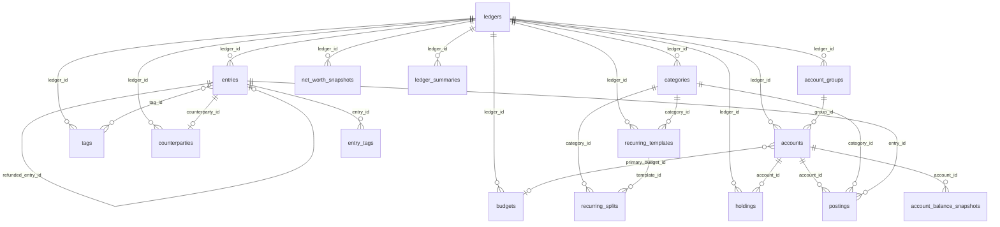

# Ledger Software — SQLite Database Schema Design

> **Version:** v2.0 → **v3** (2026-06-07, post double-entry cutover)
> **Audience:** Engineering Team (including junior developers)
> **Goal:** Complete reference for building the ledger software database
> **Tech Stack:** SQLite 3.x (with JSON functions enabled)

> **v3 (2026-06-07, post double-entry cutover):** `entries` + `postings` replace `transactions` + `transfer_groups` + `transaction_splits`. `categories` gains the `system` column + `equity` kind, drops the `transfer` kind. Migration via `lib/db/cutover.ts`. `SCHEMA_VERSION = 2026-06-14T00:00:00Z`. See `plans/done/DOUBLE_ENTRY_PLAN.md` for the canonical design record. **9 new balanced-entry invariants (I1-I9)**, the two-phase `sealed` write pattern, the per-ledger system equity categories (Opening / Adjustment / FX gain/loss), and the `auditLedger` semantic sweep.

---

## 1. Introduction

### 1.1 What Is This Document?

This document describes the complete database schema for a personal/family accounting application. It tells the engineering team exactly what tables to create, what each column means, how the tables relate to each other, and what business rules to follow.

Think of it as the **source of truth** for everything database-related: schema definition, indexes, triggers, data constraints, and the reasoning behind each design decision.

### 1.2 Why SQLite?

SQLite is a file-based, serverless database. It requires no separate database process to run — the application links SQLite in and talks to it directly. This makes it ideal for:

- Personal desktop/mobile apps (no server infrastructure needed)
- Single-user local storage
- Easy backup (just copy the `.db` file)

SQLite does not support stored procedures (we handle logic in the application layer) but it does support triggers, indexes, and JSON functions natively.

### 1.3 Core Concepts Before You Start

Before reading the schema, understand these key concepts in our system:

**Ledger** = A complete, isolated set of books. Like having separate spreadsheets for "Personal" and "Family" finances. All data is scoped to a ledger. Ledgers never share data.

**Entries + postings (double-entry core)** = Since v3 the schema is double-entry. An `entry` is a journal header (date, description, kind, status, …) and the money lives in 2+ `postings` legs that **sum to zero in the ledger base** (the I1 invariant). A simple expense is two legs (account −X, category +X); a transfer is two account legs (A −X, B +X, plus an optional FX-residue equity leg if the currencies differ). The client still talks the single-entry vocabulary (expense / income / transfer — never "debit/credit"); the projection in `lib/db/state.ts` rehydrates a flat `Tx` view from the postings, so pages and selectors are untouched. See `plans/done/DOUBLE_ENTRY_PLAN.md` for the full design record.

**Multi-currency** = Each posting carries its own `amount` (in `currency`) and `amount_base` (in the ledger base), with the conversion rate `exchange_rate` locked at the entry's date. For an account leg `currency` must equal the account's own currency (the `tr_post_currency` guard, F3 fix); for a category leg `currency` is the ledger base.

**Pending vs Confirmed** = Some entries (especially from recurring templates) are created in `pending` status first, meaning they are expected but not yet verified. The user confirms them later, and only then do they flow into reports.

---

## 2. Project Structure

> **v3 layout** (post-cutover): the SQL is now TypeScript in
> `frontend/lib/db/` — the schema is a single canonical `SCHEMA` string
> in `frontend/lib/db/schema.ts`, the entries/postings DDL + the
> `categories` upgrade live in `frontend/lib/db/entries-schema.ts`, and
> the cutover migration is `frontend/lib/db/cutover.ts`. The reference
> below is the conceptual v2 layout; the source of truth is the live
> code.

```
ledger/
├── schema.sql              # All CREATE TABLE, INDEX, TRIGGER statements
├── seed.sql                # Initial data (default ledger, sample accounts)
├── migrations/             # Incremental migration scripts
│   ├── 001_init.sql
│   └── 002_add_feature.sql
└── queries/                # Common query templates as .sql files
    ├── monthly_summary.sql
    ├── budget_tracking.sql
    └── net_worth.sql
```

**Important:** All production SQL should be written to `.sql` files in `queries/` so they can be reviewed and tested independently. Avoid embedding long SQL strings in application code.

---

## 3. Data Type Conventions

### 3.1 IDs — Always TEXT (UUID)

We use UUID v4 for ALL primary keys. Example: `a1b2c3d4-e5f6-7890-abcd-ef1234567890`

**Why not AUTOINCREMENT integers?** UUIDs are better for our sync model (multiple devices generating records independently — IDs won't collide). They also make it impossible to guess record IDs, which is a minor security benefit.

```sql
-- Generate a UUID in SQLite
lower(hex(randomblob(16)))
```

### 3.2 Money/Amount Fields — Always REAL

We use SQLite's `REAL` type for all monetary values. This is a IEEE 754 double-precision float. **You must round to 2 decimal places in the application layer** before writing — SQLite will not do this for you.

```sql
-- In Python/SQLite, store like this:
ROUND(amount, 2)
```

### 3.3 Dates and Times

| Field type | Format | Example |
|------------|--------|---------|
| `date` | `YYYY/MM/DD` | `2026/05/13` |
| `time` | `HH:MM` | `07:51` |
| `*_at` (timestamps) | ISO 8601 | `2026-05-13T07:51:00` |
| `year_month` | `YYYY-MM` | `2026-05` |

All timestamps are stored as TEXT in ISO 8601 format. Always use `datetime('now')` in SQLite to generate them.

### 3.4 JSON Fields

Some fields store JSON arrays. Query them with SQLite's built-in `json_each()`:

```sql
-- Example: check if account_id is in budget's account_ids list
json_valid(b.account_ids) = 0 OR b.account_ids IS NULL OR t.account_id IN (
    SELECT value FROM json_each(b.account_ids)
)
```

The pattern `json_valid(field) = 0 OR field IS NULL` means "no filter specified" — use this to treat empty/null JSON as "all records match".

---

## 4. Enumeration Values

All check constraints are documented here. If you add a new enum value, update both the schema and this document.

### 4.1 Entry Status (`entries.status`)

> **v3 rename** (was `transactions.status`).

| Value | Meaning | Included in Reports |
|-------|---------|---------------------|
| `pending` | Awaiting user confirmation | No |
| `confirmed` | Verified, should be counted | Yes |

### 4.2 Account Types (`accounts.type`)

| Value | Meaning |
|-------|---------|
| `savings` | Bank savings account |
| `credit_card` | Credit card (current_balance is what you owe) |
| `investment` | Brokerage / investment account |
| `cash` | Physical cash |
| `fx` | Foreign currency account |
| `virtual` | Virtual account used for splitting income |

### 4.3 Category Kinds (`categories.kind`)

> **v3:** `equity` added; `transfer` removed.

| Value | Meaning |
|-------|---------|
| `expense` | Money leaving your account |
| `income` | Money entering your account |
| `equity` | The three system categories per ledger (resolved by `categories.system` = `opening` / `adjustment` / `fx`). Never user-pickable. |

Refund-shaped entries don't get their own category type — they use the **original expense's category** with `entries.kind = 'refund'` so reports net them against the right line. See §6.9 *Kinds*.

> **Naming:** the income/expense/transfer discriminator is named **`kind`** on every table that carries it — `categories.kind`, `budgets.kind`, `scheduled_templates.kind`, and `entries.kind`. Only `accounts.type` keeps the name `type`, because it is a different classification (`savings`/`credit_card`/…), not the income/expense family. (`categories.kind` is now a *display hint*; money math buckets by `entries.kind` — see §6.5.)

### 4.4 Template Kinds (`scheduled_templates.kind`)

| Value | Meaning |
|-------|---------|
| `income` | Recurring income (e.g., salary) |
| `expense` | Recurring expense (e.g., rent) |
| `transfer` | Recurring transfer (e.g., monthly savings) |

### 4.5 Template Frequency (`scheduled_templates.frequency`)

| Value | Meaning |
|-------|---------|
| `daily` | Every day |
| `weekly` | Every week, on `day_of_week` (0=Sunday, 6=Saturday) |
| `biweekly` | Every 14 days |
| `monthly` | Every month, on `day_of_month` (1–31) |
| `quarterly` | Every quarter, on `nth_weekday` + `day_of_week` |
| `yearly` | Once a year, same month/day as `start_date` |

### 4.6 Budget Kinds (`budgets.kind`)

| Value | Meaning |
|-------|---------|
| `income` | Track income against a budget |
| `expense` | Track spending against a budget |

Note: We do NOT have a `transfer` budget type. Transfers do not change your net worth, so they don't need budgets.

### 4.7 Summary Types (`ledger_summaries.type`)

| Value | Meaning |
|-------|---------|
| `income` | Regular income (salary, etc.) |
| `expense` | Regular spending |
| `transfer_in` | Money transferred IN from another ledger |
| `transfer_out` | Money transferred OUT to another ledger |

---

## 5. Entity Relationship Diagram



**Reading the diagram:**
- `||--o{` means "one-to-many" (one ledger has many accounts; one entry has many postings)
- `}o--o|` means "optional many-to-many" or "many-to-one"
- Each `entry` has 2+ `postings` (account and/or category legs, XOR-typed — the two sides of a balanced journal entry). Transfers are entries with two account legs; splits are entries with multiple category legs; there's no separate `transfer_groups` table.

---

## 6. Schema Definitions

Reference for every table in the live schema (`frontend/lib/db/schema.ts`,
with the entries/postings DDL constants in `frontend/lib/db/entries-schema.ts`
consumed by both the canonical schema and the cutover migration).
Each section gives a one-line purpose, the canonical `CREATE TABLE` block,
and a column reference table.

> **v3 renames (no semantic change):** `transaction_tags` → `entry_tags`;
> `transactions_fts` → `entries_fts`; `transaction_attachments` →
> `entry_attachments`. The tables are otherwise identical to their v2
> counterparts (FK re-pointed at the new `entries.id`).

**Tables, in declaration order:**

1. [`ledgers`](#61-ledgers--top-level-books)
2. [`account_groups`](#62-account_groups--account-buckets-on-the-accounts-screen)
3. [`budget_groups`](#63-budget_groups--budget-buckets-on-the-budgets-screen)
4. [`accounts`](#64-accounts--individual-money-accounts)
5. [`categories`](#65-categories--spendingincome-and-equity-tags) *(v3: gains `system` + `equity` kind, drops `transfer` kind)*
6. [`tags`](#66-tags--user-defined-entry-tags)
7. [`entry_tags`](#67-entry_tags--manymany-link-between-entries-and-tags) *(renamed from `transaction_tags`)*
8. [`counterparties`](#68-counterparties--merchantpayee-catalog)
9. [`entries`](#69-entries--the-core-money-movement-headers-) *(v3: replaces `transactions` + `transfer_groups` + `transaction_splits`)*
10. [`postings`](#610-postings--balanced-legs-of-an-entry-) *(v3: the money lives here)*
11. [`budgets`](#611-budgets--named-spendingincome-targets)
12. [`scheduled_templates`](#612-scheduled_templates--recurring-entry-blueprints)
13. [`scheduled_splits`](#613-scheduled_splits--multi-account-splits-for-a-template)
14. [`exchange_rates`](#614-exchange_rates--locked-historical-fx-rates)
15. [`app_state`](#615-app_state--transitional-keyvalue-bag)
16. [`db_metadata`](#616-db_metadata--single-row-self-description-of-the-file)
17. [`entries_fts`](#617-entries_fts--fts5-inverted-index-over-entry-text) *(renamed from `transactions_fts`)*
18. [`holdings`](#618-holdings--investment-positions-inside-an-investment-account)

---

### 6.1 `ledgers` — top-level books

A complete, isolated set of books. Everything else FKs into a ledger.

```sql
CREATE TABLE ledgers (
  id            TEXT PRIMARY KEY,
  name          TEXT NOT NULL,
  base_currency TEXT NOT NULL DEFAULT 'SGD',
  is_default    INTEGER NOT NULL DEFAULT 0,
  created_at    TEXT NOT NULL,
  updated_at    TEXT NOT NULL
);
```

| Column | Type | Description |
|---|---|---|
| `id` | TEXT PK | App-stable id, e.g. `personal`, `family`. |
| `name` | TEXT NOT NULL | Display name. |
| `base_currency` | TEXT NOT NULL · default `SGD` | ISO 4217. All `amount_base` values in this ledger are denominated in it. Mutable via the `changeLedgerBase` mutation, which atomically updates this column and rewrites every locked `amount_base` (postings — both account and category legs) under the new base using each row's own date — see `recomputeAmountBases` in `lib/db/queries/ledgers.ts`. |
| `is_default` | INTEGER NOT NULL · default 0 | `1` for the ledger new users start in. At most one row should be `1`. |
| `created_at` | TEXT NOT NULL | ISO 8601 UTC. |
| `updated_at` | TEXT NOT NULL | ISO 8601 UTC, bumped on every patch. |

---

### 6.2 `account_groups` — account buckets on the Accounts screen

Purely organisational groupings (Cash & Banking, Credit Cards, Investments, Loans). The net-worth flag is per-account (see §6.4); groups carry no defaults.

```sql
CREATE TABLE account_groups (
  id         TEXT PRIMARY KEY,
  ledger_id  TEXT NOT NULL REFERENCES ledgers(id) ON DELETE CASCADE,
  name       TEXT NOT NULL,
  sort_order INTEGER NOT NULL DEFAULT 0,
  created_at TEXT NOT NULL,
  updated_at TEXT NOT NULL
);
```

| Column | Type | Description |
|---|---|---|
| `id` | TEXT PK | App-stable id (`cash`, `credit`, `invest`, …). |
| `ledger_id` | TEXT NOT NULL FK → `ledgers.id` · CASCADE | Owning ledger. |
| `name` | TEXT NOT NULL | Display label. |
| `sort_order` | INTEGER NOT NULL · default 0 | Display order on the Accounts screen. |
| `created_at` / `updated_at` | TEXT NOT NULL | Audit. |

---

### 6.3 `budget_groups` — budget buckets on the Budgets screen

Folders for named budgets ("Bills", "Lifestyle", etc).

```sql
CREATE TABLE budget_groups (
  id         TEXT PRIMARY KEY,
  ledger_id  TEXT NOT NULL REFERENCES ledgers(id) ON DELETE CASCADE,
  name       TEXT NOT NULL,
  sort_order INTEGER NOT NULL DEFAULT 0,
  created_at TEXT NOT NULL,
  updated_at TEXT NOT NULL
);
```

| Column | Type | Description |
|---|---|---|
| `id` | TEXT PK | `bgg-<random>` typically. |
| `ledger_id` | TEXT NOT NULL FK → `ledgers.id` · CASCADE | Owning ledger. |
| `name` | TEXT NOT NULL | Display label. |
| `sort_order` | INTEGER NOT NULL · default 0 | Display order. |
| `created_at` / `updated_at` | TEXT NOT NULL | Audit. |

---

### 6.4 `accounts` — individual money accounts

One row per real-world account (bank, card, wallet, brokerage).

```sql
CREATE TABLE accounts (
  id                   TEXT PRIMARY KEY,
  ledger_id            TEXT NOT NULL REFERENCES ledgers(id) ON DELETE CASCADE,
  group_id             TEXT REFERENCES account_groups(id) ON DELETE SET NULL,
  name                 TEXT NOT NULL,
  type                 TEXT NOT NULL CHECK(type IN ('savings','credit_card','investment','cash','fx','virtual')),
  currency             TEXT NOT NULL DEFAULT 'SGD',
  current_balance      REAL NOT NULL DEFAULT 0,
  opening_balance      REAL NOT NULL DEFAULT 0,
  opening_balance_base REAL NOT NULL DEFAULT 0,
  color                TEXT,
  sort_order           INTEGER NOT NULL DEFAULT 0,
  include_in_net_worth INTEGER NOT NULL DEFAULT 1,
  is_active            INTEGER NOT NULL DEFAULT 1,
  archived_at          TEXT,
  created_at           TEXT NOT NULL,
  updated_at           TEXT NOT NULL
);
```

| Column | Type | Description |
|---|---|---|
| `id` | TEXT PK | App-stable id (`chk`, `cc`, `acct-<random>`). |
| `ledger_id` | TEXT NOT NULL FK · CASCADE | Owning ledger. |
| `group_id` | TEXT FK → `account_groups.id` · SET NULL | Optional grouping. NULL = "Ungrouped". |
| `name` | TEXT NOT NULL | Display name. Users encode any disambiguator (e.g. last-4) directly here — there is no separate column. |
| `type` | TEXT NOT NULL · CHECK | `savings` / `credit_card` / `investment` / `cash` / `fx` / `virtual`. |
| `currency` | TEXT NOT NULL · default `SGD` | ISO 4217 — currency the account holds. **Immutable after creation** (not in `AccountPatch`); changing it would re-interpret every stored native `amount`. |
| `current_balance` | REAL NOT NULL · default 0 | **Cached.** Kept in sync by `recomputeAccount()` after txn writes. |
| `opening_balance` | REAL NOT NULL · default 0 | Balance before the first tracked transaction. `current = opening + Σ amount_base` (in account currency). |
| `opening_balance_base` | REAL NOT NULL · default 0 | Ledger-base value of `opening_balance`, **locked at account creation** using the rate on that date. Stays put when FX moves later, so the account's cost basis (`opening_balance_base + Σ amount_base of confirmed account legs`) is stable. Re-stamped only when the ledger's base currency itself changes (via `recomputeAmountBases`). Drives the unrealized FX gain/loss: `(current_balance × today's rate) − cost basis`. **v3:** the underlying opening balance is now also represented as an `opening` entry (1 account leg + 1 `sys:opening-balance` equity leg), making the v2 `accounts.opening_balance` / `opening_balance_base` columns redundant; they remain in the schema for compatibility / cost-basis math. |
| `color` | TEXT | Hex card / accent colour. Drives the avatar chip on the Accounts screen and the per-row badge in transaction lists. |
| `sort_order` | INTEGER NOT NULL · default 0 | Display order within the group. |
| `include_in_net_worth` | INTEGER NOT NULL · default 1 | 0 / 1. Defaulted from `type` at create (credit_card → 0, else 1); flippable per account. |
| `is_active` | INTEGER NOT NULL · default 1 | Soft-archive flag. `0` hides from active lists; history is kept. |
| `archived_at` | TEXT | ISO 8601 UTC stamped when `is_active` flips to 0. |
| `created_at` / `updated_at` | TEXT NOT NULL | Audit. |

---

### 6.5 `categories` — spending/income (and equity) categories (2-level tree)

One row per category. Used on **postings** (category legs) and budgets. Categories form a **2-level taxonomy** via the self-referential `parent_id`: rows with `parent_id IS NULL` are top-level "parents", rows pointing at one of those are "children". The "no grandchildren" invariant is enforced at the mutation layer (see `assertCanBeParent` in `mutations.ts`).

Both levels are **bookable** — a posting can file directly against a parent ("Food & Dining") or a leaf ("Groceries"). Reports get a `categorySpend` (leaf-keyed, as filed) plus a pure `rollupCategorySpend` helper that folds each child's total into its parent's bucket so a parent figure = its own postings + Σ(children's postings).

> **v3 changes:** the `kind` CHECK becomes `('expense','income','equity')` — it gains `equity` for the system rows and **drops `transfer`**: under double-entry a transfer has two account legs and no category leg, so a transfer-kind category is unreferenceable by construction. A new nullable `system` column marks the three system rows (`opening` / `adjustment` / `fx`); the cutover re-kinds any pre-existing `'transfer'` rows to `'expense'` (none in the v2 seed, only user-created rows can exist). The categories admin page stops offering `'transfer'` in the type picker. See `plans/done/DOUBLE_ENTRY_PLAN.md` §2.3.

```sql
CREATE TABLE categories (
  id         TEXT PRIMARY KEY,
  ledger_id  TEXT NOT NULL REFERENCES ledgers(id) ON DELETE CASCADE,
  parent_id  TEXT REFERENCES categories(id) ON DELETE SET NULL,
  name       TEXT NOT NULL,
  kind       TEXT NOT NULL CHECK(kind IN ('expense','income','equity')),
  icon       TEXT,
  color      TEXT,
  sort_order INTEGER NOT NULL DEFAULT 0,
  system     TEXT CHECK(system IN ('opening','adjustment','fx')),
  created_at TEXT NOT NULL,
  updated_at TEXT NOT NULL
);
CREATE INDEX idx_cat_parent   ON categories(parent_id)    WHERE parent_id IS NOT NULL;
CREATE INDEX idx_cat_ledger   ON categories(ledger_id);
CREATE UNIQUE INDEX idx_cat_system ON categories(ledger_id, system) WHERE system IS NOT NULL;
```

| Column | Type | Description |
|---|---|---|
| `id` | TEXT PK | App-stable id (`food`, `rent`, `cat-<random>`). |
| `ledger_id` | TEXT NOT NULL FK · CASCADE | Owning ledger. |
| `parent_id` | TEXT FK → `categories.id` · **SET NULL** | NULL = top-level. Non-NULL = child of that parent. Deleting a parent **promotes its children to top-level** (no data destroyed). The "no grandchildren" rule is enforced by mutations. |
| `name` | TEXT NOT NULL | Display name. |
| `kind` | TEXT NOT NULL · CHECK | `expense` / `income` / `equity`. The `equity` kind is for the three system categories only (resolved by `system`, not by `kind`). Category-row kind is a *display hint* (picker grouping, equity hiding); money math buckets by the entry's `kind`, never by the category's. |
| `icon` | TEXT | Icon key (`fork`, `home`, …) — matches `components/primitives.tsx`. |
| `color` | TEXT | Hex `#rrggbb`. The Categories edit page offers a curated swatch picker; new picks come from `lib/colors.categoryHex(hue)`. Used directly as CSS. |
| `sort_order` | INTEGER NOT NULL · default 0 | Display order within the ledger. |
| `system` | TEXT · CHECK | `opening` / `adjustment` / `fx` for the system rows; `NULL` for ordinary categories. Backed by the unique `idx_cat_system` so each system kind appears at most once per ledger. System rows are resolved by this column (rename-safe), never by id or name. |
| `created_at` / `updated_at` | TEXT NOT NULL | Audit. |

The three system rows are seeded (idempotently) per ledger by `ensureSystemCategories(exec, ledgerId)` (`frontend/lib/db/entries.ts`) at seed, in the cutover migration, and on `createLedger`. They are **hidden from the user** by the categories admin page and excluded from category pickers (which already filter by `kind IN ('expense','income')`). The opening / adjustment / FX legs of double-entry entries post against them — see §6.9 and §6.10.

---

### 6.6 `tags` — user-defined entry tags

Free-form labels attached to entries via `entry_tags` (renamed from `transaction_tags` in v3; FK re-pointed at `entries.id`).

```sql
CREATE TABLE tags (
  id         TEXT PRIMARY KEY,
  ledger_id  TEXT NOT NULL REFERENCES ledgers(id) ON DELETE CASCADE,
  name       TEXT NOT NULL,
  color      TEXT,
  created_at TEXT NOT NULL,
  updated_at TEXT NOT NULL
);
```

| Column | Type | Description |
|---|---|---|
| `id` | TEXT PK | App-stable id (`tag-business`, `tag-<random>`). |
| `ledger_id` | TEXT NOT NULL FK · CASCADE | Owning ledger. |
| `name` | TEXT NOT NULL | Display label. |
| `color` | TEXT | Hex `#rrggbb` for the chip — optional. Curated swatch picker; new picks come from `lib/colors.tagHex(hue)`. |
| `created_at` / `updated_at` | TEXT NOT NULL | Audit. |

---

### 6.7 `entry_tags` — many↔many link between entries and tags

> **v3 rename** (FK re-pointed at `entries.id`, no semantic change). Tags are
> deliberately **entry-level**, not leg-level (decision #3): a transfer's two
> account legs share their tags.

```sql
CREATE TABLE entry_tags (
  entry_id TEXT NOT NULL REFERENCES entries(id) ON DELETE CASCADE,
  tag_id   TEXT NOT NULL REFERENCES tags(id) ON DELETE CASCADE,
  PRIMARY KEY (entry_id, tag_id)
);
```

| Column | Type | Description |
|---|---|---|
| `entry_id` | TEXT NOT NULL FK · CASCADE | Tagged entry. |
| `tag_id` | TEXT NOT NULL FK · CASCADE | Applied tag. |
| (PK) | — | Composite — a tag may appear at most once per entry. |

---

### 6.8 `counterparties` — merchant/payee catalog

A standalone catalog of canonical merchant names. Linked back from `entries.counterparty_id` (was `transactions.counterparty_id` in v2; SET NULL on delete); see §6.9 + decision #18. Used by the `/merchants` admin screen.

```sql
CREATE TABLE counterparties (
  id          TEXT PRIMARY KEY,
  ledger_id   TEXT NOT NULL REFERENCES ledgers(id) ON DELETE CASCADE,
  name        TEXT NOT NULL COLLATE NOCASE,
  is_verified INTEGER NOT NULL DEFAULT 0,
  created_at  TEXT NOT NULL,
  updated_at  TEXT NOT NULL
);
CREATE INDEX idx_counterparty_ledger_name ON counterparties(ledger_id, name);
```

Category is intentionally absent: the same merchant (Amazon, etc.) can have transactions in multiple categories, so category lives on the transaction. Display disambiguators (alternative spellings) belong in the canonical `name` itself. (The column was renamed from `standardized_name` → `name` so the entity-label column is called `name` on every table.)

| Column | Type | Description |
|---|---|---|
| `id` | TEXT PK | `cp-<n>`. |
| `ledger_id` | TEXT NOT NULL FK · CASCADE | Owning ledger. |
| `name` | TEXT NOT NULL · COLLATE NOCASE | Canonical display name ("Starbucks"). The NOCASE collation lets `resolveCounterpartyIdByName` do case-insensitive index seeks without `LOWER()` defeating the index. |
| `is_verified` | INTEGER NOT NULL · default 0 | User-confirmed entry (true) vs. auto-suggested (false). |
| `created_at` / `updated_at` | TEXT NOT NULL | Audit. |

---

### 6.9 `entries` — the core money-movement headers ⭐

The heart of the schema (since v3). Every write to `entries` (and to its
companion `postings` table, §6.10) flows through the single chokepoint
`postEntry` / `rebuildEntry` / `deleteEntry` in `lib/db/entries.ts`. The
two-phase `sealed` write (insert with `sealed=0`, then `UPDATE … sealed=1`
that fires the balance-check trigger) is what makes the balanced-entry
invariant (I1) a database-level contract rather than a convention in
TypeScript — see `plans/done/DOUBLE_ENTRY_PLAN.md` §3.

> ✅ **Refunds are implemented.** The `refunded_entry_id` self-FK and the
> `kind='refund'` enum value below are live in `schema.ts` (with
> `idx_entry_refunded`). The spend selectors (`categorySpend` /
> `monthlyByCategory`, the client `lib/select.ts`, and budget rollover)
> widen to `kind IN ('expense','refund')` so a refund's positive
> `amount_base` nets against its category; cash-flow income is gated to
> `kind='income'` so refunds never count as income. The entry detail page
> has a "Refund" action that pre-fills amount + category from the
> original.

```sql
CREATE TABLE entries (
  id                 TEXT PRIMARY KEY,
  ledger_id          TEXT NOT NULL REFERENCES ledgers(id) ON DELETE CASCADE,
  date               TEXT NOT NULL,
  time               TEXT,
  description        TEXT,
  -- Cached classification label; the postings SHAPE is the truth (I7).
  -- postEntry stamps the label, auditLedger checks it against the postings.
  kind               TEXT NOT NULL CHECK(kind IN ('opening','income','expense','transfer','adjustment','refund')),
  status             TEXT NOT NULL DEFAULT 'confirmed' CHECK(status IN ('pending','confirmed')),
  confirmed_at       TEXT,
  -- Link to the canonical merchant when one matches. NULL = free-text only;
  -- otherwise display picks the catalog name so renames follow history. SET
  -- NULL on delete preserves the original description text.
  counterparty_id    TEXT REFERENCES counterparties(id) ON DELETE SET NULL,
  -- A refund row's link back to the original expense it offsets. SET NULL on
  -- delete: if the original expense is removed, the refund survives as an
  -- orphan (the money really did come back). One expense can have many
  -- refunds (partial returns).
  refunded_entry_id  TEXT REFERENCES entries(id) ON DELETE SET NULL,
  source_template_id TEXT,
  notes              TEXT,
  applied_rule_ids   TEXT,
  reviewed_at        TEXT,
  -- Double-submit backstop (the entries-layer mirror of the old
  -- idx_txn_dedup). Chokepoint-computed sha256 over
  -- date|time|description|sorted(account:amount); NULL when time is NULL,
  -- reproducing the old "NULL time never collides" carve-out for
  -- scheduled auto-posts.
  dedup_hash         TEXT,
  -- Two-phase write flag: postings are inserted while sealed = 0, then the
  -- seal UPDATE fires the balance-check trigger (§9). A sealed entry's
  -- postings are immutable; edits unseal → rewrite → reseal.
  sealed             INTEGER NOT NULL DEFAULT 0,
  created_at         TEXT NOT NULL,
  updated_at         TEXT NOT NULL
);
```

| Column | Type | Description |
|---|---|---|
| `id` | TEXT PK | `e-<random>`. The cutover reuses pre-DE `t-<n>` ids verbatim (the migration writes new `entries.id = old transactions.id`), so historical cross-references survive. |
| `ledger_id` | TEXT NOT NULL FK · CASCADE | Owning ledger. |
| `date` | TEXT NOT NULL | `YYYY-MM-DD`. Also acts as the rate's effective date for every leg. |
| `time` | TEXT | Optional `HH:MM` for ordering same-day rows. |
| `description` | TEXT | Free-text merchant / memo line (FTS-indexed by `entries_fts`). |
| `kind` | TEXT NOT NULL · CHECK | `opening` / `income` / `expense` / `transfer` / `adjustment` / `refund` — see *Kinds* below. The cached label; the postings shape is the source of truth (I7). |
| `status` | TEXT NOT NULL · default `confirmed` · CHECK | `pending` (excluded from reports + balances) / `confirmed`. |
| `confirmed_at` | TEXT | ISO 8601 UTC stamped on pending → confirmed transition. |
| `counterparty_id` | TEXT FK → `counterparties.id` · SET NULL | Set when `description` matches a row in `counterparties` (case-insensitive exact match within the same ledger). Resolved at insert/update by `resolveCounterpartyIdByName`. NULL when no catalog row matches — `description` stands on its own. Renames on the catalog row follow history automatically because the projection swaps `merchant` for the canonical name when this FK is set. SET NULL on delete preserves the row's plain description text. |
| `refunded_entry_id` | TEXT FK → `entries.id` · SET NULL | Set on `kind='refund'` rows; points at the original expense being refunded. NULL on every other kind. |
| `source_template_id` | TEXT | Link back to `scheduled_templates.id` for auto-posted occurrences (no FK — soft link). |
| `notes` | TEXT | User memo. |
| `applied_rule_ids` | TEXT | JSON array of rule ids that fired against this entry (for the reviewed-pane UI). |
| `reviewed_at` | TEXT | ISO 8601 UTC; set when the user reviews an auto-classified entry. Entry-level (not leg-level — a transfer's two legs share the same reviewed state, decision #3). |
| `dedup_hash` | TEXT | Double-submit backstop; see above. |
| `sealed` | INTEGER NOT NULL · default 0 | Two-phase write flag. The `tr_post_sealed_*` triggers reject any INSERT/UPDATE/DELETE on a posting whose entry is sealed; rebuildEntry unseals → rewrites → reseals. The `idx_entry_unsealed` partial index flags torn writes (the audit's I1 check). |
| `created_at` / `updated_at` | TEXT NOT NULL | Audit. |

**Kinds**

| `kind` | Postings shape | Affects category spend | Affects income totals | Notes |
|---|---|---|---|---|
| `expense` | 1 account leg (−X) + 1+ category leg(s) (Σ +X) | yes | no | The default. Splits are multiple category legs on one entry. |
| `income` | 1 account leg (+X) + 1+ category leg(s) (Σ −X) | no | yes | Salary, interest, gifts. |
| `transfer` | 2 account legs (A −X, B +X) [+ optional FX-residue equity leg, decision §10.7] | no | no | **Replaces the old `transfer_groups` table.** No group row, no pair id; the two account legs share the entry. |
| `opening` | 1 account leg (+B) + 1 equity leg (sys:opening-balance, −B) | no | no | Per-account opening balance posted as an entry (replaces `accounts.opening_balance[_base]` columns — F5 dies). |
| `adjustment` | 1 account leg (+δ) + 1 equity leg (sys:balance-adjustment, −δ) | no | no | Manual reconciliation row (sets the cached balance back to truth without inventing a category). |
| `refund` | 1 account leg (+R) + 1+ category leg(s) (Σ −R) | **yes — netted against the original's category** | no | Linked to the original expense via `refunded_entry_id`. The positive `amount_base` reduces the offset category's spend (a $50 refund against a $200 grocery purchase shows "Groceries: $150 net"). One expense can have multiple partial refunds. |

The refund's category typically inherits the original expense's category (UI auto-fills) so the netting works on the right line. Users can override — assigning a refund to a dedicated "Returns" category bypasses the offset and surfaces refunds as their own report bucket instead.

> **Transfers under DE (v3):** a transfer is an `entry` with `kind='transfer'`
> and 2 account legs (plus an optional `sys:fx-gain` equity leg when the
> from/to currencies differ — the realized FX residue, §6.10 + DE plan §5.1).
> No `transfer_groups` table. The previously-stored `from_currency` /
> `to_currency` / `exchange_rate` metadata is **derivable** from the two
> account legs (`exchange_rate = |toAmount / fromAmount|`); on a
> cross-currency edit the chokepoint rewrites the residue leg so the
> implied bank rate is preserved. `Tx.transferGroupId` in the projection
> is now just the entry id (legacy: `tg-<n>` → now `e-<n>`). The
> `/transfers` page lists all entries with `kind='transfer'`.

---

### 6.10 `postings` — balanced legs of an entry

The money. Every entry has 2+ postings, ≥ 1 account leg, and
`Σ amount_base = 0` per ledger base (I1). The `account_id` / `category_id`
XOR (`CHECK (account_id IS NULL OR category_id IS NULL)`) keeps each leg
on exactly one side of the journal. The full `lib/db/entries.ts`
chokepoint + the `tr_post_*` triggers (§9) keep this contract
database-enforced, not a TypeScript convention.

```sql
CREATE TABLE postings (
  id            TEXT PRIMARY KEY,
  entry_id      TEXT NOT NULL REFERENCES entries(id) ON DELETE CASCADE,
  -- Exactly one side: account leg (account_id set) or category leg
  -- (account_id NULL; category_id may itself be NULL = "uncategorized",
  -- which preserves the SET-NULL-on-category-delete semantics).
  account_id    TEXT REFERENCES accounts(id) ON DELETE RESTRICT,
  category_id   TEXT REFERENCES categories(id) ON DELETE SET NULL,
  amount        REAL NOT NULL,
  currency      TEXT NOT NULL,
  amount_base   REAL NOT NULL,
  exchange_rate REAL NOT NULL,
  -- Display-only original figure when the user typed a currency other
  -- than the account's (the "JPY hotel on the SGD card" case, DE plan §5.2).
  orig_amount   REAL,
  orig_currency TEXT,
  memo          TEXT,
  -- Reconcile clearing is per account leg (clearing a transfer from
  -- account A's statement must not clear account B's leg).
  cleared_at    TEXT,
  sort_order    INTEGER NOT NULL DEFAULT 0,
  CHECK (account_id IS NULL OR category_id IS NULL)
);
```

| Column | Type | Description |
|---|---|---|
| `id` | TEXT PK | `p-<random>`. The cutover reuses pre-DE txn ids for the **first** posting of each row (the account leg), so historical `Tx.id` survives. |
| `entry_id` | TEXT NOT NULL FK → `entries.id` · CASCADE | Parent entry. FK CASCADE is the I4 ("postings never exist without their entry") backstop. |
| `account_id` | TEXT FK → `accounts.id` · RESTRICT | Set on account legs (must be one of the legs). NULL on category legs and on FX-residue / opening / adjustment equity legs. The `tr_post_currency` trigger enforces `currency` = the account's currency here (F3 dies by construction). |
| `category_id` | TEXT FK → `categories.id` · SET NULL | Set on category legs. NULL = "uncategorized" (preserves the SET-NULL-on-category-delete semantics). `system`-kind categories (opening / adjustment / fx) appear on equity legs of `opening` / `adjustment` / transfer-FX-residue entries. |
| `amount` | REAL NOT NULL | Signed, in `currency`. Account leg: signed delta to the account's `current_balance` (cached by the `tr_post_balance` trigger on insert; edits/deletes recompute). Category leg: signed amount in the ledger base. |
| `currency` | TEXT NOT NULL | For an account leg, **must** equal the account's `currency` (the `tr_post_currency` guard aborts otherwise — F3 dies). For a category leg, equals the ledger base. |
| `amount_base` | REAL NOT NULL | Signed, in the ledger base. **Locked at the entry's date** — the same "rate is the rate on the row's own date" invariant the v2 schema had. |
| `exchange_rate` | REAL NOT NULL | Rate used to derive `amount_base`. Locked. |
| `orig_amount` / `orig_currency` | REAL / TEXT | Display-only when the user entered the row in a currency other than the account's (the "JPY 10,000 hotel on the SGD card" case). NULL otherwise. The chokepoint writes both; neither is used in balance math. |
| `memo` | TEXT | Per-leg memo (was `transaction_splits.description` in v2). |
| `cleared_at` | TEXT | ISO 8601 UTC stamped on reconcile-clear. **Per account leg only** — clearing a transfer from A's statement must not clear B's leg. |
| `sort_order` | INTEGER NOT NULL · default 0 | Display order in the splits editor. |

> **Splits under DE (v3):** a split is multiple **category legs** on a single
> entry. They sum to the **account leg's amount** (so the entry still
> balances: account + Σ category = 0). A category leg's `category_id` may
> be `NULL` ("uncategorized" portion). The parent entry's displayed
> `category` (the projection's `Tx.category`) is the largest-`|amount|`
> category leg, or `null` if there is no category leg (e.g. transfers,
> adjustments). The v2 `transaction_splits` table is gone — its
> `amount` / `amount_base` / `description` / `sort_order` / `id` map 1:1
> onto a postings row with `entry_id` set and `account_id NULL`.

---

### 6.11 `budgets` — named spending/income targets

Each row is an independent budget (e.g. "Groceries", "Holiday fund"). Filters by category / account / tag arrays.

```sql
CREATE TABLE budgets (
  id                 TEXT PRIMARY KEY,
  ledger_id          TEXT NOT NULL REFERENCES ledgers(id) ON DELETE CASCADE,
  group_id           TEXT REFERENCES budget_groups(id) ON DELETE SET NULL,
  name               TEXT,
  kind               TEXT NOT NULL CHECK(kind IN ('income','expense')),
  amount             REAL NOT NULL,
  saved              REAL NOT NULL DEFAULT 0,
  carry_forward      REAL NOT NULL DEFAULT 0,
  frequency          TEXT NOT NULL CHECK(frequency IN ('daily','weekly','biweekly','monthly','quarterly','yearly')),
  start_date         TEXT NOT NULL,
  end_date           TEXT,
  is_recurring       INTEGER NOT NULL DEFAULT 1,
  rollover           INTEGER NOT NULL DEFAULT 0,
  rollover_limit     REAL,
  last_rolled_period TEXT,
  pending_amount     REAL,
  account_ids        TEXT,
  category_ids       TEXT,
  tag_ids            TEXT,
  warning_pct        REAL NOT NULL DEFAULT 80,
  created_at         TEXT NOT NULL,
  updated_at         TEXT NOT NULL
);
```

| Column | Type | Description |
|---|---|---|
| `id` | TEXT PK | `bgt-<random>`. |
| `ledger_id` | TEXT NOT NULL FK · CASCADE | Owning ledger. |
| `group_id` | TEXT FK → `budget_groups.id` · SET NULL | Optional grouping. |
| `name` | TEXT | Display label. |
| `kind` | TEXT NOT NULL · CHECK | `expense` (limit) or `income` (target). |
| `amount` | REAL NOT NULL | Current-period limit/target in the ledger base. |
| `saved` | REAL NOT NULL · default 0 | Manual accumulator for one-shot income goals. |
| `carry_forward` | REAL NOT NULL · default 0 | Unused budget rolled in from the prior period (expense + rollover only). |
| `frequency` | TEXT NOT NULL · CHECK | Cycle length: `daily`/`weekly`/`biweekly`/`monthly`/`quarterly`/`yearly`. |
| `start_date` | TEXT NOT NULL | `YYYY-MM-DD`. Anchors the cycle. |
| `end_date` | TEXT | Optional close-out date. |
| `is_recurring` | INTEGER NOT NULL · default 1 | `1` repeats every cycle; `0` is one-shot (single window). |
| `rollover` | INTEGER NOT NULL · default 0 | Roll under-spend forward as `carry_forward` at period boundary. |
| `rollover_limit` | REAL | Optional cap on the rolled-forward balance. NULL = uncapped. |
| `last_rolled_period` | TEXT | Catch-up marker for `rollBudgetsIfDue()`. NULL = never rolled. |
| `pending_amount` | REAL | Staged amount change activated at the next period boundary. NULL = none. |
| `account_ids` | TEXT | JSON array of account ids (empty = match every account). |
| `category_ids` | TEXT | JSON array of category ids (empty = match every category). |
| `tag_ids` | TEXT | JSON array of tag ids (empty = no tag filter). |
| `warning_pct` | REAL NOT NULL · default 80 | Spend threshold that flips the "over" indicator. |
| `created_at` / `updated_at` | TEXT NOT NULL | Audit. |

---

### 6.12 `scheduled_templates` — recurring entry blueprints

> **v3:** templates still stamp `source_template_id` on the produced
> `entries` row, but the term "transaction" below now means "entry" —
> the schema columns are unchanged; only the table name moved. See
> §6.9 for the entry shape.

Plans for transactions that recur (salary, rent, subscriptions). Auto-posting fills `transactions` with `source_template_id` set back to the template.

A template is a **recipe** for transactions, not a transaction itself. It mirrors the postable fields of `transactions` (real account FKs, a `description`, a `kind`) so posting is close to a copy, **plus** recurrence fields (`frequency`, `next_run`, …) that have no transaction analogue, and **minus** the fields a transaction freezes at write time. In particular it does **not** store `amount_base` / `exchange_rate` / `currency`: those are derived per occurrence at post time from the linked account's currency and the rate on that date (a template that locked them at creation would reshape future postings). Accounts are referenced by real FK (`account_id` / `from_account_id`); display names are derived by joining `accounts` at read time, exactly like `transactions`.

```sql
CREATE TABLE scheduled_templates (
  id                   TEXT PRIMARY KEY,
  ledger_id            TEXT NOT NULL REFERENCES ledgers(id) ON DELETE CASCADE,
  name                 TEXT,
  description          TEXT,
  kind                 TEXT NOT NULL CHECK(kind IN ('income','expense','transfer')),
  amount               REAL,
  amount_varies        INTEGER NOT NULL DEFAULT 0,
  splits_enabled       INTEGER NOT NULL DEFAULT 0,
  account_id           TEXT NOT NULL REFERENCES accounts(id) ON DELETE RESTRICT,
  from_account_id      TEXT REFERENCES accounts(id) ON DELETE RESTRICT,
  category_id          TEXT REFERENCES categories(id) ON DELETE RESTRICT,
  frequency            TEXT NOT NULL CHECK(frequency IN ('once','daily','weekly','biweekly','monthly','quarterly','yearly')),
  day_of_month         INTEGER,
  day_of_week          INTEGER,
  start_date           TEXT NOT NULL,
  end_date             TEXT,
  next_run             TEXT,
  last_run             TEXT,
  auto_post            INTEGER NOT NULL DEFAULT 1,
  is_active            INTEGER NOT NULL DEFAULT 1,
  max_executions       INTEGER,
  installment_total    INTEGER,
  color                TEXT,
  created_at           TEXT NOT NULL,
  updated_at           TEXT NOT NULL
);
```

| Column | Type | Description |
|---|---|---|
| `id` | TEXT PK | `rt-<random>` / `sch-<random>` typically. |
| `ledger_id` | TEXT NOT NULL FK · CASCADE | Owning ledger. |
| `name` | TEXT | Template's own label in the UI ("Spotify Premium"). |
| `description` | TEXT | Text stamped onto each posted transaction. Falls back to `name` when NULL. Distinct from `name` so renaming the template doesn't rewrite the description of future occurrences. |
| `kind` | TEXT NOT NULL · CHECK | `income` / `expense` / `transfer`. (No `adjustment` — a recurring reconciliation makes no sense.) |
| `amount` | REAL | Default amount per occurrence, in the linked account's currency. NULL when `amount_varies = 1`. |
| `amount_varies` | INTEGER NOT NULL · default 0 | `1` = user enters amount per occurrence. |
| `splits_enabled` | INTEGER NOT NULL · default 0 | `1` = use `scheduled_splits` for fan-out (income templates only). |
| `account_id` | TEXT NOT NULL FK → `accounts.id` · RESTRICT | Primary account (the destination for a transfer). The posted row's native currency is this account's currency. The display name is derived by joining `accounts`. |
| `from_account_id` | TEXT FK → `accounts.id` · RESTRICT | Source account for a transfer; NULL for income/expense. |
| `category_id` | TEXT FK → `categories.id` · RESTRICT | Default category for the posted tx. |
| `frequency` | TEXT NOT NULL · CHECK | `once` / `daily` / `weekly` / `biweekly` / `monthly` / `quarterly` / `yearly`. |
| `day_of_month` | INTEGER | 1–31 for monthly+ frequencies. Day 31 clamps to month-end. |
| `day_of_week` | INTEGER | 0–6 (Sun–Sat) for weekly/biweekly. |
| `start_date` | TEXT NOT NULL | `YYYY-MM-DD`. First eligible occurrence. |
| `end_date` | TEXT | Optional stop date. |
| `next_run` | TEXT | Cached next occurrence (display hint). |
| `last_run` | TEXT | Cached last posted occurrence. |
| `auto_post` | INTEGER NOT NULL · default 1 | `1` = post automatically; `0` = surface as a pending suggestion. |
| `is_active` | INTEGER NOT NULL · default 1 | Soft-archive flag. |
| `max_executions` | INTEGER | Optional cap on lifetime occurrences. Silent — no progress UI. |
| `installment_total` | INTEGER | Optional installment plan size (e.g. 24 for a 24-month phone contract). NULL = ordinary recurring expense. Caps `generateDueScheduled` the same way `max_executions` does; the post handler also blocks once paid reaches total, so a fully-paid plan can't sneak through. The matching "paid so far" count is **derived**, not stored — it's `COUNT(*) FROM transactions WHERE source_template_id = id AND status = 'confirmed'`, so pending rows don't inflate it and a cancelled pending row leaves it untouched. Cash math only — for the interest/principal split of a loan payment, the user adds transaction splits to the posted row. |
| `color` | TEXT | Display tint for the calendar / list. |
| `created_at` / `updated_at` | TEXT NOT NULL | Audit. |

---

### 6.13 `scheduled_splits` — multi-account splits for a template

For income templates: paycheck → split N ways across accounts. Each row contributes a percentage or absolute amount.

```sql
CREATE TABLE scheduled_splits (
  id          TEXT PRIMARY KEY,
  template_id TEXT NOT NULL REFERENCES scheduled_templates(id) ON DELETE CASCADE,
  account_id  TEXT NOT NULL REFERENCES accounts(id) ON DELETE RESTRICT,
  amount_pct  REAL,
  amount_abs  REAL,
  category_id TEXT REFERENCES categories(id) ON DELETE RESTRICT,
  description TEXT,
  sort_order  INTEGER NOT NULL DEFAULT 0,
  CHECK (amount_pct IS NOT NULL OR amount_abs IS NOT NULL)
);
```

> **Not the same concept as entry splits.** Despite the parallel name, entry splits (multiple category legs on one `entries` row — the v3 replacement for `transaction_splits`) divide one entry across **categories** (the category legs sum to the parent account leg); `scheduled_splits` distributes income across **accounts** (a paycheck allocation). They are deliberately not unified.

| Column | Type | Description |
|---|---|---|
| `id` | TEXT PK | `<template>-s<n>`. |
| `template_id` | TEXT NOT NULL FK → `scheduled_templates.id` · CASCADE | Parent template. |
| `account_id` | TEXT NOT NULL FK → `accounts.id` · RESTRICT | Destination account. Display name derived by joining `accounts`. |
| `amount_pct` | REAL | Percentage of the parent template's amount (0–100). |
| `amount_abs` | REAL | Or an absolute amount in the template's currency. |
| `category_id` | TEXT FK → `categories.id` · RESTRICT | Override category for this leg. |
| `description` | TEXT | Per-split memo. |
| `sort_order` | INTEGER NOT NULL · default 0 | Display + processing order. |
| (CHECK) | — | At least one of `amount_pct` / `amount_abs` must be set. |

---

### 6.14 `exchange_rates` — FX rate record (USD-pivoted, append-only)

An **append-only record**, never pruned (a decade of daily rates for every supported currency is ~1 MB — there is no size problem to solve). Each row stores `USD per 1 unit of currency` on a date; USD itself is the universal hub and is never stored. Cross-rate is derived as `rate(C → B) = rate(C) / rate(B)`.

> **v3:** the rate is now locked onto each **posting** at insert time
> (`postings.exchange_rate` + `postings.amount_base`). The table is
> still the input for any recompute — `recomputeAmountBases` on a
> base-currency change, and `rebuildEntry` on an amount/currency/date
> edit (the rate is always the rate on the row's own date). Pruning
> would make those recomputes lossy for entries older than the
> window; that's why the old rolling-90-day `pruneOldRates` was
> removed.

Historical values for foreign-currency transactions are **not** read from this table on display — the rate is locked onto each transaction at insert time (`transactions.exchange_rate` + `transactions.amount_base`). But the table **is** the input whenever those locks are *re-derived*: `recomputeAmountBases` on a base-currency change, and `updateTransaction` on an amount/currency/**date** edit (a date-only edit re-locks too — the invariant is that `exchange_rate` is always the rate on the row's own date). Pruning would make those recomputes lossy for transactions older than the window; that's why the old rolling-90-day `pruneOldRates` was removed.

Lookup for a date with no stored row (`rateToHub`):
1. nearest stored rate on-or-before the txn date
2. nearest stored rate on-or-after the txn date (covers backdates before the first stored row)
3. static `FALLBACK_USD_PER_UNIT` map (covers an empty table on a fresh DB)

**Write-through:** the resolved rate is then pinned under the requested date (`source = 'derived'`, via `INSERT OR IGNORE` so a user-set row is never clobbered). A backdated conversion may use an approximated rate, but the approximation is *stable*: every future recompute at that date finds the pinned row and reproduces the same figure.

```sql
CREATE TABLE exchange_rates (
  date     TEXT NOT NULL,
  currency TEXT NOT NULL,
  rate     REAL NOT NULL,
  source   TEXT,
  PRIMARY KEY (date, currency)
);
```

| Column | Type | Description |
|---|---|---|
| `date` | TEXT NOT NULL · PK part | `YYYY-MM-DD` the rate applies to. |
| `currency` | TEXT NOT NULL · PK part | ISO 4217 code. Never `USD` (the hub). |
| `rate` | REAL NOT NULL | USD per 1 unit of `currency`. |
| `source` | TEXT | Where the rate came from (`manual`, `ECB`, etc.). `derived` marks a write-through pin: the nearest-available/fallback rate a conversion resolved for this date. |
| (PK) | — | `(date, currency)` composite. |

---

### 6.15 `app_state` — transitional key/value bag

Generic JSON-value storage for slices that haven't been moved to dedicated tables yet (pending state, scheduled-occurrence cache, etc.). Each later phase moves a key out of here into its own table.

```sql
CREATE TABLE app_state (
  key        TEXT PRIMARY KEY,
  value      TEXT,
  created_at TEXT NOT NULL,
  updated_at TEXT NOT NULL
);
```

| Column | Type | Description |
|---|---|---|
| `key` | TEXT PK | Slice name (`scheduled.occurrences`, etc.). |
| `value` | TEXT | JSON-encoded payload. |
| `created_at` / `updated_at` | TEXT NOT NULL | Audit. |

---

### 6.16 `db_metadata` — single-row self-description of the file

Describes the file itself: what wrote it, what schema version it carries, when it was last written, and (after an export) provenance + a SHA-256 checksum for tamper detection on import.

```sql
CREATE TABLE db_metadata (
  id              INTEGER PRIMARY KEY CHECK (id = 1),
  app_name        TEXT NOT NULL,
  schema_version  TEXT NOT NULL,
  app_version     TEXT NOT NULL,
  created_at      TEXT NOT NULL,
  updated_at      TEXT NOT NULL,
  exported_at     TEXT,
  exported_from   TEXT,
  row_counts      TEXT,
  checksum        TEXT
);
```

| Column | Type | Description |
|---|---|---|
| `id` | INTEGER PK · CHECK (id = 1) | Singleton — only one row allowed. |
| `app_name` | TEXT NOT NULL | Magic value `finch`; rejected on import if it doesn't match. |
| `schema_version` | TEXT NOT NULL | ISO 8601 datetime stamp (`2026-06-01T02:00:00Z`). Source of truth for migration ordering. |
| `app_version` | TEXT NOT NULL | App `package.json` version that wrote the row. |
| `created_at` | TEXT NOT NULL | When the file was first initialised. |
| `updated_at` | TEXT NOT NULL | Bumped on every `persist()`. |
| `exported_at` | TEXT | ISO 8601 UTC stamped by `GET /api/export` (on a clone, not the live row). |
| `exported_from` | TEXT | Hostname that produced the export. Suppressed when `FINCH_EXPORT_INCLUDE_HOST=0`. |
| `row_counts` | TEXT | JSON `{ entries: N, postings: N, accounts: N, … }` at export time (v3: `transactions` / `transaction_splits` / `transfer_groups` are gone; the count is over `entries` + `postings`). |
| `checksum` | TEXT | SHA-256 over a deterministic dump of the canonical tables. Verified on import. |

---

### 6.17 `entries_fts` — FTS5 inverted index over entry text

> **v3 rename** (FK re-pointed at `entries.id`; the three sync triggers now
> mirror `entries.description + notes`). No semantic change.

A virtual table that mirrors `entries.description + notes` so the Activity / ⌘K search can use an indexed full-text match instead of a `LIKE '%term%'` table scan. Kept in lock-step with `entries` by three triggers (`tr_entry_fts_insert` / `_update` / `_delete`).

```sql
CREATE VIRTUAL TABLE entries_fts USING fts5(
  id UNINDEXED,
  description,
  notes,
  tokenize='unicode61 remove_diacritics 2'
);
```

| Column | Notes |
|---|---|
| `id` | The owning `entries.id`. UNINDEXED — stored for the JOIN back, not tokenized. |
| `description` | Indexed. Tokenized as unicode words with diacritics folded. |
| `notes` | Indexed. Same tokenizer. |

Query shape:
```sql
SELECT * FROM entries
WHERE id IN (SELECT id FROM entries_fts WHERE entries_fts MATCH 'blue* AND bottle*')
```

User input is translated by `toFts5Query` in `lib/db/queries/transactions.ts`: each whitespace-separated word becomes a case-folded prefix term joined with `AND` (so "blue bottle" → `blue* AND bottle*`). Non-word characters are stripped so accidental punctuation doesn't trip FTS5's own query syntax.

---

### 6.18 `holdings` — investment positions inside an investment account

One row per position (e.g. 50 shares of VTI) inside an account whose `type = 'investment'`. The account's cached `current_balance` continues to represent the cash position only — bought/sold/dividend entries (with their category legs) move it the same as for any other account (v3: the entry's account leg drives the `tr_post_balance` cache update; the wording "transactions" in v2 meant entries in the v3 model). The shares + cost basis + last logged price live here; total account value at display = `accounts.current_balance + Σ holdings_value` (computed on the fly, not stored).

The price pair (`last_price`, `last_price_date`) is the only quote we keep — there's no separate price-history table, so updating a price overwrites the previous values. Prices are entered manually by the user (no external feeds), so a per-share history would mostly be empty noise. A holding without a logged price falls back to its cost basis when summed into the account total.

```sql
CREATE TABLE holdings (
  id              TEXT PRIMARY KEY,
  ledger_id       TEXT NOT NULL REFERENCES ledgers(id) ON DELETE CASCADE,
  account_id      TEXT NOT NULL REFERENCES accounts(id) ON DELETE CASCADE,
  symbol          TEXT NOT NULL,
  name            TEXT,
  shares          REAL NOT NULL DEFAULT 0,
  cost_basis      REAL NOT NULL DEFAULT 0,
  currency        TEXT NOT NULL,
  last_price      REAL,
  last_price_date TEXT,
  notes           TEXT,
  created_at      TEXT NOT NULL,
  updated_at      TEXT NOT NULL
);
```

| Column | Type | Description |
|---|---|---|
| `id` | TEXT PK | App-stable id (`h-<random>`). |
| `ledger_id` | TEXT NOT NULL FK · CASCADE | Owning ledger. |
| `account_id` | TEXT NOT NULL FK · CASCADE | The investment account this position sits in. The mutation handler rejects non-investment accounts; the FK uses CASCADE because a hard account delete (only possible when txn-less) should take its holdings with it rather than leave orphans. Archiving is unaffected (`is_active = 0` only). |
| `symbol` | TEXT NOT NULL | Ticker / symbol, stored upper-cased (e.g. `VTI`, `AAPL`, `BTC`). The mutation layer upper-cases on write. |
| `name` | TEXT | Optional human-readable name (`Vanguard Total Stock Market ETF`). |
| `shares` | REAL NOT NULL · default 0 | Quantity currently held. Fractional shares supported. |
| `cost_basis` | REAL NOT NULL · default 0 | Total amount paid in `currency` for the current `shares`. Per-share average = `cost_basis / shares` (derived, not stored — partial sells / DRIP reinvestments make storing both forms fragile). |
| `currency` | TEXT NOT NULL | The holding's denomination (e.g. `USD` for VTI even on an SGD-base ledger). Set at creation and not editable through `updateHolding`. |
| `last_price` | REAL | Per-share price the user last logged, in `currency`. NULL = no quote yet; the position shows cost basis but no live valuation. |
| `last_price_date` | TEXT | `YYYY-MM-DD` the `last_price` was effective. Required when `last_price` is set; cleared together when both are null. |
| `notes` | TEXT | Freeform note (purchase rationale, broker label, etc.). |
| `created_at` / `updated_at` | TEXT NOT NULL | Audit. |

---
---

## 7. Indexes

Indexes speed up queries. Without them, SQLite would scan every row in a table ("full table scan") — fine for small tables, terrible for entries with 10,000+ rows.

> **Note:** The list below is **aspirational** and predates the current live schema. It references tables that do not exist today (`account_balance_snapshots`, `recurring_templates`, `ledger_summaries`, `net_worth_snapshots`). The authoritative index list is at the bottom of `frontend/lib/db/schema.ts` — including the v3 entries/postings set (`idx_entry_ledger_date`, `idx_entry_pending`, `idx_entry_refunded`, `idx_entry_dedup`, `idx_entry_unsealed`, `idx_post_entry`, `idx_post_account`, `idx_post_category`). The old `idx_txn_*` names are gone with the v2 `transactions` table.

```sql
-- Account groups (find all groups in a ledger)
CREATE INDEX idx_ag_ledger ON account_groups(ledger_id);

-- Accounts (find all accounts in a ledger, or by group)
CREATE INDEX idx_acc_ledger ON accounts(ledger_id);
CREATE INDEX idx_acc_group ON accounts(group_id);

-- Categories (find all categories in a ledger)
CREATE INDEX idx_cat_ledger ON categories(ledger_id);
CREATE UNIQUE INDEX idx_cat_system ON categories(ledger_id, system) WHERE system IS NOT NULL;

-- Tags (find tags in a ledger)
CREATE INDEX idx_tags_ledger ON tags(ledger_id);

-- Counterparties (find merchants in a ledger)
CREATE INDEX idx_counterparty_ledger ON counterparties(ledger_id);
CREATE INDEX idx_counterparty_verified ON counterparties(is_verified);

-- Entries — most important indexes
-- Query pattern: "all entries in a ledger between two dates"
CREATE INDEX idx_entry_ledger_date ON entries(ledger_id, date);
-- Query pattern: "find pending entries"
CREATE INDEX idx_entry_pending ON entries(ledger_id, status) WHERE status = 'pending';
-- Query pattern: "find entries by source template"
CREATE INDEX idx_entry_source ON entries(source_template_id) WHERE source_template_id IS NOT NULL;
-- Query pattern: "show all refunds of an expense"
CREATE INDEX idx_entry_refunded ON entries(refunded_entry_id) WHERE refunded_entry_id IS NOT NULL;
-- Query pattern: "find entries by counterparty"
CREATE INDEX idx_entry_counterparty ON entries(counterparty_id) WHERE counterparty_id IS NOT NULL;
-- Audit: torn writes (entries whose seal UPDATE never fired)
CREATE INDEX idx_entry_unsealed ON entries(sealed) WHERE sealed = 0;
-- Dedup: per-ledger, only when hash is set (the "NULL time never collides" carve-out)
CREATE UNIQUE INDEX idx_entry_dedup ON entries(ledger_id, dedup_hash) WHERE dedup_hash IS NOT NULL;

-- Postings — the money-side hot path
CREATE INDEX idx_post_entry    ON postings(entry_id);
CREATE INDEX idx_post_account  ON postings(account_id)  WHERE account_id IS NOT NULL;
CREATE INDEX idx_post_category ON postings(category_id) WHERE category_id IS NOT NULL;

-- Entry-tag associations (entry_tags replaces transaction_tags in v3)
CREATE INDEX idx_entrytag_entry ON entry_tags(entry_id);
CREATE INDEX idx_entrytag_tag   ON entry_tags(tag_id);

-- Balance snapshots (balance chart query)
CREATE INDEX idx_snap_account_date ON account_balance_snapshots(account_id, date);

-- Budgets (find active budgets for a ledger)
CREATE INDEX idx_budget_ledger_freq ON budgets(ledger_id, frequency, start_date);

-- Recurring templates (find active templates)
CREATE INDEX idx_recurring_ledger_active ON recurring_templates(ledger_id, is_active) WHERE is_active = 1;
CREATE INDEX idx_recurring_ledger_archived ON recurring_templates(ledger_id, is_archived) WHERE is_archived = 0;

-- Ledger summaries (monthly report query)
CREATE INDEX idx_summary_ledger_month ON ledger_summaries(ledger_id, year_month);

-- Net worth snapshots
CREATE INDEX idx_networth_ledger_date ON net_worth_snapshots(ledger_id, date);

-- Exchange rates
CREATE INDEX idx_rate_date ON exchange_rates(date);
CREATE INDEX idx_rate_currency ON exchange_rates(currency);
```

---

## 8. Cascade Delete Policy

When you delete a parent record, what happens to the child records? We use three strategies:

| Strategy | What it means | When we use it |
|----------|--------------|----------------|
| `ON DELETE CASCADE` | Deleting the parent automatically deletes all children | Ledger-level cascade (delete a ledger → delete everything); `entries` → `postings` so postings can never exist without their entry (I4) |
| `ON DELETE SET NULL` | Deleting the parent sets the FK to NULL | When the child should survive, losing the link is acceptable |
| `ON DELETE RESTRICT` | Deleting the parent is blocked if children exist | When destroying the relationship would destroy financial history; account postings can never be orphaned (I4) |

**Detailed table (v3):**

| Parent | Child | Behavior | Reason |
|--------|-------|----------|--------|
| `ledgers` | All tables | CASCADE | Delete a ledger → delete all its data |
| `entries` | `postings` | CASCADE | Postings never exist without their entry (I4). The chokepoint's `deleteEntry` runs `DELETE FROM entries` and lets the cascade take the postings. |
| `entries` | `entry_tags` | CASCADE | Tag links go with their entry |
| `entries` (original expense) | `entries` (refund, via `refunded_entry_id`) | SET NULL | The refund row survives as an orphan — the money really did come back, even if the original expense was later removed. |
| `entries` | `entries` (refunded_entry_id) | SET NULL | Same as above; one expense can have many refunds |
| `accounts` | `postings` (account legs) | RESTRICT | Never delete an account with postings. Use `is_active = 0` instead. |
| `accounts` | `holdings` | CASCADE | A holding without an account is meaningless; only zero-posting accounts are hard-deletable anyway. |
| `accounts` | `account_balance_snapshots` | CASCADE | Snapshots are meaningless without the account |
| `accounts` | `budgets` (primary_budget_id) | SET NULL | Budget survives, just loses its linked account |
| `accounts` | `recurring_templates` | RESTRICT | Cannot delete an account used by a template |
| `accounts` | `recurring_splits` | RESTRICT | Cannot delete an account used by a split rule |
| `categories` | `postings` (category legs) | SET NULL | History preserved; the leg becomes "uncategorized" (matches the old `transaction_splits.category_id` semantics). The `categories.system` rows (opening / adjustment / fx) **cannot** be SET NULLed in practice — they have no account, and `ensureSystemCategories` recreates them. |
| `categories` | `recurring_templates` | RESTRICT | Cannot delete a category used by a template |
| `tags` | `entry_tags` | CASCADE | Tag association goes away, entry preserved |
| `recurring_templates` | `entries` (source_template_id) | SET NULL | Entry preserved, loses template link |
| `recurring_templates` | `recurring_splits` | CASCADE | Splits are only meaningful with their template |
| `account_groups` | `accounts` | SET NULL | Accounts survive, become "ungrouped" |

> **Removed in v3:** `transfer_groups` (no group table; transfers are entries), `transaction_splits` (splits are category legs on an entry).

---

## 9. Triggers

Triggers automatically run SQL statements in response to INSERT/UPDATE/DELETE events on a table. We use triggers to keep derived data (balances, summaries, snapshots) in sync automatically — and, post-v3, to backstop the balanced-entry contract at the database level rather than relying on TypeScript convention.

> **v3 changes:** the v2 `tr_update_account_balance` (on `transactions`,
> `balance_after`-based, with a currency CASE) is gone. The
> `tr_post_balance` trigger on `postings` is its v3 replacement — simpler
> (no currency CASE: the `tr_post_currency` guard already enforces
> `posting.currency = account.currency`, F3 dies by construction),
> insert-only (edits and deletes recompute explicitly via
> `recomputeAccount`). The `tr_snapshot_balance` / `tr_update_ledger_summary`
> triggers (which referenced tables that no longer exist, e.g.
> `account_balance_snapshots` / `ledger_summaries`) are dropped. The
> DE-specific triggers (`tr_entry_seal`, `tr_post_sealed_*`,
> `tr_post_currency_*`, `tr_post_balance`) live in
> `frontend/lib/db/entries-schema.ts` as `ENTRIES_SCHEMA` and are
> consumed by both the canonical `schema.ts` and the cutover migration.
> They are **required** — I1–I8 (the contract table in §A below) are
> enforced at the schema layer, not in the application.

### 9.1 v2 triggers (history) — superseded

The legacy triggers `tr_update_account_balance` (on `transactions`),
`tr_snapshot_balance` (on `transactions` → `account_balance_snapshots`),
`tr_update_ledger_summary` (on `transactions` → `ledger_summaries`),
and `tr_update_ledger_summary_status` (on `UPDATE OF status ON
transactions`) were dropped in v3 alongside the `transactions` table
and the never-shipped `account_balance_snapshots` / `ledger_summaries`
tables they referenced.

### 9.2 v3 trigger: `tr_entry_seal` — balance + shape check, fired by the seal UPDATE

The two-phase write pattern: `postEntry` inserts an entry with `sealed = 0`,
inserts its postings, then `UPDATE entries SET sealed = 1`. The seal
UPDATE fires this trigger, which aborts the transaction if the postings
don't balance, the entry has fewer than 2 postings, or there's no
account leg.

```sql
CREATE TRIGGER tr_entry_seal
BEFORE UPDATE OF sealed ON entries
FOR EACH ROW WHEN NEW.sealed = 1 AND (
     ROUND((SELECT COALESCE(SUM(amount_base), 0) FROM postings WHERE entry_id = NEW.id), 2) != 0
  OR (SELECT COUNT(*) FROM postings WHERE entry_id = NEW.id) < 2
  OR (SELECT COUNT(*) FROM postings WHERE entry_id = NEW.id AND account_id IS NOT NULL) < 1)
BEGIN
  SELECT RAISE(ABORT, 'Entry postings must balance');
END;
```

### 9.3 v3 trigger: `tr_post_sealed_*` — sealed-entry immutability

Once an entry is sealed, its postings cannot be inserted, updated (on
money/shape columns), or deleted. The trigger list is three:
`tr_post_sealed_insert` (BEFORE INSERT), `tr_post_sealed_update` (BEFORE
UPDATE OF `entry_id, account_id, amount, currency, amount_base,
exchange_rate, orig_amount, orig_currency, sort_order`), and
`tr_post_sealed_delete` (BEFORE DELETE). `cleared_at` and `memo` are
deliberately **not** in the UPDATE column list — per-leg clearing edits
work on sealed entries. The WHEN subquery returns NULL once the parent
entry row is gone, so the FK CASCADE from an entry delete passes the
DELETE guard untouched.

### 9.4 v3 trigger: `tr_post_currency_*` — account-leg currency guard

Kills F3 by construction: an account leg's `currency` **must** equal the
account's `currency`. Two triggers: `tr_post_currency_insert` (BEFORE
INSERT) and `tr_post_currency_update` (BEFORE UPDATE OF `account_id,
currency`).

### 9.5 v3 trigger: `tr_post_balance` — cached balance on insert

When a posting is inserted with `account_id IS NOT NULL` and the parent
entry is `confirmed`, increment `accounts.current_balance` by the
posting's `amount` (in the account's own currency, because
`tr_post_currency` already enforced it). No currency CASE. Edits and
deletes go through `recomputeAccount` instead.

```sql
CREATE TRIGGER tr_post_balance
AFTER INSERT ON postings
FOR EACH ROW WHEN NEW.account_id IS NOT NULL
  AND (SELECT status FROM entries WHERE id = NEW.entry_id) = 'confirmed'
BEGIN
  UPDATE accounts
     SET current_balance = ROUND(current_balance + NEW.amount, 2),
         updated_at = datetime('now')
   WHERE id = NEW.account_id;
END;
```

---

## 10. Key SQL Queries

> **v3:** the canonical reads no longer touch `transactions` /
> `transaction_splits` / `transfer_groups` — the projection in
> `lib/db/state.ts` builds the `Tx` shape from `entries ⋈ postings`, and
> the live aggregations in `lib/db/queries/*` (and the page-level
> selectors) read directly from `postings`. The raw SQL below is the
> pre-projection shape (the SQL the projection itself issues, conceptually)
> — kept here as the design record.

### 10.1 Monthly Spending by Category

Sums **category leg `amount_base`** for entries of `kind IN
('expense','refund')` (refunds net in — F7 dies by construction). Equity
legs (`sys:opening-balance` / `sys:balance-adjustment` /
`sys:fx-gain`) and the account-side of transfers are excluded by the
`category_id IS NOT NULL` filter on the posting; the entry-kind filter
excludes `transfer` / `opening` / `adjustment` headers.

```sql
SELECT
    c.id,
    c.name,
    SUM(p.amount_base) AS total_base   -- already positive: category legs are +X for expenses
FROM entries e
JOIN postings p ON p.entry_id = e.id AND p.category_id IS NOT NULL
JOIN categories c ON c.id = p.category_id
WHERE e.ledger_id = 'default'
  AND e.date LIKE '2026/05%'
  AND e.kind IN ('expense','refund')   -- spending + refunds (which net in)
  AND e.status = 'confirmed'
GROUP BY c.id
ORDER BY total_base DESC;
```

### 10.2 Monthly Cash Flow

Sum **account leg `amount_base`** across confirmed entries; gate by
`entries.kind` for the income/expense bucket (transfers are excluded;
adjustments / openings are excluded because they aren't real cash flow).

```sql
SELECT
    SUM(CASE WHEN e.kind = 'income'   THEN p.amount_base ELSE 0 END) AS income_base,
    SUM(CASE WHEN e.kind = 'expense'  THEN p.amount_base ELSE 0 END) AS expense_base,
    SUM(CASE WHEN e.kind IN ('income','expense') THEN p.amount_base ELSE 0 END) AS net_base
FROM entries e
JOIN postings p ON p.entry_id = e.id AND p.account_id IS NOT NULL
WHERE e.ledger_id = 'default'
  AND e.date LIKE '2026/05%'
  AND e.kind IN ('income','expense')
  AND e.status = 'confirmed';
```

### 10.3 Budget Progress

Same shape as 10.1, joined to the budget's filter arrays. The category
filter now matches a budget's `category_ids` against **any category leg
on the entry** (decision #4: split rows are no longer invisible to the
filter).

```sql
SELECT
    b.id, b.name,
    b.amount + b.carry_forward AS budget_total,
    COALESCE(SUM(CASE WHEN p.category_id IS NOT NULL THEN p.amount_base ELSE 0 END), 0) AS spent_base,
    b.amount + b.carry_forward
      - COALESCE(SUM(CASE WHEN p.category_id IS NOT NULL THEN p.amount_base ELSE 0 END), 0) AS remaining_base,
    ROUND(COALESCE(SUM(CASE WHEN p.category_id IS NOT NULL THEN p.amount_base ELSE 0 END), 0)
          / (b.amount + b.carry_forward) * 100, 1) AS pct,
    CASE
        WHEN COALESCE(SUM(CASE WHEN p.category_id IS NOT NULL THEN p.amount_base ELSE 0 END), 0)
             / (b.amount + b.carry_forward) >= b.warning_pct / 100
        THEN '⚠️ OVER THRESHOLD'
        ELSE '✅ OK'
    END AS status
FROM budgets b
LEFT JOIN entries e ON e.ledger_id = b.ledger_id
    AND e.date >= b.start_date
    AND e.date < date(b.start_date, '+1 month')
    AND e.kind IN ('expense','refund')
    AND e.status = 'confirmed'
    AND (b.account_ids IS NULL OR json_valid(b.account_ids) = 0
         OR EXISTS (SELECT 1 FROM postings p2
                    WHERE p2.entry_id = e.id AND p2.account_id IS NOT NULL
                    AND p2.account_id IN (SELECT value FROM json_each(b.account_ids))))
LEFT JOIN postings p ON p.entry_id = e.id
    AND (b.category_ids IS NULL OR json_valid(b.category_ids) = 0
         OR p.category_id IN (SELECT value FROM json_each(b.category_ids)))
WHERE b.ledger_id = 'default'
GROUP BY b.id;
```

---

## 11. CSV Import Logic

> **v3:** the importer is now a thin adapter over `postEntry` (and the
> transfer / split / refund wrappers around it). The conceptual flow
> below is unchanged; the concrete difference is that **a single
> `transfer_groups` row + two `transactions` rows become a single
> `entries` row with two account legs** (plus an optional FX-residue
> equity leg when the currencies differ, §6.10).

### 11.1 File Format Detection

The first line of the CSV tells us the delimiter:

```
sep=|      ← pipe-delimited
sep=,      ← comma-delimited
```

If neither is present, treat as comma-delimited.

### 11.2 Import Flow

```
Read file
  ↓
Detect delimiter from sep= line
  ↓
For each data row:
  ├─ If 命名 (account name) column is non-empty:
  │   → Create/update accounts table
  │   → Switch "current account" to this account
  │
  ├─ If 日期 (date) column is non-empty:
  │   → Buffer the parsed row (date, account, amount, description, …)
  │   → Decide income / expense / transfer (and the to-account for a
  │     transfer) from the description's "转出"/"转入" keywords
  │   │
  │   ├─ Normal row (no transfer keywords):
  │   │   → Look up exchange rate for date + currency
  │   │   → Call postEntry({ kind: 'expense' | 'income', legs: [accountLeg, categoryLeg] })
  │   │   → chokepoint derives amount_base, computes dedup_hash, runs the
  │   │     rules engine, inserts the entry + postings, seals it
  │   │
  │   └─ Transfer (description contains "转出"/"转入"):
  │       → Call postTransfer({ fromAccount, toAccount, fromAmount, toAmount, date, ... })
  │       → chokepoint derives the (optional) FX-residue equity leg when
  │         fromCurrency ≠ toCurrency, then inserts ONE entries row with
  │         2 account legs (+ 1 equity leg) — no transfer_groups row
  │
  └─ Other columns → update current record buffer
```

### 11.3 Exchange Rate Priority

1. Check `exchange_rates` table for `date` + `currency` → use it
2. Call external API (Open Exchange Rates / Yahoo Finance) — cache result in `exchange_rates`
3. If all else fails, prompt user to enter rate manually

The chokepoint then **pins the resolved rate under the requested date**
(`source = 'derived'`, via `INSERT OR IGNORE` so a user-set row is
never clobbered), exactly as in v2 — a backdated conversion may use an
approximated rate, but the approximation is stable: every future
recompute at that date finds the pinned row and reproduces the same
figure.

### 11.4 Cross-Ledger Transfer Example

Transfer SGD 80,000 from "Personal" ledger UOB account to "Business" ledger CMB account (CNY 6,000):

```
1. Personal ledger: postTransfer({ fromAccount: UOB, toAccount: Business, fromAmount: -80,000 SGD, toAmount: ?, date })
   → chokepoint resolves: fromAccountLeg = (-80,000 SGD, amount_base = -80,000),
                           toAccountLeg   = (+6,000 CNY, amount_base = -80,000),
                           residueLeg     = (+/- realized FX, posts to sys:fx-gain)
   → ONE entries row inserted (sealed), THREE postings (from / to / residue)

2. Business ledger: postTransfer({ fromAccount: Personal, toAccount: CMB, fromAmount: -80,000 SGD, toAmount: +6,000 CNY, date })
   → mirror entry; same shape, but `fromAccount` is just the in-ledger
     view of the outgoing leg (cross-ledger transfers are a UI
     composition; the schema itself is per-ledger).
```

When computing reports:
- Personal ledger: the entry's `kind='transfer'` is excluded from
  category spend and income totals (selector gate on `kind IN
  ('income','expense','refund')`).
- Business ledger: same.
- The realized FX is on the equity leg of the entry in each ledger, and
  the §10.7 net-worth-explained panel surfaces it.

> **Removed in v3:** the `transfer_groups` row (one per transfer), the
> two `transactions` rows (out leg + in leg), the `transfer_group_id`
> column on each transaction, and the sign-archaeology in
> `listTransfers`. Transfers are just `entries` with `kind='transfer'`.

---

## 12. Seed Data (Initial Setup)

These records are created when the database is first initialized. **In v3**
`ensureSystemCategories` is called at seed, in the cutover migration, and
on `createLedger` (it is idempotent and per-ledger) to seed the three
system categories (opening / adjustment / fx) that the equity legs of
`opening` / `adjustment` / transfer-FX-residue entries post against:

```sql
-- Default ledger
INSERT INTO ledgers (id, name, base_currency, is_default, created_at, updated_at)
VALUES ('default', 'My Ledger', 'SGD', 1, datetime('now'), datetime('now'));

-- Sample account groups (purely organisational — no net-worth defaults)
INSERT INTO account_groups (id, ledger_id, name, sort_order, created_at, updated_at)
VALUES
    ('grp_savings', 'default', 'Savings',      1, datetime('now'), datetime('now')),
    ('grp_credit',  'default', 'Credit Cards', 2, datetime('now'), datetime('now')),
    ('grp_invest',  'default', 'Investments',  3, datetime('now'), datetime('now'));

-- v3: per-ledger system categories, seeded by ensureSystemCategories().
-- system values: 'opening' (opening balance equity), 'adjustment' (manual
-- reconciliation), 'fx' (realized FX residue on cross-currency transfers).
-- Resolved by `system`, not by id/name (rename-safe). The UNIQUE index
-- idx_cat_system enforces "at most one of each per ledger".
INSERT INTO categories (id, ledger_id, parent_id, name, kind, icon, color, sort_order, system, created_at, updated_at)
VALUES
    ('cat_sys_opening',    'default', NULL, 'Opening balance',    'equity', NULL, NULL, 0, 'opening',    datetime('now'), datetime('now')),
    ('cat_sys_adjustment', 'default', NULL, 'Balance adjustment', 'equity', NULL, NULL, 0, 'adjustment', datetime('now'), datetime('now')),
    ('cat_sys_fx',         'default', NULL, 'FX gain/loss',       'equity', NULL, NULL, 0, 'fx',         datetime('now'), datetime('now'));

-- Sample accounts (include_in_net_worth is defaulted from `type`: credit_card → 0, else 1)
INSERT INTO accounts (id, ledger_id, group_id, name, type, currency, current_balance, include_in_net_worth, created_at, updated_at)
VALUES
    ('UOB_One',   'default', 'grp_savings', 'UOB One',  'savings',     'SGD', 0, 1, datetime('now'), datetime('now')),
    ('UOB_LADY',  'default', 'grp_credit',  'UOB LADY', 'credit_card', 'SGD', 0, 0, datetime('now'), datetime('now'));
```

---

## Appendix A. Double-entry invariants (I1–I9)

The balanced-entry contract enforced by the chokepoint + the schema
triggers. I1–I6 are required to be true for **every** live entry; I7–I9
are checked by the `auditLedger` semantic sweep (DE plan §3.3) and
back-stopped where the schema can. Any violation is an audit problem,
not a silent drift.

| # | Invariant | Enforced by |
|---|-----------|-------------|
| I1 | Per entry: `ROUND(Σ amount_base, 2) = 0` **exactly** (the residue, when ≠ 0, is an explicit `sys:fx-gain` leg, §6.10 + DE plan §5.1) | chokepoint + `tr_entry_seal` (the two-phase `sealed` write) |
| I2 | Per entry: ≥ 2 postings, ≥ 1 account leg | chokepoint + `tr_entry_seal` |
| I3 | Account leg `currency` = the account's `currency`; category leg `currency` = ledger base | chokepoint + `tr_post_currency_insert` / `_update` (F3 dies by construction) |
| I4 | Postings of a sealed entry are immutable; postings never exist without their entry (FK CASCADE); legs are never written/edited/deleted individually | `tr_post_sealed_insert` / `_update` / `_delete`; FK CASCADE `entries → postings` |
| I5 | Every posting's account/category belongs to the entry's ledger | chokepoint + `auditLedger` |
| I6 | Only `status='confirmed'` entries move cached balances; `current_balance = Σ confirmed account-leg amounts` (opening entry included — F5 dies) | `tr_post_balance` (gated on entry status) + `recomputeAccount` |
| I7 | `entries.kind` matches the postings shape: `transfer` ⟺ 2 account legs (no category leg); `opening`/`adjustment` ⟺ equity leg with matching `categories.system`; `refund` ⟹ positive account leg (+ optional `refunded_entry_id`) | chokepoint + `auditLedger` |
| I8 | Global trial balance: `Σ all postings.amount_base = 0` per ledger | `auditLedger` (DE plan §3.3) |
| I9 | Display-currency identity: `amount = amount_base` exactly when `currency` = ledger base | chokepoint + `auditLedger` |

See `plans/done/DOUBLE_ENTRY_PLAN.md` §2.4 for the design record and §3.2
for the exact trigger SQL.

---

## Appendix B. Decisions #26–33 (DE cutover behaviour changes)

The deliberate behaviour changes the v3 cutover shipped, beyond the
schema rename itself. Copied from `plans/done/DOUBLE_ENTRY_PLAN.md`
§10.1–§10.8 for the design-doc reader. Each is a behaviour change vs.
the v2 single-entry model.

26. **Deleting a transfer leg deletes the whole transfer** (was: silent
    orphan leg). The entry-detail delete copy gains a "removes both
    sides" hint when the entry is a `kind='transfer'`. Under the v2
    sign-archaeology a single `deleteTransaction` could leave the other
    leg rendering as `amount: 0`; under DE the entry *is* the transfer,
    so `deleteEntry` takes both account legs with it.
27. **Balances move for foreign-currency rows on mismatched accounts**
    (F3 fix materializing at migration time). Expected to touch few/no
    real rows (the add form defaults to the account currency); the
    migration logs a count. Previously, a row whose `currency` ≠
    account currency contributed its **ledger-base** figure to the
    account's **native** balance.
28. **Tags and reviewed-state become entry-level** — a transfer's two
    legs share them (was: independently taggable legs). v2's
    `transaction_tags` and the v2 reviewed flag lived on the leg; v3's
    `entry_tags` and `entries.reviewed_at` live on the entry. F3-by-
    product: the FK re-point is one row per transfer, not two.
29. **Category filter in Activity now matches split entries** whose
    category legs contain the filter (was: parent-category-only match
    via `transactions.category_id`). v3's `category_id` on a split
    entry is the largest-`|amount|` category leg, but the filter
    matches any leg — so a $100 entry split 60/40 across
    Food / Transport now matches both.
30. **`installmentPaid` on transfer templates counts occurrences, not
    legs** (pre-existing double-count bug fixed by construction). v2
    counted the two legs of each confirmed transfer occurrence as two
    payments; v3 counts the entry as one.
31. **`Tx.category` for split entries** = largest split's category
    (was: the stale parent default, which aggregations already
    ignored). v3 makes the projection pick the largest-`|amount|`
    category leg explicitly so the header's `category` matches the
    per-leg numbers you see in the splits editor.
32. **Adjustment/opening entries carry explicit equity legs** —
    invisible in the v2 UI (projection emits `category: null` for
    equity legs), but newly queryable: a future Insights
    "net-worth-explained" panel (income − expenses + adjustments + FX)
    becomes a SELECT over postings, not a project. Enabled by
    `categories.system` = `opening` / `adjustment` / `fx` and the
    three per-ledger system rows (`ensureSystemCategories`).
33. **The category type picker drops "Transfer"** (Appendix on
    `categories.kind`); existing transfer-kind categories silently
    become expense-kind. They were inert — no aggregation ever read
    them. The `categories.kind` CHECK becomes `('expense','income',
    'equity')`.

---

## 13. Design Decisions and Rationale

These are the non-obvious decisions made during schema design, with explanations of why we chose this approach. If you're wondering "why does it work this way?", the answer is here.

> Some entries describe **design** that's ahead of the live `schema.ts`. Where that's the case, the entry is marked 🚧.

| # | Decision | Rationale |
|---|----------|------------|
| 1 | All primary keys are UUID TEXT | Our sync model has multiple devices creating records independently. Auto-increment integers would collide. UUIDs are safe for distributed generation. |
| 2 | `amount_base` is locked at import time | If we recalculated `amount_base` every time rates changed, your past monthly reports would shift every day. Locking at import time preserves historical accuracy. |
| 3 | `transfer_group_id` unifies all transfers | Both same-ledger and cross-ledger transfers use the same mechanism. The initiating ledger's `transfer_group` record is the authoritative source. **Superseded in v3** — there is no `transfer_groups` table anymore; a transfer is a single `entries` row with 2 account legs (§6.9 / Appendix B #26). |
| 4 | `ledger_summaries` is pre-aggregated | Scanning thousands of transactions for every monthly report would be slow. Pre-aggregation (updated by trigger on every write) makes reports instant. **Removed in v3** — `ledger_summaries` was never shipped and the pre-aggregation triggers were dropped with the `transactions` table; monthly reports now scan the entries / postings tables directly (cheap at personal scale). |
| 5 | Tags use a junction table, not JSON | If you rename a tag, the junction table approach updates it in one place (the `tags` row). A JSON array approach would require scanning and updating every transaction record that contains the tag. **In v3 the junction is `entry_tags` (renamed from `transaction_tags`); the rationale is unchanged.** |
| 6 | `counterparties` is a pure name catalog | Earlier versions carried `aliases` (JSON array) and `category`. Aliases were UI-search aid only — there's no FK from transactions, so they never drove deduplication. Users who want alternate-name searchability can encode it directly in the canonical name. Category was always wrong by construction: the same merchant (Amazon, etc.) can have purchases in many categories, so category lives on the transaction. **In v3 the FK is `entries.counterparty_id` (was `transactions.counterparty_id`); the rationale is unchanged.** |
| 7 | Budgets have no `transfer` type | Transfers don't change net worth — money leaving one account just enters another. They don't need budget tracking. |
| 8 | Per-account `include_in_net_worth` | Users disagree about whether credit cards should count in net worth. The flag is defaulted by `account.type` at create (credit_card → 0, else 1) and stays flippable per account. We tried a group-level default with an account-level override (three-state nullable) but it made the COALESCE join the most confusing piece of the read path; the type-based default covers the common case without the complexity. |
| 9 | Three JSON filter arrays in budgets | Some users want a budget for "dining out" (category filter). Others want "UOB card only" (account filter). The three arrays can combine: "UOB card + dining out + business trips". All three must match. **In v3 the category filter matches any category leg on the entry (Appendix B #29).** |
| 10 | `category_id` ON DELETE SET NULL | Deleting a category shouldn't delete the transactions — that's your financial history. The category field becomes NULL and the transaction shows as "uncategorized". **In v3 the FK is `postings.category_id` (was `transactions.category_id`); SET NULL semantics preserved.** |
| 11 | `account_id` ON DELETE RESTRICT | An account with transaction history cannot be deleted. This prevents accidental data loss. To "close" an account, set `is_active = 0`. **In v3 the FK is `postings.account_id` (was `transactions.account_id`); RESTRICT semantics preserved (I4 backstop).** |
| 12 | `balance_after` stored on transactions | Every transaction records what the balance was after it posted. This enables the balance curve chart without querying the snapshot table in reverse. The trigger keeps `accounts.current_balance` in sync automatically. **Removed in v3** — there is no `balance_after` column. `accounts.current_balance` is the sum of confirmed account legs, maintained by `tr_post_balance` on insert and by `recomputeAccount` on edit/delete (F5 dies: "balance at a date" is now derived, not stored). |
| 13 | Refunds are their own `kind`, linked back via `refunded_entry_id` | Treating a refund as `income` is wrong for reports: a $50 grocery refund should make "Groceries" show $150 net, not $200 spent + $50 income. The `kind='refund'` marker lets the spend selectors include refunds in their original category as a negative offset, while income totals stay clean. The optional `refunded_entry_id` FK captures the user's intent (this $50 came back from the $200 May-12 Whole Foods purchase), survives the original expense being deleted (SET NULL), and supports partial / multiple refunds against one expense via many-to-one. We don't enforce sign or sum-≤-|original| in SQL — both get awkward fast across currencies, and the UI handles those validations. **In v3 the FK is `entries.refunded_entry_id` (was `transactions.refunded_transaction_id`).** |
| 14 | The income/expense/transfer discriminator is uniformly named `kind` | It was `kind` on `transactions` but `type` on `categories`/`budgets`/`scheduled_templates` — the same concept under two names. Unified to `kind` everywhere it carries the income/expense family (incl. the planned `refund` above). `accounts.type` keeps `type` because its values (`savings`/`credit_card`/…) are a different classification. Likewise `counterparties.standardized_name` → `name`, so the entity-label column is `name` on every table. |
| 15 | `scheduled_templates` reference accounts by FK, not name | An earlier design stored account *names* (`account_name`) and re-resolved them to ids at post time via fuzzy matching — fragile (a rename silently broke posting) and unlike `transactions`. Now `account_id` is a real NOT NULL FK; names are derived by joining `accounts`. The seed resolves its mock names to ids once (and fails loudly if one doesn't match). Currency and `amount_base` are intentionally **not** stored on the template — they're derived from the account + the rate on each post date, so a later edit can't reshape history. |
| 16 | `accounts.currency` is immutable after creation | An account's currency denominates every transaction's native `amount`, the cached `current_balance`, and the locked `amount_base` on each row. Editing it would silently re-interpret all of that history. So `currency` is set only at create time — it's absent from `AccountPatch`, the edit UI shows it read-only, and `updateAccount` skips it. To "switch", create a new account (a transaction-less account can be deleted; RESTRICT only blocks accounts with history). |
| 17 | Categories are a 2-level tree with bookable parents, promote-on-delete | A flat list is too thin (no rollup view of "Food spending"); arbitrary nesting is too heavy (UX and aggregation math blow up past 2 levels). The shape settles at parent + child, both bookable so a vague purchase can file at the parent without forcing a sub-choice. `categorySpend` returns leaf-keyed totals (no double-count); `rollupCategorySpend` is a pure helper that callers apply when they want the parent rollup. Deletion uses `ON DELETE SET NULL` on `parent_id` — deleting a parent promotes its children to top-level, matching the rest of the schema's "preserve data, lose only the link" cascade pattern. The "no grandchildren" invariant lives in the mutation layer (`assertCanBeParent`) rather than a self-referential CHECK; the cost of a few extra SELECTs on create/update is small and the SQL stays portable. |
| 18 | `entries.counterparty_id` resolves at insert, display at projection, SET NULL on catalog delete | Earlier the `counterparties` catalog was orphan-decorative — renaming "Don Don Donki" on the merchants page didn't touch any past transaction's `description`. The FK turns the catalog into the source of truth for merchant names: `postEntry` / `rebuildEntry` call `resolveCounterpartyIdByName` (case-insensitive exact match within the ledger) to set the link; the projection then overrides each linked row's `merchant` with the canonical catalog name, so renames follow history automatically. We do **not** auto-create counterparties from typed names — the catalog stays manually curated. SET NULL on delete preserves the row's plain `description` text. **In v3 the FK is `entries.counterparty_id` (was `transactions.counterparty_id`); the chokepoint callsite moved from `addTransaction` / `updateTransaction` to `postEntry` / `rebuildEntry`.** |
| 19 | `ledgers.base_currency` is mutable via an atomic full-ledger recompute | A ledger's base currency *can* change (user switches the reporting currency of their books). Doing this safely means rewriting every locked `amount_base` so historical reports stay consistent. `recomputeAmountBases` runs in a transaction: it (a) updates `ledgers.base_currency`, (b) reconverts every posting's `amount_base` + `exchange_rate` using each row's own date and currency (so the historical rate at the time is honored, not today's rate), and (c) re-runs `recomputeAccount` for every account in the ledger so cached balances reflect the new delta meaning. A same-base call is a no-op; failures `ROLLBACK`. The v2 step "(c) reconverts each `transaction_splits.amount_base`" is gone in v3 — splits are postings, so the rewrite is already covered by step (b). |
| 20 | `counterparties.name` uses `COLLATE NOCASE`, not `LOWER()` in queries | `resolveCounterpartyIdByName` runs on every entry insert/update — every single write does a counterparty lookup. The original `WHERE LOWER(name) = LOWER(?)` form couldn't use any index on `name` because the function wraps the column; it scanned the whole ledger's catalog for each match attempt. Switching `name` to `TEXT NOT NULL COLLATE NOCASE` makes `=` case-insensitive natively, and `idx_counterparty_ledger_name ON counterparties(ledger_id, name)` is then actually used. `searchCounterparties` is unaffected (LIKE has its own ASCII case-fold). |
| 21 | Entry text search uses an FTS5 shadow, not `LIKE '%term%'` | `LIKE` with a leading wildcard can't use a B-tree index — every search scanned every entry. The Activity / ⌘K search needed real indexed lookup. `entries_fts` is an FTS5 virtual table mirroring `description + notes`, kept in sync by three triggers (renamed from `transactions_fts` in v3; FK re-pointed at `entries.id`). The list query translates the user's typed query through `toFts5Query` (lowercased prefix terms joined with AND, punctuation stripped) and matches via `id IN (SELECT id FROM entries_fts WHERE … MATCH ?)`. Trade-off: FTS5 matches **whole-word prefixes**, not arbitrary substrings — so a query "ucks" no longer matches "Starbucks" the way LIKE did. Per-word prefix matching is the standard search semantics users expect from autocomplete, and the index makes the search constant-time at any practical scale. |
| 22 | `accounts.opening_balance_base` locks the starting cost basis for unrealized FX | Without it, every foreign-currency account would look like it cost (today's rate × opening_balance), which moves around as FX moves and hides the gain/loss buried in any account that isn't in the ledger base. The new column captures the ledger-base value of `opening_balance` at the rate on the account's creation date. With it, an account's cost basis is simply `opening_balance_base + Σ amount_base of confirmed postings` (every posting's `amount_base` is already locked at its own date's rate), and unrealized FX = `(current_balance × today's rate) − cost basis`. **Superseded in v3** — the v3 model replaces the column with an `opening` entry (1 account leg + 1 equity leg against `sys:opening-balance`); the per-account cost basis is now derived as `Σ amount_base of confirmed account legs` over the account's entries, with no stored `opening_balance_base`. |
| 23 | Investment holdings are a separate table from `entries`, with `last_price` overwritten in place (no history table) | A holding is a long-lived position (shares + cost basis + a current quote) — fundamentally different from a cashflow event. Modeling it as an "entry with extra columns" forces every cashflow query to special-case it, and a `LIKE 'SHARES%'` description convention would rot fast. The `holdings` table stays narrow: shares + cost basis + the last quote the user logged. Buys / sells / dividends are still ordinary entries (with their category legs) against the account's cash position; the user keeps the holding row in sync manually (this PR is no-API; an integration would write to both). Total account value = `accounts.current_balance + Σ holdings_value` (live, computed on the fly), so the existing `current_balance` ledger keeps working unchanged and only the investment-account UI knows about holdings. We chose `last_price` + `last_price_date` over a separate `holding_prices(symbol, currency, date)` history because prices are typed manually — a per-symbol history would be sparse and rarely useful, and a future integration can add the table without disturbing the column. CASCADE on `account_id` (not SET NULL) is deliberate: a holding without an account is meaningless, and the only path to a hard account delete is "zero postings" anyway. |
| 24 | Installment plan progress is derived from confirmed entries, not a stored counter | A 24-month phone contract or 0% furniture plan is a finite version of an ordinary recurring expense — it ends after N postings instead of running forever. The minimum schema bump is one column: `installment_total`. The matching "how many paid so far" figure could be a second column maintained by every post/confirm/cancel/delete path, but that's four code paths to keep in sync and one missed update is a permanent drift. Instead we **derive** it via `COUNT(*) FROM entries WHERE source_template_id = id AND status = 'confirmed'` — pending occurrences don't inflate progress (the user hasn't acted on them yet), cancelling a pending row deletes it (count drops naturally), and there's no counter to corrupt. Two enforcement points share the total: `generateDueScheduled` caps occurrences at `installment_total - have.size` (mirrors the `max_executions` cap), and `postScheduled` refuses once `installmentPaid >= installment_total` so a fully-paid plan can't be tipped over by a manual click. **In v3 the "double-count" footgun on transfer templates is fixed by construction** — a transfer is one entry, not two leg transactions, so `installmentPaid` counts occurrences, not legs (Appendix B #30). Interest is intentionally not modeled here — for users who care about the principal / interest split of a payment, that lives on the posted entry's category legs, not on the template. |
| 25 | Recurring transfers auto-post as confirmed; everything else materializes as pending | `generateDueScheduled` materializes income/expense templates as `pending` so the user can review them before they move a balance — that matches how a credit-card auto-charge is "in flight" until the bank confirms. Transfers are different: they're entirely within the user's own books (chk → sav), they don't depend on a third-party clearing, and a pending transfer would be visually confusing on both account ledgers (two half-confirmed legs hanging around). So a recurring transfer auto-posts as **confirmed** via `postTransfer` (v3; was `createTransfer` in v2), matching the manual "Post now" behavior. The entry is stamped with `source_template_id`, so dedupe and the `installment_total` / `max_executions` cap math work unchanged. A transfer template missing `from_account_id` is left to manual entry rather than silently failing. |
| 26 | **(v3) Deleting a transfer leg deletes the whole transfer** | Under DE the entry *is* the transfer — `deleteEntry` takes both account legs (and any FX-residue equity leg) atomically. The v2 single-leg `deleteTransaction` could leave an orphan leg; the entry-detail delete copy now adds a "removes both sides" hint for `kind='transfer'`. See Appendix B. |
| 27 | **(v3) Balances move for foreign-currency rows on mismatched accounts** (F3 fix) | v2 mixed a row's **ledger-base** figure into the account's **native** balance when `transactions.currency ≠ accounts.currency`; v3's `tr_post_currency` guard aborts any such insert, and the migration normalises the existing few mismatches. See Appendix B. |
| 28 | **(v3) Tags and reviewed-state are entry-level, not leg-level** | v2 carried them on `transactions`; v3 lifts them to `entries` (and `entry_tags`). A transfer's two legs share the same tags + reviewed-state — they were independently taggable before, which was a UX footgun. See Appendix B. |
| 29 | **(v3) Category filter in Activity matches split entries by any leg, not parent-category-only** | v2 filtered on `transactions.category_id`; v3 matches a split entry if any of its category legs carries the filter, so a 60/40 Food/Transport split matches both. `entries.kind` is still the bucketing key for spend. See Appendix B. |
| 30 | **(v3) `installmentPaid` counts occurrences, not legs** | v2 double-counted a confirmed transfer occurrence (one occurrence = two leg transactions = +2 to the count); v3 counts the entry as one. The cap math in `generateDueScheduled` + `postScheduled` now hits `installment_total` at the right time. See Appendix B. |
| 31 | **(v3) `Tx.category` for a split entry = the largest-`|amount|` category leg** | v2 emitted the stale parent default for split rows (aggregations already ignored it); v3 picks the largest leg explicitly so the header's `category` matches the per-leg numbers the splits editor shows. See Appendix B. |
| 32 | **(v3) Adjustment / opening entries carry explicit equity legs** | v2 hid them as `category: null` and they were unqueryable; v3 posts them against the per-ledger system categories (`sys:opening-balance` / `sys:balance-adjustment` / `sys:fx-gain`, resolved by `categories.system`). The Insights "net-worth-explained" panel becomes a SELECT over postings (`netWorthExplained` in `lib/select.ts` + `NetWorthExplainedCard`). See Appendix B. |
| 33 | **(v3) `categories.kind` gains `equity`, drops `transfer`** | `transfer` was inert (no aggregation ever read it) and is unreferenceable under DE (a transfer has no category leg). The picker drops it; existing transfer-kind categories are re-kinded to `expense` in the migration. |

---

## 14. Future Considerations (Not Implemented Yet)

These features are planned but not in the current schema. If you're implementing them later, add new tables in `migrations/` — do not modify this document for future features.

| Feature | Description |
|---------|-------------|
| Bill calendar | Recurring template due-date reminders via cron + Telegram notification |
| Annual tax report | Export全年数据 by IRAS tax categories |
| Web admin UI | Flask/React web interface for managing the ledger |
| AI category suggestions | LLM-based auto-categorization from transaction description |
