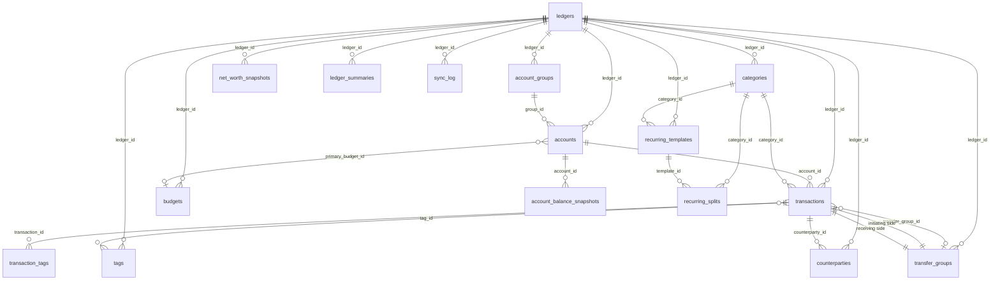

# Ledger Software — SQLite Database Schema Design

> **Version:** v2.0
> **Audience:** Engineering Team (including junior developers)
> **Goal:** Complete reference for building the ledger software database
> **Tech Stack:** SQLite 3.x (with JSON functions enabled)

---

## 1. Introduction

### 1.1 What Is This Document?

This document describes the complete database schema for a personal/family accounting application. It tells the engineering team exactly what tables to create, what each column means, how the tables relate to each other, and what business rules to follow.

Think of it as the **source of truth** for everything database-related: schema definition, indexes, triggers, data constraints, and the reasoning behind each design decision.

### 1.2 Why SQLite?

SQLite is a file-based, serverless database. It requires no separate database process to run — the application links SQLite in and talks to it directly. This makes it ideal for:

- Personal desktop/mobile apps (no server infrastructure needed)
- Single-user local storage
- Easy backup (just copy the `.db` file)

SQLite does not support stored procedures (we handle logic in the application layer) but it does support triggers, indexes, and JSON functions natively.

### 1.3 Core Concepts Before You Start

Before reading the schema, understand these key concepts in our system:

**Ledger** = A complete, isolated set of books. Like having separate spreadsheets for "Personal" and "Family" finances. All data is scoped to a ledger. Ledgers never share data.

**Multi-currency** = We store two amounts for every transaction:
- `amount` — the original currency (e.g., JPY 10,000)
- `amount_base` — converted to the ledger's base currency (e.g., SGD 92)

The conversion rate is **locked at import time**. It never changes, even if market rates fluctuate later. This ensures your historical reports stay accurate.

**Transfer Groups** = When you transfer money between accounts (or between ledgers), both sides of the transfer share the same `transfer_group_id`. This lets us track the pair as one logical transfer and prevents double-counting in reports.

**Pending vs Confirmed** = Some transactions (especially from recurring templates) are created in `pending` status first, meaning they are expected but not yet verified. The user confirms them later, and only then do they flow into reports.

---

## 2. Project Structure

```
ledger/
├── schema.sql              # All CREATE TABLE, INDEX, TRIGGER statements
├── seed.sql                # Initial data (default ledger, sample accounts)
├── migrations/             # Incremental migration scripts
│   ├── 001_init.sql
│   └── 002_add_feature.sql
└── queries/                # Common query templates as .sql files
    ├── monthly_summary.sql
    ├── budget_tracking.sql
    └── net_worth.sql
```

**Important:** All production SQL should be written to `.sql` files in `queries/` so they can be reviewed and tested independently. Avoid embedding long SQL strings in application code.

---

## 3. Data Type Conventions

### 3.1 IDs — Always TEXT (UUID)

We use UUID v4 for ALL primary keys. Example: `a1b2c3d4-e5f6-7890-abcd-ef1234567890`

**Why not AUTOINCREMENT integers?** UUIDs are better for our sync model (multiple devices generating records independently — IDs won't collide). They also make it impossible to guess record IDs, which is a minor security benefit.

```sql
-- Generate a UUID in SQLite
lower(hex(randomblob(16)))
```

### 3.2 Money/Amount Fields — Always REAL

We use SQLite's `REAL` type for all monetary values. This is a IEEE 754 double-precision float. **You must round to 2 decimal places in the application layer** before writing — SQLite will not do this for you.

```sql
-- In Python/SQLite, store like this:
ROUND(amount, 2)
```

### 3.3 Dates and Times

| Field type | Format | Example |
|------------|--------|---------|
| `date` | `YYYY/MM/DD` | `2026/05/13` |
| `time` | `HH:MM` | `07:51` |
| `*_at` (timestamps) | ISO 8601 | `2026-05-13T07:51:00` |
| `year_month` | `YYYY-MM` | `2026-05` |

All timestamps are stored as TEXT in ISO 8601 format. Always use `datetime('now')` in SQLite to generate them.

### 3.4 JSON Fields

Some fields store JSON arrays. Query them with SQLite's built-in `json_each()`:

```sql
-- Example: check if account_id is in budget's account_ids list
json_valid(b.account_ids) = 0 OR b.account_ids IS NULL OR t.account_id IN (
    SELECT value FROM json_each(b.account_ids)
)
```

The pattern `json_valid(field) = 0 OR field IS NULL` means "no filter specified" — use this to treat empty/null JSON as "all records match".

---

## 4. Enumeration Values

All check constraints are documented here. If you add a new enum value, update both the schema and this document.

### 4.1 Transaction Status (`transactions.status`)

| Value | Meaning | Included in Reports |
|-------|---------|---------------------|
| `pending` | Awaiting user confirmation | No |
| `confirmed` | Verified, should be counted | Yes |
| `cancelled` | Voided, should be ignored | No |

### 4.2 Account Types (`accounts.type`)

| Value | Meaning |
|-------|---------|
| `savings` | Bank savings account |
| `credit_card` | Credit card (current_balance is what you owe) |
| `investment` | Brokerage / investment account |
| `cash` | Physical cash |
| `fx` | Foreign currency account |
| `virtual` | Virtual account used for splitting income |

### 4.3 Category Types (`categories.type`)

| Value | Meaning |
|-------|---------|
| `expense` | Money leaving your account |
| `income` | Money entering your account |
| `transfer` | Internal transfer (usually between your own accounts) |
| `refund` | A refund (treated as income) |

### 4.4 Template Types (`recurring_templates.type`)

| Value | Meaning |
|-------|---------|
| `income` | Recurring income (e.g., salary) |
| `expense` | Recurring expense (e.g., rent) |
| `transfer` | Recurring transfer (e.g., monthly savings) |

### 4.5 Template Frequency (`recurring_templates.frequency`)

| Value | Meaning |
|-------|---------|
| `daily` | Every day |
| `weekly` | Every week, on `day_of_week` (0=Sunday, 6=Saturday) |
| `biweekly` | Every 14 days |
| `monthly` | Every month, on `day_of_month` (1–31) |
| `quarterly` | Every quarter, on `nth_weekday` + `day_of_week` |
| `yearly` | Once a year, same month/day as `start_date` |

### 4.6 Budget Types (`budgets.type`)

| Value | Meaning |
|-------|---------|
| `income` | Track income against a budget |
| `expense` | Track spending against a budget |

Note: We do NOT have a `transfer` budget type. Transfers do not change your net worth, so they don't need budgets.

### 4.7 Summary Types (`ledger_summaries.type`)

| Value | Meaning |
|-------|---------|
| `income` | Regular income (salary, etc.) |
| `expense` | Regular spending |
| `transfer_in` | Money transferred IN from another ledger |
| `transfer_out` | Money transferred OUT to another ledger |

---

## 5. Entity Relationship Diagram



**Reading the diagram:**
- `||--o{` means "one-to-many" (one ledger has many accounts)
- `}o--o|` means "optional many-to-many" or "many-to-one"
- `||--||` means "one-to-one" (in practice, two transaction records share one transfer_group)

---

## 6. Schema Definitions

### 6.1 `ledgers` — The Top Level

**What it does:** Represents a complete, isolated set of books. Everything else in the database belongs to a ledger. You might have a "Personal" ledger and a "Family Business" ledger — they share no data.

**In plain English:** A ledger is like a separate filing cabinet. All your financial data lives inside one cabinet, and you can have multiple cabinets for different purposes.

```sql
CREATE TABLE ledgers (
    id              TEXT PRIMARY KEY,
    name            TEXT NOT NULL,
    base_currency   TEXT NOT NULL DEFAULT 'SGD',
    is_default      INTEGER NOT NULL DEFAULT 0,
    created_at      TEXT NOT NULL,
    updated_at      TEXT NOT NULL
);
```

| Column | What it means |
|--------|--------------|
| `base_currency` | All `amount_base` values in this ledger are expressed in this currency. If you change this, you must recalculate ALL `amount_base` fields. |
| `is_default` | Only one ledger should be `1`. This is the ledger new users start in. |

> **⚠️ Changing `base_currency`:**
> This is a significant operation. You must recompute every `amount_base` in every transaction by applying the new exchange rate. The historical data will lose perfect precision (old rates may not be recoverable). Document this operation and consider requiring a confirmation dialog in the UI.

---

### 6.2 `account_groups` — Grouping Accounts

**What it does:** Organizes accounts into logical groups like "Savings", "Credit Cards", "Investments". Used for net worth calculations and UI grouping.

**In plain English:** Imagine grouping your bank accounts by their type. All your savings accounts go in one group, all your credit cards in another. The group has a setting that says "include in net worth calculation" — and individual accounts can override this.

```sql
CREATE TABLE account_groups (
    id                   TEXT PRIMARY KEY,
    ledger_id            TEXT NOT NULL REFERENCES ledgers(id) ON DELETE CASCADE,
    name                 TEXT NOT NULL,
    include_in_net_worth INTEGER NOT NULL DEFAULT 1,
    sort_order           INTEGER NOT NULL DEFAULT 0,
    created_at           TEXT NOT NULL,
    updated_at           TEXT NOT NULL
);
```

| Column | What it means |
|--------|--------------|
| `include_in_net_worth` | `1` = accounts in this group count toward your net worth by default. `0` = excluded (e.g., credit cards are liabilities, some users exclude them). Individual accounts can override this. |
| `sort_order` | UI display order within the group list |

---

### 6.3 `accounts` — Individual Accounts

**What it does:** Represents a single financial account (bank account, credit card, investment account, etc.). Every transaction belongs to exactly one account.

**In plain English:** This is the basic building block — one row per bank account or card. Your "UOB One savings account" is one row. Your "UOB LADY credit card" is another.

```sql
CREATE TABLE accounts (
    id                   TEXT PRIMARY KEY,
    ledger_id            TEXT NOT NULL REFERENCES ledgers(id) ON DELETE CASCADE,
    group_id             TEXT REFERENCES account_groups(id) ON DELETE SET NULL,
    name                 TEXT NOT NULL,
    type                 TEXT NOT NULL CHECK(type IN ('savings','credit_card','investment','cash','fx','virtual')),
    currency             TEXT NOT NULL DEFAULT 'SGD',
    current_balance      REAL NOT NULL DEFAULT 0,
    credit_limit         REAL,
    notes                TEXT,
    primary_budget_id    TEXT REFERENCES budgets(id) ON DELETE SET NULL,
    include_in_net_worth INTEGER,
    is_active            INTEGER NOT NULL DEFAULT 1,
    created_at           TEXT NOT NULL,
    updated_at           TEXT NOT NULL
);
```

| Column | What it means |
|--------|--------------|
| `group_id` | Which group this account belongs to. NULL means "ungrouped". |
| `current_balance` | The running balance after the most recent transaction. Updated automatically by a trigger when new transactions are inserted. |
| `credit_limit` | Only filled for `credit_card` type. The credit limit (e.g., 10,000 SGD). |
| `include_in_net_worth` | Override the group's default. NULL = "inherit from group". `0` or `1` = explicit override. |
| `primary_budget_id` | If set, this account is associated with one main budget. The budget will track spending on this account specifically. |

> **Net Worth Logic:**
> ```
> IF account.include_in_net_worth IS NOT NULL
>     THEN use account.include_in_net_worth
>     ELSE use account_groups.include_in_net_worth
> ```
> A credit card with a negative balance (you owe money) still counts as a liability in net worth calculations.

---

### 6.4 `categories` — Spending/Income Categories

**What it does:** Organizes transactions into types. "Food", "Transport", "Salary". Supports two levels: a parent category (e.g., "Food") and subcategories (e.g., "Food > Restaurants", "Food > Groceries").

**In plain English:** When you spend money, you tag it with a category. Categories are hierarchical — you can have "Food" as a parent and "Restaurants" and "Groceries" as children. The parent_name field points to the parent's ID (or NULL for top-level categories).

```sql
CREATE TABLE categories (
    id          TEXT PRIMARY KEY,
    ledger_id   TEXT NOT NULL REFERENCES ledgers(id) ON DELETE CASCADE,
    name        TEXT NOT NULL,
    parent_name TEXT,
    type        TEXT NOT NULL CHECK(type IN ('expense','income','transfer','refund')),
    icon        TEXT,
    sort_order  INTEGER NOT NULL DEFAULT 0
);
```

| Column | What it means |
|--------|--------------|
| `parent_name` | NULL for top-level categories. For subcategories, this is the parent's `name` field (not ID — note this is a design quirk, the parent row's `name` is used as reference). |
| `type` | Controls which transactions can use this category. An `income` category should not be used for an expense transaction. |

---

### 6.5 `tags` — Custom Tags

**What it does:** Provides an extra dimension for labeling transactions beyond categories. A transaction can have multiple tags. Unlike categories, tags do not imply type (any transaction can use any tag).

**In plain English:** Think of tags like Gmail labels. "Travel", "Business Trip", "Medical". You can filter your transactions by tag. Tags are global within a ledger — renaming a tag updates every transaction that uses it.

```sql
CREATE TABLE tags (
    id          TEXT PRIMARY KEY,
    ledger_id   TEXT NOT NULL REFERENCES ledgers(id) ON DELETE CASCADE,
    name        TEXT NOT NULL,
    color       TEXT
);
```

---

### 6.6 `transaction_tags` — Tag-to-Transaction Association

**What it does:** A many-to-many join table. One transaction can have multiple tags. One tag can be applied to many transactions.

**In plain English:** This table just holds pairs of (transaction_id, tag_id). It's a classic junction table. The combination is unique — you can't tag the same transaction with the same tag twice.

```sql
CREATE TABLE transaction_tags (
    transaction_id TEXT NOT NULL REFERENCES transactions(id) ON DELETE CASCADE,
    tag_id         TEXT NOT NULL REFERENCES tags(id) ON DELETE CASCADE,
    PRIMARY KEY (transaction_id, tag_id)
);
```

> **Note:** We don't need `ledger_id` here because `tag_id` already carries the ledger (via the `tags` table). Ledger isolation is achieved through the transaction's own `ledger_id`.

---

### 6.7 `counterparties` — Merchant/Payee Database

**What it does:** Standardizes merchant names so the same vendor doesn't appear as multiple variants in reports. When importing a CSV, the system tries to match the raw description against this table before creating a new entry.

**In plain English:** "7-Eleven" might appear in your bank statement as "7-Eleven", "7-11", "seven eleven", or "SEVEN ELEVEN". We store one canonical name and all its variants as aliases. When importing, we match against aliases first, then mark as "unverified" if it's a new match so the user can confirm.

```sql
CREATE TABLE counterparties (
    id                 TEXT PRIMARY KEY,
    ledger_id          TEXT NOT NULL REFERENCES ledgers(id) ON DELETE CASCADE,
    standardized_name  TEXT NOT NULL,
    aliases            TEXT,
    category           TEXT,
    logo_url           TEXT,
    is_verified        INTEGER NOT NULL DEFAULT 0,
    created_at        TEXT NOT NULL
);
```

| Column | What it means |
|--------|--------------|
| `aliases` | JSON array of alternate spellings. `["7-11", "7Eleven", "seven eleven"]` |
| `is_verified` | `0` = auto-matched, needs user confirmation. `1` = user has confirmed this is correct. |

**Match priority during CSV import:**
1. Exact match on `standardized_name`
2. Case-insensitive match on `standardized_name`
3. Fuzzy match against `aliases` JSON array
4. No match → create new entry with `is_verified = 0` (goes to a "pending review" queue)

---

### 6.8 `transfer_groups` — Transfer Metadata

**What it does:** Records the metadata for a money transfer (within same ledger or across ledgers). When you transfer $100 from Account A to Account B, both transaction records point to the same `transfer_group_id`.

**In plain English:** This table groups the two sides of a transfer together. It stores what currency you transferred, the exchange rate used, and the base currency amount. For cross-ledger transfers, this is the single source of truth that connects the two ledgers' views of the same transfer.

```sql
CREATE TABLE transfer_groups (
    id              TEXT PRIMARY KEY,
    ledger_id       TEXT NOT NULL REFERENCES ledgers(id) ON DELETE CASCADE,
    created_at      TEXT NOT NULL,
    amount_base     REAL NOT NULL,
    from_currency   TEXT NOT NULL,
    to_currency     TEXT NOT NULL,
    exchange_rate   REAL,
    notes           TEXT
);
```

| Column | What it means |
|--------|--------------|
| `ledger_id` | The ledger that initiated this transfer. Used for filtering in the ledger where the transfer started. |
| `amount_base` | The amount expressed in the initiating ledger's base currency. Both sides of the transfer share this value (converted on the receiving side). |

---

### 6.9 `transactions` — The Core Table ⭐

**What it does:** Every single financial event is stored here. Deposits, purchases, transfers, refunds — everything. This is the biggest, most important table in the system.

**In plain English:** This is where all the money data lives. Each row is one transaction — one debit or credit to one account. The `amount` field is the raw amount in the original currency. The `amount_base` field is the same amount converted to the ledger's base currency, locked at the time of import.

```sql
CREATE TABLE transactions (
    id                      TEXT PRIMARY KEY,
    ledger_id               TEXT NOT NULL REFERENCES ledgers(id) ON DELETE CASCADE,
    account_id              TEXT NOT NULL REFERENCES accounts(id) ON DELETE RESTRICT,
    date                    TEXT NOT NULL,
    time                    TEXT,
    amount                  REAL NOT NULL,
    amount_base             REAL NOT NULL,
    exchange_rate           REAL NOT NULL,
    exchange_rate_date      TEXT,
    description             TEXT,
    category_id             TEXT REFERENCES categories(id) ON DELETE SET NULL,
    counterparty_id         TEXT REFERENCES counterparties(id) ON DELETE SET NULL,
    transfer_group_id      TEXT REFERENCES transfer_groups(id) ON DELETE SET NULL,
    status                  TEXT NOT NULL DEFAULT 'confirmed' CHECK(status IN ('pending','confirmed','cancelled')),
    confirmed_at            TEXT,
    source_template_id      TEXT REFERENCES recurring_templates(id) ON DELETE SET NULL,
    source_split_id         TEXT REFERENCES recurring_splits(id) ON DELETE SET NULL,
    balance_after           REAL NOT NULL,
    currency                TEXT NOT NULL DEFAULT 'SGD',
    notes                   TEXT,
    created_at              TEXT NOT NULL,
    UNIQUE(account_id, date, time, amount, description)
);
```

| Column | What it means |
|--------|--------------|
| `amount` | Positive = money in (income / transfer received). Negative = money out (expense / transfer sent). |
| `amount_base` | `amount` converted to the ledger's base currency, **locked at import time**. This never changes, even if exchange rates change later. Use this for all cross-currency aggregations. |
| `exchange_rate` | The rate used to convert `amount` to `amount_base`. E.g., if you spend JPY 10,000 and the rate was 0.0092, `amount_base` = 10,000 × 0.0092 = 92 SGD. |
| `exchange_rate_date` | Which date's exchange rate was used |
| `transfer_group_id` | NULL = normal transaction. Non-NULL = this is one side of a transfer. Two transactions with the same `transfer_group_id` = a linked transfer pair. |
| `status` | `pending` (not yet confirmed), `confirmed` (normal), `cancelled` (voided). Only `confirmed` transactions count in reports. |
| `confirmed_at` | When the user confirmed a `pending` transaction |
| `source_template_id` | If this transaction came from a recurring template, this points to the template |
| `source_split_id` | If this transaction is from a split (分摊) rule, this points to the split |
| `balance_after` | The account balance AFTER this transaction. Updated by trigger. Used for the balance curve chart. |
| `UNIQUE` constraint | Prevents accidental duplicate imports of the same transaction |

> **⚠️ `ON DELETE RESTRICT` on `account_id`:**
> You cannot delete an account that has transactions. This is a safety measure — deleting an account would destroy your financial history. If you really need to close an account, mark it `is_active = 0` instead.

> **Multi-currency Example:**
> You buy something for JPY 10,000 on May 13, 2026.
> - `currency` = `JPY`
> - `amount` = `-10000`
> - `exchange_rate` = `0.0092` (1 JPY = 0.0092 SGD on that date)
> - `amount_base` = `-92` (SGD equivalent, locked)
>
> Next month JPY strengthens. Your ledger base is still SGD.
> The `amount_base` stays at `-92` — it does NOT change. Your historical reports remain accurate.

---

### 6.10 `account_balance_snapshots` — Daily Balance History

**What it does:** Stores one snapshot of each account's balance per day. Used to draw the balance trend chart in the UI.

**In plain English:** Every time a transaction is inserted, a trigger automatically records the new balance for that day. If a snapshot for that day already exists, it's ignored (`INSERT OR IGNORE`). The result is a clean daily time series — one row per account per day.

```sql
CREATE TABLE account_balance_snapshots (
    id          TEXT PRIMARY KEY,
    account_id  TEXT NOT NULL REFERENCES accounts(id) ON DELETE CASCADE,
    date        TEXT NOT NULL,
    balance     REAL NOT NULL,
    UNIQUE(account_id, date)
);
```

> **Performance note:** This table grows by ~365 rows per account per year. For 10 accounts over 5 years, that's ~18,000 rows — perfectly fine for SQLite. Queries for balance charts should use this table, NOT compute from transactions directly (that would be slow on large datasets).

---

### 6.11 `budgets` — Budget Tracking

**What it does:** Sets spending or income targets per period. Supports rollover (unused budget from last month carries forward), filters (budget applies only to certain accounts/categories/tags), and warning alerts.

**In plain English:** "I want to spend at most SGD 500 on food this month." That's a budget. You can also say "track only my UOB card for food, not my cash". If you have leftover budget at the end of the month and `rollover = 1`, the leftover carries forward to next month.

```sql
CREATE TABLE budgets (
    id              TEXT PRIMARY KEY,
    ledger_id       TEXT NOT NULL REFERENCES ledgers(id) ON DELETE CASCADE,
    name            TEXT,
    type            TEXT NOT NULL CHECK(type IN ('income', 'expense')),
    amount          REAL NOT NULL,
    carry_forward   REAL NOT NULL DEFAULT 0,
    frequency       TEXT NOT NULL CHECK(frequency IN ('daily','weekly','biweekly','monthly','quarterly','yearly')),
    start_date      TEXT NOT NULL,
    end_date        TEXT,
    is_recurring    INTEGER NOT NULL DEFAULT 1,
    rollover        INTEGER NOT NULL DEFAULT 0,
    rollover_limit  REAL,
    account_ids     TEXT,
    category_ids    TEXT,
    tag_ids         TEXT,
    warning_pct     REAL NOT NULL DEFAULT 80,
    created_at      TEXT NOT NULL,
    updated_at      TEXT NOT NULL,
    UNIQUE(ledger_id, name, frequency, start_date)
);
```

| Column | What it means |
|--------|--------------|
| `amount` | The budget amount for one period, in the ledger's base currency |
| `carry_forward` | Amount brought forward from the previous period. Updated automatically at period end. |
| `rollover` | `1` = unused budget carries to next period. `0` = budget resets each period. |
| `rollover_limit` | Maximum amount that can be carried forward. Prevents runaway rollover from very large unused budgets. NULL = no limit. |
| `account_ids` / `category_ids` / `tag_ids` | JSON arrays. If NULL or empty, the budget applies to ALL matching transactions. If set, only transactions matching at least one of the listed items count. All three are AND-combined (must match all non-empty filters). |
| `warning_pct` | Alert threshold. Default 80% — send warning when 80% of budget is spent. |
| `is_recurring` | `1` = automatically repeat this budget at period end. `0` = one-shot budget. |

**Filter Logic (important):**
```sql
-- A transaction matches a budget IF:
--   (account_ids is null/empty OR account_id is in the list)  AND
--   (category_ids is null/empty OR category_id is in the list) AND
--   (tag_ids is null/empty OR transaction has one of the listed tags)
```

**Rollover Logic (at period end):**
```
closing_balance = amount + carry_forward - actual_spent
if rollover = 1 AND closing_balance > 0 AND closing_balance <= rollover_limit:
    carry_forward = closing_balance
else:
    carry_forward = 0
```

---

### 6.12 `recurring_templates` — Recurring Transaction Templates

**What it does:** Defines automated transactions that repeat on a schedule (daily, weekly, monthly, etc.). Can auto-post (create a `confirmed` transaction immediately) or create a `pending` transaction for user review first.

**In plain English:** "Pay rent of SGD 2,000 on the 1st of every month from my DBS account." That's a recurring template. When it's time to execute, the system either creates the transaction automatically or asks you to confirm first.

```sql
CREATE TABLE recurring_templates (
    id                      TEXT PRIMARY KEY,
    ledger_id               TEXT NOT NULL REFERENCES ledgers(id) ON DELETE CASCADE,
    name                    TEXT,
    type                    TEXT NOT NULL CHECK(type IN ('income','expense','transfer')),
    amount                  REAL,
    amount_varies           INTEGER NOT NULL DEFAULT 0,
    splits_enabled          INTEGER NOT NULL DEFAULT 0,
    account_id              TEXT REFERENCES accounts(id) ON DELETE RESTRICT,
    from_account_id         TEXT REFERENCES accounts(id) ON DELETE RESTRICT,
    category_id             TEXT REFERENCES categories(id) ON DELETE RESTRICT,
    frequency               TEXT NOT NULL CHECK(frequency IN ('daily','weekly','biweekly','monthly','quarterly','yearly')),
    day_of_month            INTEGER,
    day_of_week             INTEGER,
    nth_weekday             INTEGER,
    start_date              TEXT NOT NULL,
    end_date                TEXT,
    auto_post               INTEGER NOT NULL DEFAULT 1,
    reminder_days_before    INTEGER NOT NULL DEFAULT 3,
    is_active               INTEGER NOT NULL DEFAULT 1,
    is_archived             INTEGER NOT NULL DEFAULT 0,
    max_executions          INTEGER,
    last_executed_at        TEXT,
    notes                   TEXT,
    created_at              TEXT NOT NULL,
    updated_at              TEXT NOT NULL
);
```

| Column | What it means |
|--------|--------------|
| `amount` | The amount. NULL means "figure it out from the previous actual amount" (useful for variable expenses like electricity bills). |
| `amount_varies` | `1` = amount is not fixed, always use last actual amount. `0` = use the `amount` field. |
| `splits_enabled` | `1` = split this income across multiple accounts (see `recurring_splits`). Used for salary splitting. |
| `account_id` | For income: the account receiving money. For expense: the account paying. For transfer: the destination account. |
| `from_account_id` | For transfers only: the source account. Leave NULL for income/expense. |
| `auto_post` | `1` = auto-create a `confirmed` transaction when due. `0` = create a `pending` transaction and notify the user to confirm. |
| `reminder_days_before` | How many days before the due date to send a reminder (e.g., "rent is due in 3 days") |
| `is_archived` | `1` = this template is done/closed. It no longer appears in the active templates list. |
| `max_executions` | NULL = run forever. A number = stop after this many executions. When reached, the cron job sets `is_archived = 1`. |
| `last_executed_at` | Timestamp of the last time this template ran. Used to compute the next execution date. |

**Required fields by type:**
| Type | Required fields |
|------|----------------|
| `income` | `account_id` (destination), `category_id` |
| `expense` | `account_id` (source), `category_id` |
| `transfer` | `from_account_id` (source), `account_id` (destination) |

---

### 6.13 `recurring_splits` — Income Splitting Rules

**What it does:** When enabled, splits one recurring income (like a salary) across multiple target accounts by percentage or fixed amount. E.g., "60% to savings, 40% to investment".

**In plain English:** You get paid SGD 5,000. You want SGD 3,000 to go to your savings account and SGD 2,000 to your investment account. You configure one template with `splits_enabled = 1` and two split rules. When the template executes, two transaction records are created instead of one.

```sql
CREATE TABLE recurring_splits (
    id              TEXT PRIMARY KEY,
    template_id     TEXT NOT NULL REFERENCES recurring_templates(id) ON DELETE CASCADE,
    account_id      TEXT NOT NULL REFERENCES accounts(id) ON DELETE RESTRICT,
    amount_pct      REAL,
    amount_abs      REAL,
    category_id     TEXT REFERENCES categories(id) ON DELETE RESTRICT,
    description     TEXT,
    sort_order      INTEGER NOT NULL DEFAULT 0,
    CHECK (amount_pct IS NOT NULL OR amount_abs IS NOT NULL)
);
```

| Column | What it means |
|--------|--------------|
| `amount_pct` | Percentage (0–100). `50` means 50%. Cannot mix with `amount_abs` in the same row. |
| `amount_abs` | Fixed amount in the ledger's base currency. `2000` means SGD 2,000. Cannot mix with `amount_pct` in the same row. |

> **Constraint:** Each row must have either `amount_pct` OR `amount_abs`, not both. The CHECK constraint enforces this.

---

### 6.14 `net_worth_snapshots` — Wealth Over Time

**What it does:** Stores periodic snapshots of the ledger's net worth (total assets minus total liabilities), broken down by category (investment assets, total debt).

**In plain English:** On the last day of each month, the system records: "Your net worth is SGD 87,432. Of that, SGD 50,000 is investments, SGD 10,000 is debt." This is how your wealth trends over months and years.

```sql
CREATE TABLE net_worth_snapshots (
    id              TEXT PRIMARY KEY,
    ledger_id       TEXT NOT NULL REFERENCES ledgers(id) ON DELETE CASCADE,
    date            TEXT NOT NULL,
    total_base      REAL,
    total_investment REAL,
    total_debt      REAL,
    notes           TEXT,
    UNIQUE(ledger_id, date)
);
```

> **How net worth is computed:**
> For each account with `include_in_net_worth = 1` (or inheriting from group):
> - If `current_balance` is positive → counts as asset
> - If `current_balance` is negative (credit card) → counts as liability
> Sum all assets - sum all liabilities = `total_base`

---

### 6.15 `ledger_summaries` — Pre-Aggregated Monthly Reports

**What it does:** Stores pre-computed monthly totals by category (income/expense/transfer_in/transfer_out). This table is updated automatically by triggers whenever transactions are inserted or modified.

**In plain English:** Instead of scanning all transactions every time you view a monthly report, we pre-compute and store the totals here. Every time a transaction is confirmed, the trigger adds that amount to the right bucket. Reports just read from this table — it's fast.

This table also **solves the cross-ledger transfer double-counting problem**: when money moves between ledgers, the initiating ledger records it as `transfer_out` and the receiving ledger records it as `transfer_in`. When computing global totals, we only count `income` + `expense` + `transfer_out` (NOT `transfer_in`, because that would count the same money twice).

```sql
CREATE TABLE ledger_summaries (
    id                  TEXT PRIMARY KEY,
    ledger_id           TEXT NOT NULL REFERENCES ledgers(id) ON DELETE CASCADE,
    year_month          TEXT NOT NULL,
    type                TEXT NOT NULL CHECK(type IN ('income','expense','transfer_in','transfer_out')),
    total_base          REAL NOT NULL,
    transaction_count   INTEGER NOT NULL DEFAULT 0,
    UNIQUE(ledger_id, year_month, type)
);
```

> **⚠️ Do not modify this table manually.** It is maintained entirely by triggers. If you need to correct a summary, fix the underlying transaction(s) — the trigger will recalculate automatically.

---

### 6.16 `exchange_rates` — Historical Exchange Rates

**What it does:** Stores daily exchange rates for all currencies relative to SGD. Used during CSV import to convert transaction amounts to the ledger's base currency.

**In plain English:** When you import a transaction in JPY, the system looks up the JPY/SGD rate for that date here. If not found, it calls an external API. The rate is stored alongside the transaction and never changes.

```sql
CREATE TABLE exchange_rates (
    date        TEXT NOT NULL,
    currency    TEXT NOT NULL,
    rate_to_sgd REAL NOT NULL,
    source      TEXT,
    PRIMARY KEY (date, currency)
);
```

| Column | What it means |
|--------|--------------|
| `rate_to_sgd` | 1 unit of `currency` = `rate_to_sgd` SGD. E.g., `rate_to_sgd = 0.0092` for JPY means ¥1 = SGD 0.0092. |
| `source` | Where the rate came from: `" ECB"`, `" Yahoo Finance"`, `" manual"` |

---

### 6.17 `sync_log` — Multi-Device Sync Metadata

**What it does:** Tracks the last synchronization state for each device per ledger. Used for incremental sync — when a device syncs, it only downloads transactions newer than `last_txn_id`.

**In plain English:** Your phone and laptop both use the same ledger. Each device has a device ID. When your phone syncs, we record what the latest transaction was at that moment. Next time your phone syncs, we only fetch transactions after that ID.

```sql
CREATE TABLE sync_log (
    device_id       TEXT PRIMARY KEY,
    ledger_id       TEXT NOT NULL REFERENCES ledgers(id) ON DELETE CASCADE,
    last_sync_at    TEXT NOT NULL,
    last_txn_id     TEXT
);
```

---

## 7. Indexes

Indexes speed up queries. Without them, SQLite would scan every row in a table ("full table scan") — fine for small tables, terrible for transactions with 10,000+ rows.

```sql
-- Account groups (find all groups in a ledger)
CREATE INDEX idx_ag_ledger ON account_groups(ledger_id);

-- Accounts (find all accounts in a ledger, or by group)
CREATE INDEX idx_acc_ledger ON accounts(ledger_id);
CREATE INDEX idx_acc_group ON accounts(group_id);

-- Categories (find all categories in a ledger)
CREATE INDEX idx_cat_ledger ON categories(ledger_id);

-- Tags (find tags in a ledger)
CREATE INDEX idx_tags_ledger ON tags(ledger_id);

-- Counterparties (find merchants in a ledger)
CREATE INDEX idx_counterparty_ledger ON counterparties(ledger_id);
CREATE INDEX idx_counterparty_verified ON counterparties(is_verified);

-- Transactions — most important indexes
-- Query pattern: "all transactions in a ledger between two dates"
CREATE INDEX idx_txn_ledger_date ON transactions(ledger_id, date);
-- Query pattern: "all transactions for one account"
CREATE INDEX idx_txn_account_date ON transactions(account_id, date);
-- Query pattern: "find transactions by category"
CREATE INDEX idx_txn_category ON transactions(category_id);
-- Query pattern: "find both sides of a transfer"
CREATE INDEX idx_txn_transfer_group ON transactions(transfer_group_id);
-- Query pattern: "find pending transactions"
CREATE INDEX idx_txn_pending ON transactions(ledger_id, status) WHERE status = 'pending';

-- Transaction-tag associations
CREATE INDEX idx_txntag_txn ON transaction_tags(transaction_id);
CREATE INDEX idx_txntag_tag ON transaction_tags(tag_id);

-- Balance snapshots (balance chart query)
CREATE INDEX idx_snap_account_date ON account_balance_snapshots(account_id, date);

-- Budgets (find active budgets for a ledger)
CREATE INDEX idx_budget_ledger_freq ON budgets(ledger_id, frequency, start_date);

-- Recurring templates (find active templates)
CREATE INDEX idx_recurring_ledger_active ON recurring_templates(ledger_id, is_active) WHERE is_active = 1;
CREATE INDEX idx_recurring_ledger_archived ON recurring_templates(ledger_id, is_archived) WHERE is_archived = 0;

-- Ledger summaries (monthly report query)
CREATE INDEX idx_summary_ledger_month ON ledger_summaries(ledger_id, year_month);

-- Net worth snapshots
CREATE INDEX idx_networth_ledger_date ON net_worth_snapshots(ledger_id, date);

-- Exchange rates
CREATE INDEX idx_rate_date ON exchange_rates(date);
CREATE INDEX idx_rate_currency ON exchange_rates(currency);
```

---

## 8. Cascade Delete Policy

When you delete a parent record, what happens to the child records? We use three strategies:

| Strategy | What it means | When we use it |
|----------|--------------|----------------|
| `ON DELETE CASCADE` | Deleting the parent automatically deletes all children | Ledger-level cascade (delete a ledger → delete everything) |
| `ON DELETE SET NULL` | Deleting the parent sets the FK to NULL | When the child should survive, losing the link is acceptable |
| `ON DELETE RESTRICT` | Deleting the parent is blocked if children exist | When destroying the relationship would destroy financial history |

**Detailed table:**

| Parent | Child | Behavior | Reason |
|--------|-------|----------|--------|
| `ledgers` | All tables | CASCADE | Delete a ledger → delete all its data |
| `accounts` | `transactions` | RESTRICT | Never delete an account with transactions. Use `is_active = 0` instead. |
| `accounts` | `account_balance_snapshots` | CASCADE | Snapshots are meaningless without the account |
| `accounts` | `budgets` (primary_budget_id) | SET NULL | Budget survives, just loses its linked account |
| `accounts` | `recurring_templates` | RESTRICT | Cannot delete an account used by a template |
| `accounts` | `recurring_splits` | RESTRICT | Cannot delete an account used by a split rule |
| `categories` | `transactions` | SET NULL | Transaction history preserved, category becomes "uncategorized" |
| `categories` | `recurring_templates` | RESTRICT | Cannot delete a category used by a template |
| `tags` | `transaction_tags` | CASCADE | Tag association goes away, transaction preserved |
| `transactions` | `transaction_tags` | CASCADE | When transaction is deleted, clean up tag links |
| `transfer_groups` | `transactions` | SET NULL | Transaction preserved, loses its transfer group link |
| `recurring_templates` | `transactions` (source_template_id) | SET NULL | Transaction preserved, loses template link |
| `recurring_templates` | `recurring_splits` | CASCADE | Splits are only meaningful with their template |
| `account_groups` | `accounts` | SET NULL | Accounts survive, become "ungrouped" |

---

## 9. Triggers

Triggers automatically run SQL statements in response to INSERT/UPDATE/DELETE events on a table. We use triggers to keep derived data (balances, summaries, snapshots) in sync automatically.

### 9.1 Auto-Update Account Balance

When a new transaction is inserted, update the account's `current_balance` to match the transaction's `balance_after`.

```sql
CREATE TRIGGER tr_update_account_balance
AFTER INSERT ON transactions
FOR EACH ROW
BEGIN
    UPDATE accounts
    SET current_balance = NEW.balance_after,
        updated_at = datetime('now')
    WHERE id = NEW.account_id;
END;
```

### 9.2 Auto-Insert Balance Snapshot

When a transaction is inserted, record a snapshot for that account on that date (if one doesn't already exist).

```sql
CREATE TRIGGER tr_snapshot_balance
AFTER INSERT ON transactions
FOR EACH ROW
WHEN NEW.balance_after IS NOT NULL
BEGIN
    INSERT OR IGNORE INTO account_balance_snapshots (id, account_id, date, balance)
    VALUES (
        lower(hex(randomblob(16))),
        NEW.account_id,
        NEW.date,
        NEW.balance_after
    );
END;
```

> Note the `INSERT OR IGNORE` — if a snapshot for today already exists, this does nothing. This prevents duplicate snapshots on the same day.

### 9.3 Auto-Update Ledger Summary (Insert)

When a `confirmed` transaction is inserted, update the corresponding `ledger_summaries` row. If the row doesn't exist yet, create it (`ON CONFLICT DO UPDATE`).

```sql
CREATE TRIGGER tr_update_ledger_summary
AFTER INSERT ON transactions
FOR EACH ROW
WHEN NEW.status = 'confirmed'
BEGIN
    INSERT INTO ledger_summaries (id, ledger_id, year_month, type, total_base, transaction_count)
    VALUES (
        lower(hex(randomblob(16))),
        NEW.ledger_id,
        strftime('%Y-%m', NEW.date),
        CASE
            WHEN NEW.transfer_group_id IS NOT NULL AND NEW.amount > 0 THEN 'transfer_in'
            WHEN NEW.transfer_group_id IS NOT NULL AND NEW.amount < 0 THEN 'transfer_out'
            WHEN NEW.amount > 0 THEN 'income'
            ELSE 'expense'
        END,
        NEW.amount_base,
        1
    )
    ON CONFLICT(ledger_id, year_month, type) DO UPDATE SET
        total_base = total_base + NEW.amount_base,
        transaction_count = transaction_count + 1;
END;
```

### 9.4 Auto-Update Ledger Summary (Status Change)

When a transaction's status changes FROM `confirmed`, we need to reverse its effect on the summary (subtract the amount and decrement the count). This handles the flow when a user cancels a transaction or confirms a pending one.

```sql
CREATE TRIGGER tr_update_ledger_summary_status
AFTER UPDATE OF status ON transactions
FOR EACH ROW
WHEN OLD.status = 'confirmed' AND NEW.status != 'confirmed'
BEGIN
    INSERT INTO ledger_summaries (id, ledger_id, year_month, type, total_base, transaction_count)
    VALUES (
        lower(hex(randomblob(16))),
        NEW.ledger_id,
        strftime('%Y-%m', NEW.date),
        CASE
            WHEN NEW.transfer_group_id IS NOT NULL AND NEW.amount > 0 THEN 'transfer_in'
            WHEN NEW.transfer_group_id IS NOT NULL AND NEW.amount < 0 THEN 'transfer_out'
            WHEN NEW.amount > 0 THEN 'income'
            ELSE 'expense'
        END,
        -NEW.amount_base,
        -1
    )
    ON CONFLICT(ledger_id, year_month, type) DO UPDATE SET
        total_base = total_base - OLD.amount_base,
        transaction_count = transaction_count - 1;
END;
```

---

## 10. Key SQL Queries

### 10.1 Monthly Spending by Category

```sql
SELECT
    c.id,
    c.name,
    SUM(t.amount_base * -1) AS total_base
FROM transactions t
JOIN categories c ON t.category_id = c.id
WHERE t.ledger_id = 'default'
  AND t.date LIKE '2026/05%'
  AND t.amount < 0                    -- spending only
  AND t.transfer_group_id IS NULL     -- exclude transfers
  AND t.status = 'confirmed'           -- confirmed only
GROUP BY c.id
ORDER BY total_base DESC;
```

### 10.2 Monthly Cash Flow

```sql
SELECT
    SUM(CASE WHEN amount > 0 THEN amount_base ELSE 0 END) AS income_base,
    SUM(CASE WHEN amount < 0 THEN amount_base ELSE 0 END) AS expense_base,
    SUM(amount_base) AS net_base
FROM transactions
WHERE ledger_id = 'default'
  AND date LIKE '2026/05%'
  AND transfer_group_id IS NULL
  AND status = 'confirmed';
```

### 10.3 Budget Progress

```sql
SELECT
    b.id, b.name,
    b.amount + b.carry_forward AS budget_total,
    COALESCE(SUM(t.amount_base * -1), 0) AS spent_base,
    b.amount + b.carry_forward - COALESCE(SUM(t.amount_base * -1), 0) AS remaining_base,
    ROUND(COALESCE(SUM(t.amount_base * -1), 0) / (b.amount + b.carry_forward) * 100, 1) AS pct,
    CASE
        WHEN COALESCE(SUM(t.amount_base * -1), 0) / (b.amount + b.carry_forward) >= b.warning_pct / 100
        THEN '⚠️ OVER THRESHOLD'
        ELSE '✅ OK'
    END AS status
FROM budgets b
LEFT JOIN transactions t ON t.ledger_id = b.ledger_id
    AND t.date >= b.start_date
    AND t.date < date(b.start_date, '+1 month')  -- within period
    AND t.status = 'confirmed'
    AND t.transfer_group_id IS NULL
    AND (b.account_ids IS NULL OR json_valid(b.account_ids) = 0
         OR t.account_id IN (SELECT value FROM json_each(b.account_ids)))
    AND (b.category_ids IS NULL OR json_valid(b.category_ids) = 0
         OR t.category_id IN (SELECT value FROM json_each(b.category_ids)))
    AND (b.tag_ids IS NULL OR json_valid(b.tag_ids) = 0
         OR EXISTS (SELECT 1 FROM transaction_tags tt
                    WHERE tt.transaction_id = t.id
                    AND tt.tag_id IN (SELECT value FROM json_each(b.tag_ids))))
WHERE b.ledger_id = 'default'
GROUP BY b.id;
```

---

## 11. CSV Import Logic

### 11.1 File Format Detection

The first line of the CSV tells us the delimiter:

```
sep=|      ← pipe-delimited
sep=,      ← comma-delimited
```

If neither is present, treat as comma-delimited.

### 11.2 Import Flow

```
Read file
  ↓
Detect delimiter from sep= line
  ↓
For each data row:
  ├─ If 命名 (account name) column is non-empty:
  │   → Create/update accounts table
  │   → Switch "current account" to this account
  │
  ├─ If 日期 (date) column is non-empty:
  │   → Create a transaction record
  │   → Determine if it's income/expense or transfer
  │   │
  │   ├─ Normal transaction (no transfer keywords):
  │   │   → Look up exchange rate for date + currency
  │   │   → Compute amount_base = amount × exchange_rate
  │   │   → Set status = 'confirmed'
  │   │
  │   └─ Transfer (description contains "转出"/"转入"):
  │       → Look up or create transfer_groups record
  │       → Create TWO transaction records (from and to)
  │       → Both share the same transfer_group_id
  │
  └─ Other columns → update current record
```

### 11.3 Exchange Rate Priority

1. Check `exchange_rates` table for `date` + `currency` → use it
2. Call external API (Open Exchange Rates / Yahoo Finance) → cache result in `exchange_rates`
3. If all else fails, prompt user to enter rate manually

### 11.4 Cross-Ledger Transfer Example

Transfer SGD 80,000 from "Personal" ledger UOB account to "Business" ledger CMB account (CNY 6,000):

```
1. Insert transfer_groups (ledger_id = 'personal')
   amount_base = -80,000 (negative = outgoing)
   from_currency = SGD, to_currency = CNY

2. Insert transaction in Personal ledger:
   amount = -80,000 SGD
   amount_base = -80,000
   type = transfer_out

3. Insert transaction in Business ledger:
   amount = +6,000 CNY
   amount_base = -80,000 (same base amount, converted at that moment's rate)
   type = transfer_in
```

Both transactions have the same `transfer_group_id`. When computing reports:
- Personal ledger: counts as `transfer_out`
- Business ledger: counts as `transfer_in`
- Global summary: counts `transfer_out` only (prevents double-counting)

---

## 12. Seed Data (Initial Setup)

These records are created when the database is first initialized:

```sql
-- Default ledger
INSERT INTO ledgers (id, name, base_currency, is_default, created_at, updated_at)
VALUES ('default', 'My Ledger', 'SGD', 1, datetime('now'), datetime('now'));

-- Sample account groups
INSERT INTO account_groups (id, ledger_id, name, include_in_net_worth, sort_order, created_at, updated_at)
VALUES
    ('grp_savings', 'default', 'Savings', 1, 1, datetime('now'), datetime('now')),
    ('grp_credit',  'default', 'Credit Cards', 0, 2, datetime('now'), datetime('now')),
    ('grp_invest',  'default', 'Investments', 1, 3, datetime('now'), datetime('now'));

-- Sample accounts
INSERT INTO accounts (id, ledger_id, group_id, name, type, currency, current_balance, created_at, updated_at)
VALUES
    ('UOB_One',   'default', 'grp_savings', 'UOB One',      'savings', 'SGD', 0, datetime('now'), datetime('now')),
    ('UOB_LADY',  'default', 'grp_credit',  'UOB LADY',     'credit_card', 'SGD', 0, datetime('now'), datetime('now'));
```

---

## 13. Design Decisions and Rationale

These are the non-obvious decisions made during schema design, with explanations of why we chose this approach. If you're wondering "why does it work this way?", the answer is here.

| # | Decision | Rationale |
|---|----------|------------|
| 1 | All primary keys are UUID TEXT | Our sync model has multiple devices creating records independently. Auto-increment integers would collide. UUIDs are safe for distributed generation. |
| 2 | `amount_base` is locked at import time | If we recalculated `amount_base` every time rates changed, your past monthly reports would shift every day. Locking at import time preserves historical accuracy. |
| 3 | `transfer_group_id` unifies all transfers | Both same-ledger and cross-ledger transfers use the same mechanism. The initiating ledger's `transfer_group` record is the authoritative source. |
| 4 | `ledger_summaries` is pre-aggregated | Scanning thousands of transactions for every monthly report would be slow. Pre-aggregation (updated by trigger on every write) makes reports instant. |
| 5 | Tags use a junction table, not JSON | If you rename a tag, the junction table approach updates it in one place (the `tags` row). A JSON array approach would require scanning and updating every transaction record that contains the tag. |
| 6 | `counterparties` has a `aliases` JSON field | Bank statements spell merchant names dozens of different ways. A single `aliases` array lets us match all variants without creating duplicate merchant records. |
| 7 | Budgets have no `transfer` type | Transfers don't change net worth — money leaving one account just enters another. They don't need budget tracking. |
| 8 | Two-level `include_in_net_worth` | Users disagree about whether credit cards should count in net worth. The group-level default handles the norm; the account-level override handles exceptions. |
| 9 | Three JSON filter arrays in budgets | Some users want a budget for "dining out" (category filter). Others want "UOB card only" (account filter). The three arrays can combine: "UOB card + dining out + business trips". All three must match. |
| 10 | `category_id` ON DELETE SET NULL | Deleting a category shouldn't delete the transactions — that's your financial history. The category field becomes NULL and the transaction shows as "uncategorized". |
| 11 | `account_id` ON DELETE RESTRICT | An account with transaction history cannot be deleted. This prevents accidental data loss. To "close" an account, set `is_active = 0`. |
| 12 | `balance_after` stored on transactions | Every transaction records what the balance was after it posted. This enables the balance curve chart without querying the snapshot table in reverse. The trigger keeps `accounts.current_balance` in sync automatically. |

---

## 14. Future Considerations (Not Implemented Yet)

These features are planned but not in the current schema. If you're implementing them later, add new tables in `migrations/` — do not modify this document for future features.

| Feature | Description |
|---------|-------------|
| Investment holdings | `holdings` table — track stock positions (symbol, shares, cost basis) linked to `net_worth_snapshots` |
| Installment tracking | Add `installment_total` and `installment_paid` to `recurring_templates` for tracking payment progress |
| Bill calendar | Recurring template due-date reminders via cron + Telegram notification |
| Annual tax report | Export全年数据 by IRAS tax categories |
| Web admin UI | Flask/React web interface for managing the ledger |
| AI category suggestions | LLM-based auto-categorization from transaction description |
