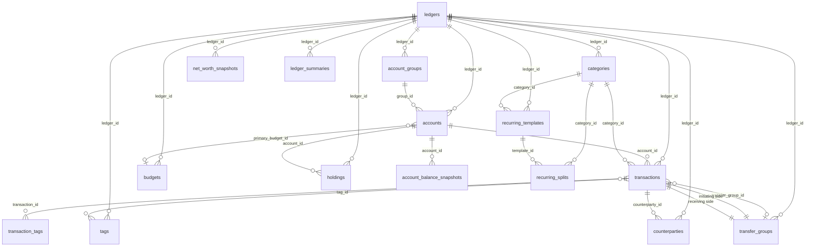

# Ledger Software — SQLite Database Schema Design

> **Version:** v2.0
> **Audience:** Engineering Team (including junior developers)
> **Goal:** Complete reference for building the ledger software database
> **Tech Stack:** SQLite 3.x (with JSON functions enabled)

---

## 1. Introduction

### 1.1 What Is This Document?

This document describes the complete database schema for a personal/family accounting application. It tells the engineering team exactly what tables to create, what each column means, how the tables relate to each other, and what business rules to follow.

Think of it as the **source of truth** for everything database-related: schema definition, indexes, triggers, data constraints, and the reasoning behind each design decision.

### 1.2 Why SQLite?

SQLite is a file-based, serverless database. It requires no separate database process to run — the application links SQLite in and talks to it directly. This makes it ideal for:

- Personal desktop/mobile apps (no server infrastructure needed)
- Single-user local storage
- Easy backup (just copy the `.db` file)

SQLite does not support stored procedures (we handle logic in the application layer) but it does support triggers, indexes, and JSON functions natively.

### 1.3 Core Concepts Before You Start

Before reading the schema, understand these key concepts in our system:

**Ledger** = A complete, isolated set of books. Like having separate spreadsheets for "Personal" and "Family" finances. All data is scoped to a ledger. Ledgers never share data.

**Multi-currency** = We store two amounts for every transaction:
- `amount` — the original currency (e.g., JPY 10,000)
- `amount_base` — converted to the ledger's base currency (e.g., SGD 92)

The conversion rate is **locked at import time**. It never changes, even if market rates fluctuate later. This ensures your historical reports stay accurate.

**Transfer Groups** = When you transfer money between accounts (or between ledgers), both sides of the transfer share the same `transfer_group_id`. This lets us track the pair as one logical transfer and prevents double-counting in reports.

**Pending vs Confirmed** = Some transactions (especially from recurring templates) are created in `pending` status first, meaning they are expected but not yet verified. The user confirms them later, and only then do they flow into reports.

---

## 2. Project Structure

```
ledger/
├── schema.sql              # All CREATE TABLE, INDEX, TRIGGER statements
├── seed.sql                # Initial data (default ledger, sample accounts)
├── migrations/             # Incremental migration scripts
│   ├── 001_init.sql
│   └── 002_add_feature.sql
└── queries/                # Common query templates as .sql files
    ├── monthly_summary.sql
    ├── budget_tracking.sql
    └── net_worth.sql
```

**Important:** All production SQL should be written to `.sql` files in `queries/` so they can be reviewed and tested independently. Avoid embedding long SQL strings in application code.

---

## 3. Data Type Conventions

### 3.1 IDs — Always TEXT (UUID)

We use UUID v4 for ALL primary keys. Example: `a1b2c3d4-e5f6-7890-abcd-ef1234567890`

**Why not AUTOINCREMENT integers?** UUIDs are better for our sync model (multiple devices generating records independently — IDs won't collide). They also make it impossible to guess record IDs, which is a minor security benefit.

```sql
-- Generate a UUID in SQLite
lower(hex(randomblob(16)))
```

### 3.2 Money/Amount Fields — Always REAL

We use SQLite's `REAL` type for all monetary values. This is a IEEE 754 double-precision float. **You must round to 2 decimal places in the application layer** before writing — SQLite will not do this for you.

```sql
-- In Python/SQLite, store like this:
ROUND(amount, 2)
```

### 3.3 Dates and Times

| Field type | Format | Example |
|------------|--------|---------|
| `date` | `YYYY/MM/DD` | `2026/05/13` |
| `time` | `HH:MM` | `07:51` |
| `*_at` (timestamps) | ISO 8601 | `2026-05-13T07:51:00` |
| `year_month` | `YYYY-MM` | `2026-05` |

All timestamps are stored as TEXT in ISO 8601 format. Always use `datetime('now')` in SQLite to generate them.

### 3.4 JSON Fields

Some fields store JSON arrays. Query them with SQLite's built-in `json_each()`:

```sql
-- Example: check if account_id is in budget's account_ids list
json_valid(b.account_ids) = 0 OR b.account_ids IS NULL OR t.account_id IN (
    SELECT value FROM json_each(b.account_ids)
)
```

The pattern `json_valid(field) = 0 OR field IS NULL` means "no filter specified" — use this to treat empty/null JSON as "all records match".

---

## 4. Enumeration Values

All check constraints are documented here. If you add a new enum value, update both the schema and this document.

### 4.1 Transaction Status (`transactions.status`)

| Value | Meaning | Included in Reports |
|-------|---------|---------------------|
| `pending` | Awaiting user confirmation | No |
| `confirmed` | Verified, should be counted | Yes |

### 4.2 Account Types (`accounts.type`)

| Value | Meaning |
|-------|---------|
| `savings` | Bank savings account |
| `credit_card` | Credit card (current_balance is what you owe) |
| `investment` | Brokerage / investment account |
| `cash` | Physical cash |
| `fx` | Foreign currency account |
| `virtual` | Virtual account used for splitting income |

### 4.3 Category Kinds (`categories.kind`)

| Value | Meaning |
|-------|---------|
| `expense` | Money leaving your account |
| `income` | Money entering your account |
| `transfer` | Internal transfer (usually between your own accounts) |

Refund-shaped transactions don't get their own category type — they use the **original expense's category** with `transactions.kind = 'refund'` so reports net them against the right line. See §6.10 *Kinds*.

> **Naming:** the income/expense/transfer discriminator is named **`kind`** on every table that carries it — `categories.kind`, `budgets.kind`, `scheduled_templates.kind`, and `transactions.kind`. Only `accounts.type` keeps the name `type`, because it is a different classification (`savings`/`credit_card`/…), not the income/expense family.

### 4.4 Template Kinds (`scheduled_templates.kind`)

| Value | Meaning |
|-------|---------|
| `income` | Recurring income (e.g., salary) |
| `expense` | Recurring expense (e.g., rent) |
| `transfer` | Recurring transfer (e.g., monthly savings) |

### 4.5 Template Frequency (`scheduled_templates.frequency`)

| Value | Meaning |
|-------|---------|
| `daily` | Every day |
| `weekly` | Every week, on `day_of_week` (0=Sunday, 6=Saturday) |
| `biweekly` | Every 14 days |
| `monthly` | Every month, on `day_of_month` (1–31) |
| `quarterly` | Every quarter, on `nth_weekday` + `day_of_week` |
| `yearly` | Once a year, same month/day as `start_date` |

### 4.6 Budget Kinds (`budgets.kind`)

| Value | Meaning |
|-------|---------|
| `income` | Track income against a budget |
| `expense` | Track spending against a budget |

Note: We do NOT have a `transfer` budget type. Transfers do not change your net worth, so they don't need budgets.

### 4.7 Summary Types (`ledger_summaries.type`)

| Value | Meaning |
|-------|---------|
| `income` | Regular income (salary, etc.) |
| `expense` | Regular spending |
| `transfer_in` | Money transferred IN from another ledger |
| `transfer_out` | Money transferred OUT to another ledger |

---

## 5. Entity Relationship Diagram



**Reading the diagram:**
- `||--o{` means "one-to-many" (one ledger has many accounts)
- `}o--o|` means "optional many-to-many" or "many-to-one"
- `||--||` means "one-to-one" (in practice, two transaction records share one transfer_group)

---

## 6. Schema Definitions

Reference for every table in the live schema (`frontend/lib/db/schema.ts`).
Each section gives a one-line purpose, the canonical `CREATE TABLE` block,
and a column reference table.

**Tables, in declaration order:**

1. [`ledgers`](#61-ledgers--top-level-books)
2. [`account_groups`](#62-account_groups--account-buckets-on-the-accounts-screen)
3. [`budget_groups`](#63-budget_groups--budget-buckets-on-the-budgets-screen)
4. [`accounts`](#64-accounts--individual-money-accounts)
5. [`categories`](#65-categories--spendingincome-categories)
6. [`tags`](#66-tags--user-defined-transaction-tags)
7. [`transaction_tags`](#67-transaction_tags--manymany-link-between-transactions-and-tags)
8. [`counterparties`](#68-counterparties--merchantpayee-catalog)
9. [`transfer_groups`](#69-transfer_groups--metadata-for-a-paired-transfer)
10. [`transactions`](#610-transactions--the-core-money-movement-rows-)
11. [`transaction_splits`](#611-transaction_splits--multi-category-allocations-for-one-tx)
12. [`budgets`](#612-budgets--named-spendingincome-targets)
13. [`scheduled_templates`](#613-scheduled_templates--recurring-transaction-blueprints)
14. [`scheduled_splits`](#614-scheduled_splits--multi-account-splits-for-a-template)
15. [`exchange_rates`](#615-exchange_rates--locked-historical-fx-rates)
16. [`app_state`](#616-app_state--transitional-keyvalue-bag)
17. [`db_metadata`](#617-db_metadata--single-row-self-description-of-the-file)

---

### 6.1 `ledgers` — top-level books

A complete, isolated set of books. Everything else FKs into a ledger.

```sql
CREATE TABLE ledgers (
  id            TEXT PRIMARY KEY,
  name          TEXT NOT NULL,
  base_currency TEXT NOT NULL DEFAULT 'SGD',
  is_default    INTEGER NOT NULL DEFAULT 0,
  created_at    TEXT NOT NULL,
  updated_at    TEXT NOT NULL
);
```

| Column | Type | Description |
|---|---|---|
| `id` | TEXT PK | App-stable id, e.g. `personal`, `family`. |
| `name` | TEXT NOT NULL | Display name. |
| `base_currency` | TEXT NOT NULL · default `SGD` | ISO 4217. All `amount_base` values in this ledger are denominated in it. Mutable via the `changeLedgerBase` mutation, which atomically updates this column and rewrites every locked `amount_base` (transactions + transaction_splits) under the new base using each row's own date — see `recomputeAmountBases` in `lib/db/queries/ledgers.ts`. |
| `is_default` | INTEGER NOT NULL · default 0 | `1` for the ledger new users start in. At most one row should be `1`. |
| `created_at` | TEXT NOT NULL | ISO 8601 UTC. |
| `updated_at` | TEXT NOT NULL | ISO 8601 UTC, bumped on every patch. |

---

### 6.2 `account_groups` — account buckets on the Accounts screen

Purely organisational groupings (Cash & Banking, Credit Cards, Investments, Loans). The net-worth flag is per-account (see §6.4); groups carry no defaults.

```sql
CREATE TABLE account_groups (
  id         TEXT PRIMARY KEY,
  ledger_id  TEXT NOT NULL REFERENCES ledgers(id) ON DELETE CASCADE,
  name       TEXT NOT NULL,
  sort_order INTEGER NOT NULL DEFAULT 0,
  created_at TEXT NOT NULL,
  updated_at TEXT NOT NULL
);
```

| Column | Type | Description |
|---|---|---|
| `id` | TEXT PK | App-stable id (`cash`, `credit`, `invest`, …). |
| `ledger_id` | TEXT NOT NULL FK → `ledgers.id` · CASCADE | Owning ledger. |
| `name` | TEXT NOT NULL | Display label. |
| `sort_order` | INTEGER NOT NULL · default 0 | Display order on the Accounts screen. |
| `created_at` / `updated_at` | TEXT NOT NULL | Audit. |

---

### 6.3 `budget_groups` — budget buckets on the Budgets screen

Folders for named budgets ("Bills", "Lifestyle", etc).

```sql
CREATE TABLE budget_groups (
  id         TEXT PRIMARY KEY,
  ledger_id  TEXT NOT NULL REFERENCES ledgers(id) ON DELETE CASCADE,
  name       TEXT NOT NULL,
  sort_order INTEGER NOT NULL DEFAULT 0,
  created_at TEXT NOT NULL,
  updated_at TEXT NOT NULL
);
```

| Column | Type | Description |
|---|---|---|
| `id` | TEXT PK | `bgg-<random>` typically. |
| `ledger_id` | TEXT NOT NULL FK → `ledgers.id` · CASCADE | Owning ledger. |
| `name` | TEXT NOT NULL | Display label. |
| `sort_order` | INTEGER NOT NULL · default 0 | Display order. |
| `created_at` / `updated_at` | TEXT NOT NULL | Audit. |

---

### 6.4 `accounts` — individual money accounts

One row per real-world account (bank, card, wallet, brokerage).

```sql
CREATE TABLE accounts (
  id                   TEXT PRIMARY KEY,
  ledger_id            TEXT NOT NULL REFERENCES ledgers(id) ON DELETE CASCADE,
  group_id             TEXT REFERENCES account_groups(id) ON DELETE SET NULL,
  name                 TEXT NOT NULL,
  type                 TEXT NOT NULL CHECK(type IN ('savings','credit_card','investment','cash','fx','virtual')),
  currency             TEXT NOT NULL DEFAULT 'SGD',
  current_balance      REAL NOT NULL DEFAULT 0,
  opening_balance      REAL NOT NULL DEFAULT 0,
  opening_balance_base REAL NOT NULL DEFAULT 0,
  color                TEXT,
  sort_order           INTEGER NOT NULL DEFAULT 0,
  include_in_net_worth INTEGER NOT NULL DEFAULT 1,
  is_active            INTEGER NOT NULL DEFAULT 1,
  archived_at          TEXT,
  created_at           TEXT NOT NULL,
  updated_at           TEXT NOT NULL
);
```

| Column | Type | Description |
|---|---|---|
| `id` | TEXT PK | App-stable id (`chk`, `cc`, `acct-<random>`). |
| `ledger_id` | TEXT NOT NULL FK · CASCADE | Owning ledger. |
| `group_id` | TEXT FK → `account_groups.id` · SET NULL | Optional grouping. NULL = "Ungrouped". |
| `name` | TEXT NOT NULL | Display name. Users encode any disambiguator (e.g. last-4) directly here — there is no separate column. |
| `type` | TEXT NOT NULL · CHECK | `savings` / `credit_card` / `investment` / `cash` / `fx` / `virtual`. |
| `currency` | TEXT NOT NULL · default `SGD` | ISO 4217 — currency the account holds. **Immutable after creation** (not in `AccountPatch`); changing it would re-interpret every stored native `amount`. |
| `current_balance` | REAL NOT NULL · default 0 | **Cached.** Kept in sync by `recomputeAccount()` after txn writes. |
| `opening_balance` | REAL NOT NULL · default 0 | Balance before the first tracked transaction. `current = opening + Σ amount_base` (in account currency). |
| `opening_balance_base` | REAL NOT NULL · default 0 | Ledger-base value of `opening_balance`, **locked at account creation** using the rate on that date. Stays put when FX moves later, so the account's cost basis (`opening_balance_base + Σ amount_base of confirmed transactions`) is stable. Re-stamped only when the ledger's base currency itself changes (via `recomputeAmountBases`). Drives the unrealized FX gain/loss: `(current_balance × today's rate) − cost basis`. |
| `color` | TEXT | Hex card / accent colour. Drives the avatar chip on the Accounts screen and the per-row badge in transaction lists. |
| `sort_order` | INTEGER NOT NULL · default 0 | Display order within the group. |
| `include_in_net_worth` | INTEGER NOT NULL · default 1 | 0 / 1. Defaulted from `type` at create (credit_card → 0, else 1); flippable per account. |
| `is_active` | INTEGER NOT NULL · default 1 | Soft-archive flag. `0` hides from active lists; history is kept. |
| `archived_at` | TEXT | ISO 8601 UTC stamped when `is_active` flips to 0. |
| `created_at` / `updated_at` | TEXT NOT NULL | Audit. |

---

### 6.5 `categories` — spending/income categories (2-level tree)

One row per category. Used on transactions, transaction_splits, and budgets. Categories form a **2-level taxonomy** via the self-referential `parent_id`: rows with `parent_id IS NULL` are top-level "parents", rows pointing at one of those are "children". The "no grandchildren" invariant is enforced at the mutation layer (see `assertCanBeParent` in `mutations.ts`).

Both levels are **bookable** — a transaction can file directly against a parent ("Food & Dining") or a leaf ("Groceries"). Reports get a `categorySpend` (leaf-keyed, as filed) plus a pure `rollupCategorySpend` helper that folds each child's total into its parent's bucket so a parent figure = its own transactions + Σ(children's transactions).

```sql
CREATE TABLE categories (
  id         TEXT PRIMARY KEY,
  ledger_id  TEXT NOT NULL REFERENCES ledgers(id) ON DELETE CASCADE,
  parent_id  TEXT REFERENCES categories(id) ON DELETE SET NULL,
  name       TEXT NOT NULL,
  kind       TEXT NOT NULL CHECK(kind IN ('expense','income','transfer')),
  icon       TEXT,
  color      TEXT,
  sort_order INTEGER NOT NULL DEFAULT 0,
  created_at TEXT NOT NULL,
  updated_at TEXT NOT NULL
);
CREATE INDEX idx_cat_parent ON categories(parent_id) WHERE parent_id IS NOT NULL;
```

| Column | Type | Description |
|---|---|---|
| `id` | TEXT PK | App-stable id (`food`, `rent`, `cat-<random>`). |
| `ledger_id` | TEXT NOT NULL FK · CASCADE | Owning ledger. |
| `parent_id` | TEXT FK → `categories.id` · **SET NULL** | NULL = top-level. Non-NULL = child of that parent. Deleting a parent **promotes its children to top-level** (no data destroyed). The "no grandchildren" rule is enforced by mutations. |
| `name` | TEXT NOT NULL | Display name. |
| `kind` | TEXT NOT NULL · CHECK | `expense` / `income` / `transfer`. |
| `icon` | TEXT | Icon key (`fork`, `home`, …) — matches `components/primitives.tsx`. |
| `color` | TEXT | Hex `#rrggbb`. The Categories edit page offers a curated swatch picker; new picks come from `lib/colors.categoryHex(hue)`. Used directly as CSS. |
| `sort_order` | INTEGER NOT NULL · default 0 | Display order within the ledger. |
| `created_at` / `updated_at` | TEXT NOT NULL | Audit. |

---

### 6.6 `tags` — user-defined transaction tags

Free-form labels attached to transactions via `transaction_tags`.

```sql
CREATE TABLE tags (
  id         TEXT PRIMARY KEY,
  ledger_id  TEXT NOT NULL REFERENCES ledgers(id) ON DELETE CASCADE,
  name       TEXT NOT NULL,
  color      TEXT,
  created_at TEXT NOT NULL,
  updated_at TEXT NOT NULL
);
```

| Column | Type | Description |
|---|---|---|
| `id` | TEXT PK | App-stable id (`tag-business`, `tag-<random>`). |
| `ledger_id` | TEXT NOT NULL FK · CASCADE | Owning ledger. |
| `name` | TEXT NOT NULL | Display label. |
| `color` | TEXT | Hex `#rrggbb` for the chip — optional. Curated swatch picker; new picks come from `lib/colors.tagHex(hue)`. |
| `created_at` / `updated_at` | TEXT NOT NULL | Audit. |

---

### 6.7 `transaction_tags` — many↔many link between transactions and tags

```sql
CREATE TABLE transaction_tags (
  transaction_id TEXT NOT NULL REFERENCES transactions(id) ON DELETE CASCADE,
  tag_id         TEXT NOT NULL REFERENCES tags(id) ON DELETE CASCADE,
  PRIMARY KEY (transaction_id, tag_id)
);
```

| Column | Type | Description |
|---|---|---|
| `transaction_id` | TEXT NOT NULL FK · CASCADE | Tagged transaction. |
| `tag_id` | TEXT NOT NULL FK · CASCADE | Applied tag. |
| (PK) | — | Composite — a tag may appear at most once per transaction. |

---

### 6.8 `counterparties` — merchant/payee catalog

A standalone catalog of canonical merchant names. Linked back from `transactions.counterparty_id` (SET NULL on delete); see §6.10 + decision #18. Used by the `/merchants` admin screen.

```sql
CREATE TABLE counterparties (
  id          TEXT PRIMARY KEY,
  ledger_id   TEXT NOT NULL REFERENCES ledgers(id) ON DELETE CASCADE,
  name        TEXT NOT NULL COLLATE NOCASE,
  is_verified INTEGER NOT NULL DEFAULT 0,
  created_at  TEXT NOT NULL,
  updated_at  TEXT NOT NULL
);
CREATE INDEX idx_counterparty_ledger_name ON counterparties(ledger_id, name);
```

Category is intentionally absent: the same merchant (Amazon, etc.) can have transactions in multiple categories, so category lives on the transaction. Display disambiguators (alternative spellings) belong in the canonical `name` itself. (The column was renamed from `standardized_name` → `name` so the entity-label column is called `name` on every table.)

| Column | Type | Description |
|---|---|---|
| `id` | TEXT PK | `cp-<n>`. |
| `ledger_id` | TEXT NOT NULL FK · CASCADE | Owning ledger. |
| `name` | TEXT NOT NULL · COLLATE NOCASE | Canonical display name ("Starbucks"). The NOCASE collation lets `resolveCounterpartyIdByName` do case-insensitive index seeks without `LOWER()` defeating the index. |
| `is_verified` | INTEGER NOT NULL · default 0 | User-confirmed entry (true) vs. auto-suggested (false). |
| `created_at` / `updated_at` | TEXT NOT NULL | Audit. |

---

### 6.9 `transfer_groups` — metadata for a paired transfer

Links the two transactions of a transfer (out leg + in leg) under one id so they reconcile and stop double-counting.

```sql
CREATE TABLE transfer_groups (
  id            TEXT PRIMARY KEY,
  ledger_id     TEXT NOT NULL REFERENCES ledgers(id) ON DELETE CASCADE,
  amount_base   REAL NOT NULL,
  from_currency TEXT NOT NULL,
  to_currency   TEXT NOT NULL,
  exchange_rate REAL,
  notes         TEXT,
  created_at    TEXT NOT NULL,
  updated_at    TEXT NOT NULL
);
```

| Column | Type | Description |
|---|---|---|
| `id` | TEXT PK | `tg-<random>`; the matching value on both transactions' `transfer_group_id`. |
| `ledger_id` | TEXT NOT NULL FK · CASCADE | Owning ledger. |
| `amount_base` | REAL NOT NULL | Sending-leg magnitude in the from-account's currency (re-recorded on edits). |
| `from_currency` | TEXT NOT NULL | Source account's currency. |
| `to_currency` | TEXT NOT NULL | Destination account's currency. |
| `exchange_rate` | REAL | Effective `to_currency` per 1 `from_currency` — derived from the two legs' magnitudes (`toAmount / fromAmount`). When the user pins both sides on a cross-currency edit, this is rewritten to match the bank's actual conversion. |
| `notes` | TEXT | User memo. |
| `created_at` / `updated_at` | TEXT NOT NULL | Audit. |

---

### 6.10 `transactions` — the core money-movement rows ⭐

The heart of the schema. Every confirmed insert moves the account balance via a trigger.

> ✅ **Refunds are implemented.** The `refunded_transaction_id` self-FK and the `kind='refund'` enum value below are live in `schema.ts` (with `idx_txn_refunded`). The spend selectors (`categorySpend`/`monthlyByCategory`, the client `lib/select.ts`, and budget rollover) widen to `kind IN ('expense','refund')` so a refund's positive amount nets against its category; cash-flow income is gated to `kind='income'` so refunds never count as income. The transaction detail page has a "Refund" action that pre-fills amount + category from the original.

```sql
CREATE TABLE transactions (
  id                      TEXT PRIMARY KEY,
  ledger_id               TEXT NOT NULL REFERENCES ledgers(id) ON DELETE CASCADE,
  account_id              TEXT NOT NULL REFERENCES accounts(id) ON DELETE RESTRICT,
  date                    TEXT NOT NULL,
  time                    TEXT,
  amount                  REAL NOT NULL,
  amount_base             REAL NOT NULL,
  exchange_rate           REAL NOT NULL,
  description             TEXT,
  category_id             TEXT REFERENCES categories(id) ON DELETE SET NULL,
  transfer_group_id       TEXT REFERENCES transfer_groups(id) ON DELETE SET NULL,
  -- Link to the canonical merchant when one matches. NULL = free-text only;
  -- otherwise display picks the catalog name so renames follow history. SET
  -- NULL on delete preserves the original description text.
  counterparty_id         TEXT REFERENCES counterparties(id) ON DELETE SET NULL,
  -- A refund row's link back to the original expense it offsets. SET NULL on
  -- delete: if the original expense is removed, the refund survives as an
  -- orphan (the money really did come back). One expense can have many
  -- refunds (partial returns).
  refunded_transaction_id TEXT REFERENCES transactions(id) ON DELETE SET NULL,
  kind                    TEXT NOT NULL DEFAULT 'expense' CHECK(kind IN ('income','expense','transfer','adjustment','refund')),
  status                  TEXT NOT NULL DEFAULT 'confirmed' CHECK(status IN ('pending','confirmed')),
  confirmed_at            TEXT,
  source_template_id      TEXT,
  currency                TEXT NOT NULL DEFAULT 'SGD',
  notes                   TEXT,
  created_at              TEXT NOT NULL,
  updated_at              TEXT NOT NULL
);
```

| Column | Type | Description |
|---|---|---|
| `id` | TEXT PK | `t-<random>`. |
| `ledger_id` | TEXT NOT NULL FK · CASCADE | Owning ledger. |
| `account_id` | TEXT NOT NULL FK → `accounts.id` · RESTRICT | The account this hits. Accounts with txns can't be hard-deleted. |
| `date` | TEXT NOT NULL | `YYYY-MM-DD`. Also acts as the rate's effective date. |
| `time` | TEXT | Optional `HH:MM` for ordering same-day rows. |
| `amount` | REAL NOT NULL | Signed amount in `currency` (the account's currency, normally). |
| `amount_base` | REAL NOT NULL | Same delta expressed in the ledger's `base_currency`. Locked at insert. |
| `exchange_rate` | REAL NOT NULL | Rate used to derive `amount_base`. Locked so future rate edits don't reshape history. |
| `description` | TEXT | Free-text merchant / memo line. |
| `category_id` | TEXT FK → `categories.id` · SET NULL | Parent category. Overridden per-row by `transaction_splits` when splits exist. |
| `counterparty_id` | TEXT FK → `counterparties.id` · SET NULL | Set when `description` matches a row in `counterparties` (case-insensitive exact match within the same ledger). Resolved at insert/update by `resolveCounterpartyIdByName`. NULL when no catalog row matches — `description` stands on its own. Renames on the catalog row follow history automatically because `projectState` swaps `merchant` for the canonical name when this FK is set. SET NULL on delete preserves the transaction's plain description text. |
| `transfer_group_id` | TEXT FK → `transfer_groups.id` · SET NULL | Set on both legs of a transfer. |
| `refunded_transaction_id` | TEXT FK → `transactions.id` · SET NULL | Set on `kind='refund'` rows; points at the original expense being refunded. NULL on every other kind. |
| `kind` | TEXT NOT NULL · default `expense` · CHECK | `income` / `expense` / `transfer` / `adjustment` / `refund` — see *Kinds* below. |
| `status` | TEXT NOT NULL · default `confirmed` · CHECK | `pending` (excluded from reports + balances) / `confirmed`. |
| `confirmed_at` | TEXT | ISO 8601 UTC stamped on pending → confirmed transition. |
| `source_template_id` | TEXT | Link back to `scheduled_templates.id` for auto-posted occurrences (no FK — soft link). |
| `currency` | TEXT NOT NULL · default `SGD` | Native currency the row was entered in. |
| `notes` | TEXT | User memo. |
| `created_at` / `updated_at` | TEXT NOT NULL | Audit. |

**Kinds**

| `kind` | `amount` sign | Affects category spend | Affects income totals | Notes |
|---|---|---|---|---|
| `expense` | negative | yes | no | The default. |
| `income` | positive | no | yes | Salary, interest, gifts. |
| `transfer` | both legs | no | no | Two rows sharing a `transfer_group_id`. |
| `adjustment` | either | no | no | Manual reconciliation row (sets the cached balance back to truth without inventing a category). |
| `refund` | positive | **yes — netted against the original's category** | no | Linked to the original expense via `refunded_transaction_id`. The positive `amount_base` reduces the offset category's spend (a $50 refund against a $200 grocery purchase shows "Groceries: $150 net", not "Groceries: $200 + $50 income"). One expense can have multiple partial refunds. |

The refund's category typically inherits the original expense's category (UI auto-fills) so the netting works on the right line. Users can override — assigning a refund to a dedicated "Returns" category bypasses the offset and surfaces refunds as their own report bucket instead.

---

### 6.11 `transaction_splits` — multi-category allocations for one tx

When present, splits override the parent's `category_id` in spend aggregations. The sum of split amounts must equal the parent's amount.

```sql
CREATE TABLE transaction_splits (
  id             TEXT PRIMARY KEY,
  transaction_id TEXT NOT NULL REFERENCES transactions(id) ON DELETE CASCADE,
  category_id    TEXT REFERENCES categories(id) ON DELETE SET NULL,
  amount         REAL NOT NULL,
  amount_base    REAL NOT NULL,
  description    TEXT,
  sort_order     INTEGER NOT NULL DEFAULT 0
);
```

| Column | Type | Description |
|---|---|---|
| `id` | TEXT PK | `<txn>-s-<n>` etc. |
| `transaction_id` | TEXT NOT NULL FK → `transactions.id` · CASCADE | Parent tx. |
| `category_id` | TEXT FK → `categories.id` · SET NULL | Override category for this allocation. |
| `amount` | REAL NOT NULL | Signed, native (parent's `currency`). |
| `amount_base` | REAL NOT NULL | Signed, ledger base. |
| `description` | TEXT | Per-split memo. |
| `sort_order` | INTEGER NOT NULL · default 0 | Display order in the editor. |

---

### 6.12 `budgets` — named spending/income targets

Each row is an independent budget (e.g. "Groceries", "Holiday fund"). Filters by category / account / tag arrays.

```sql
CREATE TABLE budgets (
  id                 TEXT PRIMARY KEY,
  ledger_id          TEXT NOT NULL REFERENCES ledgers(id) ON DELETE CASCADE,
  group_id           TEXT REFERENCES budget_groups(id) ON DELETE SET NULL,
  name               TEXT,
  kind               TEXT NOT NULL CHECK(kind IN ('income','expense')),
  amount             REAL NOT NULL,
  saved              REAL NOT NULL DEFAULT 0,
  carry_forward      REAL NOT NULL DEFAULT 0,
  frequency          TEXT NOT NULL CHECK(frequency IN ('daily','weekly','biweekly','monthly','quarterly','yearly')),
  start_date         TEXT NOT NULL,
  end_date           TEXT,
  is_recurring       INTEGER NOT NULL DEFAULT 1,
  rollover           INTEGER NOT NULL DEFAULT 0,
  rollover_limit     REAL,
  last_rolled_period TEXT,
  pending_amount     REAL,
  account_ids        TEXT,
  category_ids       TEXT,
  tag_ids            TEXT,
  warning_pct        REAL NOT NULL DEFAULT 80,
  created_at         TEXT NOT NULL,
  updated_at         TEXT NOT NULL
);
```

| Column | Type | Description |
|---|---|---|
| `id` | TEXT PK | `bgt-<random>`. |
| `ledger_id` | TEXT NOT NULL FK · CASCADE | Owning ledger. |
| `group_id` | TEXT FK → `budget_groups.id` · SET NULL | Optional grouping. |
| `name` | TEXT | Display label. |
| `kind` | TEXT NOT NULL · CHECK | `expense` (limit) or `income` (target). |
| `amount` | REAL NOT NULL | Current-period limit/target in the ledger base. |
| `saved` | REAL NOT NULL · default 0 | Manual accumulator for one-shot income goals. |
| `carry_forward` | REAL NOT NULL · default 0 | Unused budget rolled in from the prior period (expense + rollover only). |
| `frequency` | TEXT NOT NULL · CHECK | Cycle length: `daily`/`weekly`/`biweekly`/`monthly`/`quarterly`/`yearly`. |
| `start_date` | TEXT NOT NULL | `YYYY-MM-DD`. Anchors the cycle. |
| `end_date` | TEXT | Optional close-out date. |
| `is_recurring` | INTEGER NOT NULL · default 1 | `1` repeats every cycle; `0` is one-shot (single window). |
| `rollover` | INTEGER NOT NULL · default 0 | Roll under-spend forward as `carry_forward` at period boundary. |
| `rollover_limit` | REAL | Optional cap on the rolled-forward balance. NULL = uncapped. |
| `last_rolled_period` | TEXT | Catch-up marker for `rollBudgetsIfDue()`. NULL = never rolled. |
| `pending_amount` | REAL | Staged amount change activated at the next period boundary. NULL = none. |
| `account_ids` | TEXT | JSON array of account ids (empty = match every account). |
| `category_ids` | TEXT | JSON array of category ids (empty = match every category). |
| `tag_ids` | TEXT | JSON array of tag ids (empty = no tag filter). |
| `warning_pct` | REAL NOT NULL · default 80 | Spend threshold that flips the "over" indicator. |
| `created_at` / `updated_at` | TEXT NOT NULL | Audit. |

---

### 6.13 `scheduled_templates` — recurring transaction blueprints

Plans for transactions that recur (salary, rent, subscriptions). Auto-posting fills `transactions` with `source_template_id` set back to the template.

A template is a **recipe** for transactions, not a transaction itself. It mirrors the postable fields of `transactions` (real account FKs, a `description`, a `kind`) so posting is close to a copy, **plus** recurrence fields (`frequency`, `next_run`, …) that have no transaction analogue, and **minus** the fields a transaction freezes at write time. In particular it does **not** store `amount_base` / `exchange_rate` / `currency`: those are derived per occurrence at post time from the linked account's currency and the rate on that date (a template that locked them at creation would reshape future postings). Accounts are referenced by real FK (`account_id` / `from_account_id`); display names are derived by joining `accounts` at read time, exactly like `transactions`.

```sql
CREATE TABLE scheduled_templates (
  id                   TEXT PRIMARY KEY,
  ledger_id            TEXT NOT NULL REFERENCES ledgers(id) ON DELETE CASCADE,
  name                 TEXT,
  description          TEXT,
  kind                 TEXT NOT NULL CHECK(kind IN ('income','expense','transfer')),
  amount               REAL,
  amount_varies        INTEGER NOT NULL DEFAULT 0,
  splits_enabled       INTEGER NOT NULL DEFAULT 0,
  account_id           TEXT NOT NULL REFERENCES accounts(id) ON DELETE RESTRICT,
  from_account_id      TEXT REFERENCES accounts(id) ON DELETE RESTRICT,
  category_id          TEXT REFERENCES categories(id) ON DELETE RESTRICT,
  frequency            TEXT NOT NULL CHECK(frequency IN ('once','daily','weekly','biweekly','monthly','quarterly','yearly')),
  day_of_month         INTEGER,
  day_of_week          INTEGER,
  start_date           TEXT NOT NULL,
  end_date             TEXT,
  next_run             TEXT,
  last_run             TEXT,
  auto_post            INTEGER NOT NULL DEFAULT 1,
  is_active            INTEGER NOT NULL DEFAULT 1,
  max_executions       INTEGER,
  installment_total    INTEGER,
  color                TEXT,
  created_at           TEXT NOT NULL,
  updated_at           TEXT NOT NULL
);
```

| Column | Type | Description |
|---|---|---|
| `id` | TEXT PK | `rt-<random>` / `sch-<random>` typically. |
| `ledger_id` | TEXT NOT NULL FK · CASCADE | Owning ledger. |
| `name` | TEXT | Template's own label in the UI ("Spotify Premium"). |
| `description` | TEXT | Text stamped onto each posted transaction. Falls back to `name` when NULL. Distinct from `name` so renaming the template doesn't rewrite the description of future occurrences. |
| `kind` | TEXT NOT NULL · CHECK | `income` / `expense` / `transfer`. (No `adjustment` — a recurring reconciliation makes no sense.) |
| `amount` | REAL | Default amount per occurrence, in the linked account's currency. NULL when `amount_varies = 1`. |
| `amount_varies` | INTEGER NOT NULL · default 0 | `1` = user enters amount per occurrence. |
| `splits_enabled` | INTEGER NOT NULL · default 0 | `1` = use `scheduled_splits` for fan-out (income templates only). |
| `account_id` | TEXT NOT NULL FK → `accounts.id` · RESTRICT | Primary account (the destination for a transfer). The posted row's native currency is this account's currency. The display name is derived by joining `accounts`. |
| `from_account_id` | TEXT FK → `accounts.id` · RESTRICT | Source account for a transfer; NULL for income/expense. |
| `category_id` | TEXT FK → `categories.id` · RESTRICT | Default category for the posted tx. |
| `frequency` | TEXT NOT NULL · CHECK | `once` / `daily` / `weekly` / `biweekly` / `monthly` / `quarterly` / `yearly`. |
| `day_of_month` | INTEGER | 1–31 for monthly+ frequencies. Day 31 clamps to month-end. |
| `day_of_week` | INTEGER | 0–6 (Sun–Sat) for weekly/biweekly. |
| `start_date` | TEXT NOT NULL | `YYYY-MM-DD`. First eligible occurrence. |
| `end_date` | TEXT | Optional stop date. |
| `next_run` | TEXT | Cached next occurrence (display hint). |
| `last_run` | TEXT | Cached last posted occurrence. |
| `auto_post` | INTEGER NOT NULL · default 1 | `1` = post automatically; `0` = surface as a pending suggestion. |
| `is_active` | INTEGER NOT NULL · default 1 | Soft-archive flag. |
| `max_executions` | INTEGER | Optional cap on lifetime occurrences. Silent — no progress UI. |
| `installment_total` | INTEGER | Optional installment plan size (e.g. 24 for a 24-month phone contract). NULL = ordinary recurring expense. Caps `generateDueScheduled` the same way `max_executions` does; the post handler also blocks once paid reaches total, so a fully-paid plan can't sneak through. The matching "paid so far" count is **derived**, not stored — it's `COUNT(*) FROM transactions WHERE source_template_id = id AND status = 'confirmed'`, so pending rows don't inflate it and a cancelled pending row leaves it untouched. Cash math only — for the interest/principal split of a loan payment, the user adds transaction splits to the posted row. |
| `color` | TEXT | Display tint for the calendar / list. |
| `created_at` / `updated_at` | TEXT NOT NULL | Audit. |

---

### 6.14 `scheduled_splits` — multi-account splits for a template

For income templates: paycheck → split N ways across accounts. Each row contributes a percentage or absolute amount.

```sql
CREATE TABLE scheduled_splits (
  id          TEXT PRIMARY KEY,
  template_id TEXT NOT NULL REFERENCES scheduled_templates(id) ON DELETE CASCADE,
  account_id  TEXT NOT NULL REFERENCES accounts(id) ON DELETE RESTRICT,
  amount_pct  REAL,
  amount_abs  REAL,
  category_id TEXT REFERENCES categories(id) ON DELETE RESTRICT,
  description TEXT,
  sort_order  INTEGER NOT NULL DEFAULT 0,
  CHECK (amount_pct IS NOT NULL OR amount_abs IS NOT NULL)
);
```

> **Not the same concept as `transaction_splits`.** Despite the parallel name, `transaction_splits` divides one transaction across **categories** (amounts sum to the parent); `scheduled_splits` distributes income across **accounts** (a paycheck allocation). They are deliberately not unified.

| Column | Type | Description |
|---|---|---|
| `id` | TEXT PK | `<template>-s<n>`. |
| `template_id` | TEXT NOT NULL FK → `scheduled_templates.id` · CASCADE | Parent template. |
| `account_id` | TEXT NOT NULL FK → `accounts.id` · RESTRICT | Destination account. Display name derived by joining `accounts`. |
| `amount_pct` | REAL | Percentage of the parent template's amount (0–100). |
| `amount_abs` | REAL | Or an absolute amount in the template's currency. |
| `category_id` | TEXT FK → `categories.id` · RESTRICT | Override category for this leg. |
| `description` | TEXT | Per-split memo. |
| `sort_order` | INTEGER NOT NULL · default 0 | Display + processing order. |
| (CHECK) | — | At least one of `amount_pct` / `amount_abs` must be set. |

---

### 6.15 `exchange_rates` — FX rate record (USD-pivoted, append-only)

An **append-only record**, never pruned (a decade of daily rates for every supported currency is ~1 MB — there is no size problem to solve). Each row stores `USD per 1 unit of currency` on a date; USD itself is the universal hub and is never stored. Cross-rate is derived as `rate(C → B) = rate(C) / rate(B)`.

Historical values for foreign-currency transactions are **not** read from this table on display — the rate is locked onto each transaction at insert time (`transactions.exchange_rate` + `transactions.amount_base`). But the table **is** the input whenever those locks are *re-derived*: `recomputeAmountBases` on a base-currency change, and `updateTransaction` on an amount/currency/**date** edit (a date-only edit re-locks too — the invariant is that `exchange_rate` is always the rate on the row's own date). Pruning would make those recomputes lossy for transactions older than the window; that's why the old rolling-90-day `pruneOldRates` was removed.

Lookup for a date with no stored row (`rateToHub`):
1. nearest stored rate on-or-before the txn date
2. nearest stored rate on-or-after the txn date (covers backdates before the first stored row)
3. static `FALLBACK_USD_PER_UNIT` map (covers an empty table on a fresh DB)

**Write-through:** the resolved rate is then pinned under the requested date (`source = 'derived'`, via `INSERT OR IGNORE` so a user-set row is never clobbered). A backdated conversion may use an approximated rate, but the approximation is *stable*: every future recompute at that date finds the pinned row and reproduces the same figure.

```sql
CREATE TABLE exchange_rates (
  date     TEXT NOT NULL,
  currency TEXT NOT NULL,
  rate     REAL NOT NULL,
  source   TEXT,
  PRIMARY KEY (date, currency)
);
```

| Column | Type | Description |
|---|---|---|
| `date` | TEXT NOT NULL · PK part | `YYYY-MM-DD` the rate applies to. |
| `currency` | TEXT NOT NULL · PK part | ISO 4217 code. Never `USD` (the hub). |
| `rate` | REAL NOT NULL | USD per 1 unit of `currency`. |
| `source` | TEXT | Where the rate came from (`manual`, `ECB`, etc.). `derived` marks a write-through pin: the nearest-available/fallback rate a conversion resolved for this date. |
| (PK) | — | `(date, currency)` composite. |

---

### 6.16 `app_state` — transitional key/value bag

Generic JSON-value storage for slices that haven't been moved to dedicated tables yet (pending state, scheduled-occurrence cache, etc.). Each later phase moves a key out of here into its own table.

```sql
CREATE TABLE app_state (
  key        TEXT PRIMARY KEY,
  value      TEXT,
  created_at TEXT NOT NULL,
  updated_at TEXT NOT NULL
);
```

| Column | Type | Description |
|---|---|---|
| `key` | TEXT PK | Slice name (`scheduled.occurrences`, etc.). |
| `value` | TEXT | JSON-encoded payload. |
| `created_at` / `updated_at` | TEXT NOT NULL | Audit. |

---

### 6.17 `db_metadata` — single-row self-description of the file

Describes the file itself: what wrote it, what schema version it carries, when it was last written, and (after an export) provenance + a SHA-256 checksum for tamper detection on import.

```sql
CREATE TABLE db_metadata (
  id              INTEGER PRIMARY KEY CHECK (id = 1),
  app_name        TEXT NOT NULL,
  schema_version  TEXT NOT NULL,
  app_version     TEXT NOT NULL,
  created_at      TEXT NOT NULL,
  updated_at      TEXT NOT NULL,
  exported_at     TEXT,
  exported_from   TEXT,
  row_counts      TEXT,
  checksum        TEXT
);
```

| Column | Type | Description |
|---|---|---|
| `id` | INTEGER PK · CHECK (id = 1) | Singleton — only one row allowed. |
| `app_name` | TEXT NOT NULL | Magic value `finch`; rejected on import if it doesn't match. |
| `schema_version` | TEXT NOT NULL | ISO 8601 datetime stamp (`2026-06-01T02:00:00Z`). Source of truth for migration ordering. |
| `app_version` | TEXT NOT NULL | App `package.json` version that wrote the row. |
| `created_at` | TEXT NOT NULL | When the file was first initialised. |
| `updated_at` | TEXT NOT NULL | Bumped on every `persist()`. |
| `exported_at` | TEXT | ISO 8601 UTC stamped by `GET /api/export` (on a clone, not the live row). |
| `exported_from` | TEXT | Hostname that produced the export. Suppressed when `FINCH_EXPORT_INCLUDE_HOST=0`. |
| `row_counts` | TEXT | JSON `{ transactions: N, accounts: N, … }` at export time. |
| `checksum` | TEXT | SHA-256 over a deterministic dump of the canonical tables. Verified on import. |

---

### 6.18 `transactions_fts` — FTS5 inverted index over transaction text

A virtual table that mirrors `transactions.description + notes` so the Activity / ⌘K search can use an indexed full-text match instead of a `LIKE '%term%'` table scan. Kept in lock-step with `transactions` by three triggers (`tr_txn_fts_insert` / `_update` / `_delete`).

```sql
CREATE VIRTUAL TABLE transactions_fts USING fts5(
  id UNINDEXED,
  description,
  notes,
  tokenize='unicode61 remove_diacritics 2'
);
```

| Column | Notes |
|---|---|
| `id` | The owning `transactions.id`. UNINDEXED — stored for the JOIN back, not tokenized. |
| `description` | Indexed. Tokenized as unicode words with diacritics folded. |
| `notes` | Indexed. Same tokenizer. |

Query shape:
```sql
SELECT * FROM transactions
WHERE id IN (SELECT id FROM transactions_fts WHERE transactions_fts MATCH 'blue* AND bottle*')
```

User input is translated by `toFts5Query` in `lib/db/queries/transactions.ts`: each whitespace-separated word becomes a case-folded prefix term joined with `AND` (so "blue bottle" → `blue* AND bottle*`). Non-word characters are stripped so accidental punctuation doesn't trip FTS5's own query syntax.

---

### 6.19 `holdings` — investment positions inside an investment account

One row per position (e.g. 50 shares of VTI) inside an account whose `type = 'investment'`. The account's cached `current_balance` continues to represent the cash position only — bought/sold/dividend transactions move it the same as for any other account. The shares + cost basis + last logged price live here; total account value at display = `accounts.current_balance + Σ holdings_value` (computed on the fly, not stored).

The price pair (`last_price`, `last_price_date`) is the only quote we keep — there's no separate price-history table, so updating a price overwrites the previous values. Prices are entered manually by the user (no external feeds), so a per-share history would mostly be empty noise. A holding without a logged price falls back to its cost basis when summed into the account total.

```sql
CREATE TABLE holdings (
  id              TEXT PRIMARY KEY,
  ledger_id       TEXT NOT NULL REFERENCES ledgers(id) ON DELETE CASCADE,
  account_id      TEXT NOT NULL REFERENCES accounts(id) ON DELETE CASCADE,
  symbol          TEXT NOT NULL,
  name            TEXT,
  shares          REAL NOT NULL DEFAULT 0,
  cost_basis      REAL NOT NULL DEFAULT 0,
  currency        TEXT NOT NULL,
  last_price      REAL,
  last_price_date TEXT,
  notes           TEXT,
  created_at      TEXT NOT NULL,
  updated_at      TEXT NOT NULL
);
```

| Column | Type | Description |
|---|---|---|
| `id` | TEXT PK | App-stable id (`h-<random>`). |
| `ledger_id` | TEXT NOT NULL FK · CASCADE | Owning ledger. |
| `account_id` | TEXT NOT NULL FK · CASCADE | The investment account this position sits in. The mutation handler rejects non-investment accounts; the FK uses CASCADE because a hard account delete (only possible when txn-less) should take its holdings with it rather than leave orphans. Archiving is unaffected (`is_active = 0` only). |
| `symbol` | TEXT NOT NULL | Ticker / symbol, stored upper-cased (e.g. `VTI`, `AAPL`, `BTC`). The mutation layer upper-cases on write. |
| `name` | TEXT | Optional human-readable name (`Vanguard Total Stock Market ETF`). |
| `shares` | REAL NOT NULL · default 0 | Quantity currently held. Fractional shares supported. |
| `cost_basis` | REAL NOT NULL · default 0 | Total amount paid in `currency` for the current `shares`. Per-share average = `cost_basis / shares` (derived, not stored — partial sells / DRIP reinvestments make storing both forms fragile). |
| `currency` | TEXT NOT NULL | The holding's denomination (e.g. `USD` for VTI even on an SGD-base ledger). Set at creation and not editable through `updateHolding`. |
| `last_price` | REAL | Per-share price the user last logged, in `currency`. NULL = no quote yet; the position shows cost basis but no live valuation. |
| `last_price_date` | TEXT | `YYYY-MM-DD` the `last_price` was effective. Required when `last_price` is set; cleared together when both are null. |
| `notes` | TEXT | Freeform note (purchase rationale, broker label, etc.). |
| `created_at` / `updated_at` | TEXT NOT NULL | Audit. |

---
---

## 7. Indexes

Indexes speed up queries. Without them, SQLite would scan every row in a table ("full table scan") — fine for small tables, terrible for transactions with 10,000+ rows.

> **Note:** The list below is **aspirational** and predates the current live schema. It references tables that do not exist today (`account_balance_snapshots`, `recurring_templates`, `ledger_summaries`, `net_worth_snapshots`). The authoritative index list is at the bottom of `frontend/lib/db/schema.ts` — including `idx_txn_refunded ON transactions(refunded_transaction_id) WHERE refunded_transaction_id IS NOT NULL`, which backs "show all refunds of this expense".

```sql
-- Account groups (find all groups in a ledger)
CREATE INDEX idx_ag_ledger ON account_groups(ledger_id);

-- Accounts (find all accounts in a ledger, or by group)
CREATE INDEX idx_acc_ledger ON accounts(ledger_id);
CREATE INDEX idx_acc_group ON accounts(group_id);

-- Categories (find all categories in a ledger)
CREATE INDEX idx_cat_ledger ON categories(ledger_id);

-- Tags (find tags in a ledger)
CREATE INDEX idx_tags_ledger ON tags(ledger_id);

-- Counterparties (find merchants in a ledger)
CREATE INDEX idx_counterparty_ledger ON counterparties(ledger_id);
CREATE INDEX idx_counterparty_verified ON counterparties(is_verified);

-- Transactions — most important indexes
-- Query pattern: "all transactions in a ledger between two dates"
CREATE INDEX idx_txn_ledger_date ON transactions(ledger_id, date);
-- Query pattern: "all transactions for one account"
CREATE INDEX idx_txn_account_date ON transactions(account_id, date);
-- Query pattern: "find transactions by category"
CREATE INDEX idx_txn_category ON transactions(category_id);
-- Query pattern: "find both sides of a transfer"
CREATE INDEX idx_txn_transfer_group ON transactions(transfer_group_id);
-- Query pattern: "find pending transactions"
CREATE INDEX idx_txn_pending ON transactions(ledger_id, status) WHERE status = 'pending';

-- Transaction-tag associations
CREATE INDEX idx_txntag_txn ON transaction_tags(transaction_id);
CREATE INDEX idx_txntag_tag ON transaction_tags(tag_id);

-- Balance snapshots (balance chart query)
CREATE INDEX idx_snap_account_date ON account_balance_snapshots(account_id, date);

-- Budgets (find active budgets for a ledger)
CREATE INDEX idx_budget_ledger_freq ON budgets(ledger_id, frequency, start_date);

-- Recurring templates (find active templates)
CREATE INDEX idx_recurring_ledger_active ON recurring_templates(ledger_id, is_active) WHERE is_active = 1;
CREATE INDEX idx_recurring_ledger_archived ON recurring_templates(ledger_id, is_archived) WHERE is_archived = 0;

-- Ledger summaries (monthly report query)
CREATE INDEX idx_summary_ledger_month ON ledger_summaries(ledger_id, year_month);

-- Net worth snapshots
CREATE INDEX idx_networth_ledger_date ON net_worth_snapshots(ledger_id, date);

-- Exchange rates
CREATE INDEX idx_rate_date ON exchange_rates(date);
CREATE INDEX idx_rate_currency ON exchange_rates(currency);
```

---

## 8. Cascade Delete Policy

When you delete a parent record, what happens to the child records? We use three strategies:

| Strategy | What it means | When we use it |
|----------|--------------|----------------|
| `ON DELETE CASCADE` | Deleting the parent automatically deletes all children | Ledger-level cascade (delete a ledger → delete everything) |
| `ON DELETE SET NULL` | Deleting the parent sets the FK to NULL | When the child should survive, losing the link is acceptable |
| `ON DELETE RESTRICT` | Deleting the parent is blocked if children exist | When destroying the relationship would destroy financial history |

**Detailed table:**

| Parent | Child | Behavior | Reason |
|--------|-------|----------|--------|
| `ledgers` | All tables | CASCADE | Delete a ledger → delete all its data |
| `accounts` | `transactions` | RESTRICT | Never delete an account with transactions. Use `is_active = 0` instead. |
| `accounts` | `account_balance_snapshots` | CASCADE | Snapshots are meaningless without the account |
| `accounts` | `budgets` (primary_budget_id) | SET NULL | Budget survives, just loses its linked account |
| `accounts` | `recurring_templates` | RESTRICT | Cannot delete an account used by a template |
| `accounts` | `recurring_splits` | RESTRICT | Cannot delete an account used by a split rule |
| `categories` | `transactions` | SET NULL | Transaction history preserved, category becomes "uncategorized" |
| `categories` | `recurring_templates` | RESTRICT | Cannot delete a category used by a template |
| `tags` | `transaction_tags` | CASCADE | Tag association goes away, transaction preserved |
| `transactions` | `transaction_tags` | CASCADE | When transaction is deleted, clean up tag links |
| `transfer_groups` | `transactions` | SET NULL | Transaction preserved, loses its transfer group link |
| `recurring_templates` | `transactions` (source_template_id) | SET NULL | Transaction preserved, loses template link |
| `recurring_templates` | `recurring_splits` | CASCADE | Splits are only meaningful with their template |
| `account_groups` | `accounts` | SET NULL | Accounts survive, become "ungrouped" |
| `transactions` (original expense) | `transactions` (refund, via `refunded_transaction_id`) | SET NULL | The refund row survives as an orphan — the money really did come back, even if the original expense was later removed. |

---

## 9. Triggers

Triggers automatically run SQL statements in response to INSERT/UPDATE/DELETE events on a table. We use triggers to keep derived data (balances, summaries, snapshots) in sync automatically.

### 9.1 Auto-Update Account Balance

When a new transaction is inserted, update the account's `current_balance` to match the transaction's `balance_after`.

```sql
CREATE TRIGGER tr_update_account_balance
AFTER INSERT ON transactions
FOR EACH ROW
BEGIN
    UPDATE accounts
    SET current_balance = NEW.balance_after,
        updated_at = datetime('now')
    WHERE id = NEW.account_id;
END;
```

### 9.2 Auto-Insert Balance Snapshot

When a transaction is inserted, record a snapshot for that account on that date (if one doesn't already exist).

```sql
CREATE TRIGGER tr_snapshot_balance
AFTER INSERT ON transactions
FOR EACH ROW
WHEN NEW.balance_after IS NOT NULL
BEGIN
    INSERT OR IGNORE INTO account_balance_snapshots (id, account_id, date, balance)
    VALUES (
        lower(hex(randomblob(16))),
        NEW.account_id,
        NEW.date,
        NEW.balance_after
    );
END;
```

> Note the `INSERT OR IGNORE` — if a snapshot for today already exists, this does nothing. This prevents duplicate snapshots on the same day.

### 9.3 Auto-Update Ledger Summary (Insert)

When a `confirmed` transaction is inserted, update the corresponding `ledger_summaries` row. If the row doesn't exist yet, create it (`ON CONFLICT DO UPDATE`).

```sql
CREATE TRIGGER tr_update_ledger_summary
AFTER INSERT ON transactions
FOR EACH ROW
WHEN NEW.status = 'confirmed'
BEGIN
    INSERT INTO ledger_summaries (id, ledger_id, year_month, type, total_base, transaction_count)
    VALUES (
        lower(hex(randomblob(16))),
        NEW.ledger_id,
        strftime('%Y-%m', NEW.date),
        CASE
            WHEN NEW.transfer_group_id IS NOT NULL AND NEW.amount > 0 THEN 'transfer_in'
            WHEN NEW.transfer_group_id IS NOT NULL AND NEW.amount < 0 THEN 'transfer_out'
            WHEN NEW.amount > 0 THEN 'income'
            ELSE 'expense'
        END,
        NEW.amount_base,
        1
    )
    ON CONFLICT(ledger_id, year_month, type) DO UPDATE SET
        total_base = total_base + NEW.amount_base,
        transaction_count = transaction_count + 1;
END;
```

### 9.4 Auto-Update Ledger Summary (Status Change)

When a transaction's status changes FROM `confirmed`, we need to reverse its effect on the summary (subtract the amount and decrement the count). This handles the flow when a user cancels a transaction or confirms a pending one.

```sql
CREATE TRIGGER tr_update_ledger_summary_status
AFTER UPDATE OF status ON transactions
FOR EACH ROW
WHEN OLD.status = 'confirmed' AND NEW.status != 'confirmed'
BEGIN
    INSERT INTO ledger_summaries (id, ledger_id, year_month, type, total_base, transaction_count)
    VALUES (
        lower(hex(randomblob(16))),
        NEW.ledger_id,
        strftime('%Y-%m', NEW.date),
        CASE
            WHEN NEW.transfer_group_id IS NOT NULL AND NEW.amount > 0 THEN 'transfer_in'
            WHEN NEW.transfer_group_id IS NOT NULL AND NEW.amount < 0 THEN 'transfer_out'
            WHEN NEW.amount > 0 THEN 'income'
            ELSE 'expense'
        END,
        -NEW.amount_base,
        -1
    )
    ON CONFLICT(ledger_id, year_month, type) DO UPDATE SET
        total_base = total_base - OLD.amount_base,
        transaction_count = transaction_count - 1;
END;
```

---

## 10. Key SQL Queries

### 10.1 Monthly Spending by Category

```sql
SELECT
    c.id,
    c.name,
    SUM(t.amount_base * -1) AS total_base
FROM transactions t
JOIN categories c ON t.category_id = c.id
WHERE t.ledger_id = 'default'
  AND t.date LIKE '2026/05%'
  AND t.amount < 0                    -- spending only
  AND t.transfer_group_id IS NULL     -- exclude transfers
  AND t.status = 'confirmed'           -- confirmed only
GROUP BY c.id
ORDER BY total_base DESC;
```

### 10.2 Monthly Cash Flow

```sql
SELECT
    SUM(CASE WHEN amount > 0 THEN amount_base ELSE 0 END) AS income_base,
    SUM(CASE WHEN amount < 0 THEN amount_base ELSE 0 END) AS expense_base,
    SUM(amount_base) AS net_base
FROM transactions
WHERE ledger_id = 'default'
  AND date LIKE '2026/05%'
  AND transfer_group_id IS NULL
  AND status = 'confirmed';
```

### 10.3 Budget Progress

```sql
SELECT
    b.id, b.name,
    b.amount + b.carry_forward AS budget_total,
    COALESCE(SUM(t.amount_base * -1), 0) AS spent_base,
    b.amount + b.carry_forward - COALESCE(SUM(t.amount_base * -1), 0) AS remaining_base,
    ROUND(COALESCE(SUM(t.amount_base * -1), 0) / (b.amount + b.carry_forward) * 100, 1) AS pct,
    CASE
        WHEN COALESCE(SUM(t.amount_base * -1), 0) / (b.amount + b.carry_forward) >= b.warning_pct / 100
        THEN '⚠️ OVER THRESHOLD'
        ELSE '✅ OK'
    END AS status
FROM budgets b
LEFT JOIN transactions t ON t.ledger_id = b.ledger_id
    AND t.date >= b.start_date
    AND t.date < date(b.start_date, '+1 month')  -- within period
    AND t.status = 'confirmed'
    AND t.transfer_group_id IS NULL
    AND (b.account_ids IS NULL OR json_valid(b.account_ids) = 0
         OR t.account_id IN (SELECT value FROM json_each(b.account_ids)))
    AND (b.category_ids IS NULL OR json_valid(b.category_ids) = 0
         OR t.category_id IN (SELECT value FROM json_each(b.category_ids)))
    AND (b.tag_ids IS NULL OR json_valid(b.tag_ids) = 0
         OR EXISTS (SELECT 1 FROM transaction_tags tt
                    WHERE tt.transaction_id = t.id
                    AND tt.tag_id IN (SELECT value FROM json_each(b.tag_ids))))
WHERE b.ledger_id = 'default'
GROUP BY b.id;
```

---

## 11. CSV Import Logic

### 11.1 File Format Detection

The first line of the CSV tells us the delimiter:

```
sep=|      ← pipe-delimited
sep=,      ← comma-delimited
```

If neither is present, treat as comma-delimited.

### 11.2 Import Flow

```
Read file
  ↓
Detect delimiter from sep= line
  ↓
For each data row:
  ├─ If 命名 (account name) column is non-empty:
  │   → Create/update accounts table
  │   → Switch "current account" to this account
  │
  ├─ If 日期 (date) column is non-empty:
  │   → Create a transaction record
  │   → Determine if it's income/expense or transfer
  │   │
  │   ├─ Normal transaction (no transfer keywords):
  │   │   → Look up exchange rate for date + currency
  │   │   → Compute amount_base = amount × exchange_rate
  │   │   → Set status = 'confirmed'
  │   │
  │   └─ Transfer (description contains "转出"/"转入"):
  │       → Look up or create transfer_groups record
  │       → Create TWO transaction records (from and to)
  │       → Both share the same transfer_group_id
  │
  └─ Other columns → update current record
```

### 11.3 Exchange Rate Priority

1. Check `exchange_rates` table for `date` + `currency` → use it
2. Call external API (Open Exchange Rates / Yahoo Finance) → cache result in `exchange_rates`
3. If all else fails, prompt user to enter rate manually

### 11.4 Cross-Ledger Transfer Example

Transfer SGD 80,000 from "Personal" ledger UOB account to "Business" ledger CMB account (CNY 6,000):

```
1. Insert transfer_groups (ledger_id = 'personal')
   amount_base = -80,000 (negative = outgoing)
   from_currency = SGD, to_currency = CNY

2. Insert transaction in Personal ledger:
   amount = -80,000 SGD
   amount_base = -80,000
   type = transfer_out

3. Insert transaction in Business ledger:
   amount = +6,000 CNY
   amount_base = -80,000 (same base amount, converted at that moment's rate)
   type = transfer_in
```

Both transactions have the same `transfer_group_id`. When computing reports:
- Personal ledger: counts as `transfer_out`
- Business ledger: counts as `transfer_in`
- Global summary: counts `transfer_out` only (prevents double-counting)

---

## 12. Seed Data (Initial Setup)

These records are created when the database is first initialized:

```sql
-- Default ledger
INSERT INTO ledgers (id, name, base_currency, is_default, created_at, updated_at)
VALUES ('default', 'My Ledger', 'SGD', 1, datetime('now'), datetime('now'));

-- Sample account groups (purely organisational — no net-worth defaults)
INSERT INTO account_groups (id, ledger_id, name, sort_order, created_at, updated_at)
VALUES
    ('grp_savings', 'default', 'Savings',      1, datetime('now'), datetime('now')),
    ('grp_credit',  'default', 'Credit Cards', 2, datetime('now'), datetime('now')),
    ('grp_invest',  'default', 'Investments',  3, datetime('now'), datetime('now'));

-- Sample accounts (include_in_net_worth is defaulted from `type`: credit_card → 0, else 1)
INSERT INTO accounts (id, ledger_id, group_id, name, type, currency, current_balance, include_in_net_worth, created_at, updated_at)
VALUES
    ('UOB_One',   'default', 'grp_savings', 'UOB One',  'savings',     'SGD', 0, 1, datetime('now'), datetime('now')),
    ('UOB_LADY',  'default', 'grp_credit',  'UOB LADY', 'credit_card', 'SGD', 0, 0, datetime('now'), datetime('now'));
```

---

## 13. Design Decisions and Rationale

These are the non-obvious decisions made during schema design, with explanations of why we chose this approach. If you're wondering "why does it work this way?", the answer is here.

> Some entries describe **design** that's ahead of the live `schema.ts`. Where that's the case, the entry is marked 🚧.

| # | Decision | Rationale |
|---|----------|------------|
| 1 | All primary keys are UUID TEXT | Our sync model has multiple devices creating records independently. Auto-increment integers would collide. UUIDs are safe for distributed generation. |
| 2 | `amount_base` is locked at import time | If we recalculated `amount_base` every time rates changed, your past monthly reports would shift every day. Locking at import time preserves historical accuracy. |
| 3 | `transfer_group_id` unifies all transfers | Both same-ledger and cross-ledger transfers use the same mechanism. The initiating ledger's `transfer_group` record is the authoritative source. |
| 4 | `ledger_summaries` is pre-aggregated | Scanning thousands of transactions for every monthly report would be slow. Pre-aggregation (updated by trigger on every write) makes reports instant. |
| 5 | Tags use a junction table, not JSON | If you rename a tag, the junction table approach updates it in one place (the `tags` row). A JSON array approach would require scanning and updating every transaction record that contains the tag. |
| 6 | `counterparties` is a pure name catalog | Earlier versions carried `aliases` (JSON array) and `category`. Aliases were UI-search aid only — there's no FK from transactions, so they never drove deduplication. Users who want alternate-name searchability can encode it directly in the canonical name. Category was always wrong by construction: the same merchant (Amazon, etc.) can have purchases in many categories, so category lives on the transaction. |
| 7 | Budgets have no `transfer` type | Transfers don't change net worth — money leaving one account just enters another. They don't need budget tracking. |
| 8 | Per-account `include_in_net_worth` | Users disagree about whether credit cards should count in net worth. The flag is defaulted by `account.type` at create (credit_card → 0, else 1) and stays flippable per account. We tried a group-level default with an account-level override (three-state nullable) but it made the COALESCE join the most confusing piece of the read path; the type-based default covers the common case without the complexity. |
| 9 | Three JSON filter arrays in budgets | Some users want a budget for "dining out" (category filter). Others want "UOB card only" (account filter). The three arrays can combine: "UOB card + dining out + business trips". All three must match. |
| 10 | `category_id` ON DELETE SET NULL | Deleting a category shouldn't delete the transactions — that's your financial history. The category field becomes NULL and the transaction shows as "uncategorized". |
| 11 | `account_id` ON DELETE RESTRICT | An account with transaction history cannot be deleted. This prevents accidental data loss. To "close" an account, set `is_active = 0`. |
| 12 | `balance_after` stored on transactions | Every transaction records what the balance was after it posted. This enables the balance curve chart without querying the snapshot table in reverse. The trigger keeps `accounts.current_balance` in sync automatically. |
| 13 | Refunds are their own `kind`, linked back via `refunded_transaction_id` | Treating a refund as `income` is wrong for reports: a $50 grocery refund should make "Groceries" show $150 net, not $200 spent + $50 income. The `kind='refund'` marker lets the spend selectors include refunds in their original category as a negative offset, while income totals stay clean. The optional `refunded_transaction_id` FK captures the user's intent (this $50 came back from the $200 May-12 Whole Foods purchase), survives the original expense being deleted (SET NULL), and supports partial / multiple refunds against one expense via many-to-one. We don't enforce sign or sum-≤-|original| in SQL — both get awkward fast across currencies, and the UI handles those validations. |
| 14 | The income/expense/transfer discriminator is uniformly named `kind` | It was `kind` on `transactions` but `type` on `categories`/`budgets`/`scheduled_templates` — the same concept under two names. Unified to `kind` everywhere it carries the income/expense family (incl. the planned `refund` above). `accounts.type` keeps `type` because its values (`savings`/`credit_card`/…) are a different classification. Likewise `counterparties.standardized_name` → `name`, so the entity-label column is `name` on every table. |
| 15 | `scheduled_templates` reference accounts by FK, not name | An earlier design stored account *names* (`account_name`) and re-resolved them to ids at post time via fuzzy matching — fragile (a rename silently broke posting) and unlike `transactions`. Now `account_id` is a real NOT NULL FK; names are derived by joining `accounts`. The seed resolves its mock names to ids once (and fails loudly if one doesn't match). Currency and `amount_base` are intentionally **not** stored on the template — they're derived from the account + the rate on each post date, so a later edit can't reshape history. |
| 16 | `accounts.currency` is immutable after creation | An account's currency denominates every transaction's native `amount`, the cached `current_balance`, and the locked `amount_base` on each row. Editing it would silently re-interpret all of that history. So `currency` is set only at create time — it's absent from `AccountPatch`, the edit UI shows it read-only, and `updateAccount` skips it. To "switch", create a new account (a transaction-less account can be deleted; RESTRICT only blocks accounts with history). |
| 17 | Categories are a 2-level tree with bookable parents, promote-on-delete | A flat list is too thin (no rollup view of "Food spending"); arbitrary nesting is too heavy (UX and aggregation math blow up past 2 levels). The shape settles at parent + child, both bookable so a vague purchase can file at the parent without forcing a sub-choice. `categorySpend` returns leaf-keyed totals (no double-count); `rollupCategorySpend` is a pure helper that callers apply when they want the parent rollup. Deletion uses `ON DELETE SET NULL` on `parent_id` — deleting a parent promotes its children to top-level, matching the rest of the schema's "preserve data, lose only the link" cascade pattern. The "no grandchildren" invariant lives in the mutation layer (`assertCanBeParent`) rather than a self-referential CHECK; the cost of a few extra SELECTs on create/update is small and the SQL stays portable. |
| 18 | `transactions.counterparty_id` resolves at insert, display at projection, SET NULL on catalog delete | Earlier the `counterparties` catalog was orphan-decorative — renaming "Don Don Donki" on the merchants page didn't touch any past transaction's `description`. The FK turns the catalog into the source of truth for merchant names: `addTransaction` / `updateTransaction` call `resolveCounterpartyIdByName` (case-insensitive exact match within the ledger) to set the link; `projectState` then overrides each linked row's `merchant` with the canonical catalog name, so renames follow history automatically. We do **not** auto-create counterparties from typed names — the catalog stays manually curated. SET NULL on delete preserves the row's plain `description` text. |
| 19 | `ledgers.base_currency` is mutable via an atomic full-ledger recompute | A ledger's base currency *can* change (user switches the reporting currency of their books). Doing this safely means rewriting every locked `amount_base` so historical reports stay consistent. `recomputeAmountBases` runs in a transaction: it (a) updates `ledgers.base_currency`, (b) reconverts every transaction's `amount_base` + `exchange_rate` using each row's own date and currency (so the historical rate at the time is honored, not today's rate), (c) reconverts each `transaction_splits.amount_base`, and (d) re-runs `recomputeAccount` for every account in the ledger so cached balances reflect the new delta meaning. A same-base call is a no-op; failures `ROLLBACK`. `transfer_groups.amount_base` is **not** rewritten — it carries the from-leg's native magnitude, not a ledger-base figure. |
| 20 | `counterparties.name` uses `COLLATE NOCASE`, not `LOWER()` in queries | `resolveCounterpartyIdByName` runs on every transaction insert/update — every single write does a counterparty lookup. The original `WHERE LOWER(name) = LOWER(?)` form couldn't use any index on `name` because the function wraps the column; it scanned the whole ledger's catalog for each match attempt. Switching `name` to `TEXT NOT NULL COLLATE NOCASE` makes `=` case-insensitive natively, and `idx_counterparty_ledger_name ON counterparties(ledger_id, name)` is then actually used. `searchCounterparties` is unaffected (LIKE has its own ASCII case-fold). |
| 21 | Transaction text search uses an FTS5 shadow, not `LIKE '%term%'` | `LIKE` with a leading wildcard can't use a B-tree index — every search scanned every transaction. The Activity / ⌘K search needed real indexed lookup. `transactions_fts` is an FTS5 virtual table mirroring `description + notes`, kept in sync by three triggers. `listTransactions` translates the user's typed query through `toFts5Query` (lowercased prefix terms joined with AND, punctuation stripped) and matches via `id IN (SELECT id FROM transactions_fts WHERE … MATCH ?)`. Trade-off: FTS5 matches **whole-word prefixes**, not arbitrary substrings — so a query "ucks" no longer matches "Starbucks" the way LIKE did. Per-word prefix matching is the standard search semantics users expect from autocomplete, and the index makes the search constant-time at any practical scale. |
| 22 | `accounts.opening_balance_base` locks the starting cost basis for unrealized FX | Without it, every foreign-currency account would look like it cost (today's rate × opening_balance), which moves around as FX moves and hides the gain/loss buried in any account that isn't in the ledger base. The new column captures the ledger-base value of `opening_balance` at the rate on the account's creation date. With it, an account's cost basis is simply `opening_balance_base + Σ amount_base of confirmed transactions` (every transaction's `amount_base` is already locked at its own date's rate), and unrealized FX = `(current_balance × today's rate) − cost basis`. Same-currency-as-base accounts always read 0, so the column is harmless when it doesn't apply. The figure is re-stamped only when the ledger's base currency itself changes (inside `recomputeAmountBases`), using the same creation-date rate just expressed against the new base — keeping a single locked snapshot rather than auditing creation-day rates separately. |
| 23 | Investment holdings are a separate table from `transactions`, with `last_price` overwritten in place (no history table) | A holding is a long-lived position (shares + cost basis + a current quote) — fundamentally different from a cashflow event. Modeling it as a "transaction with extra columns" forces every cashflow query to special-case it, and a `LIKE 'SHARES%'` description convention would rot fast. The `holdings` table stays narrow: shares + cost basis + the last quote the user logged. Buys / sells / dividends are still ordinary transactions against the account's cash position; the user keeps the holding row in sync manually (this PR is no-API; an integration would write to both). Total account value = `accounts.current_balance + Σ holdings_value` (live, computed on the fly), so the existing `current_balance` ledger keeps working unchanged and only the investment-account UI knows about holdings. We chose `last_price` + `last_price_date` over a separate `holding_prices(symbol, currency, date)` history because prices are typed manually — a per-symbol history would be sparse and rarely useful, and a future integration can add the table without disturbing the column. CASCADE on `account_id` (not SET NULL) is deliberate: a holding without an account is meaningless, and the only path to a hard account delete is "zero transactions" anyway. |
| 24 | Installment plan progress is derived from confirmed transactions, not a stored counter | A 24-month phone contract or 0% furniture plan is a finite version of an ordinary recurring expense — it ends after N postings instead of running forever. The minimum schema bump is one column: `installment_total`. The matching "how many paid so far" figure could be a second column maintained by every post/confirm/cancel/delete path, but that's four code paths to keep in sync and one missed update is a permanent drift. Instead we **derive** it via `COUNT(*) FROM transactions WHERE source_template_id = id AND status = 'confirmed'` — pending occurrences don't inflate progress (the user hasn't acted on them yet), cancelling a pending row deletes it (count drops naturally), and there's no counter to corrupt. Two enforcement points share the total: `generateDueScheduled` caps occurrences at `installment_total - have.size` (mirrors the `max_executions` cap), and `postScheduled` refuses once `installmentPaid >= installment_total` so a fully-paid plan can't be tipped over by a manual click. Interest is intentionally not modeled here — for users who care about the principal / interest split of a payment, that lives on the posted transaction's splits, not on the template. |
| 25 | Recurring transfers auto-post as confirmed; everything else materializes as pending | `generateDueScheduled` materializes income/expense templates as `pending` so the user can review them before they move a balance — that matches how a credit-card auto-charge is "in flight" until the bank confirms. Transfers are different: they're entirely within the user's own books (chk → sav), they don't depend on a third-party clearing, and a pending transfer would be visually confusing on both account ledgers (two half-confirmed legs hanging around). So a recurring transfer auto-posts as **confirmed** via `createTransfer`, matching the manual "Post now" behavior. Both legs are stamped with `source_template_id`, so dedupe and the `installment_total` / `max_executions` cap math work unchanged — the de-dupe Set naturally collapses the two legs that share a date. A transfer template missing `from_account_id` is left to manual entry rather than silently failing. |

---

## 14. Future Considerations (Not Implemented Yet)

These features are planned but not in the current schema. If you're implementing them later, add new tables in `migrations/` — do not modify this document for future features.

| Feature | Description |
|---------|-------------|
| Bill calendar | Recurring template due-date reminders via cron + Telegram notification |
| Annual tax report | Export全年数据 by IRAS tax categories |
| Web admin UI | Flask/React web interface for managing the ledger |
| AI category suggestions | LLM-based auto-categorization from transaction description |
